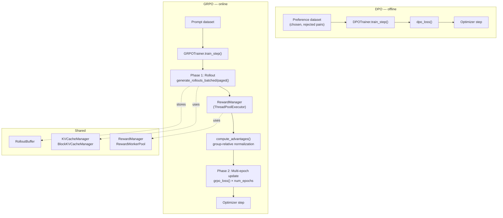
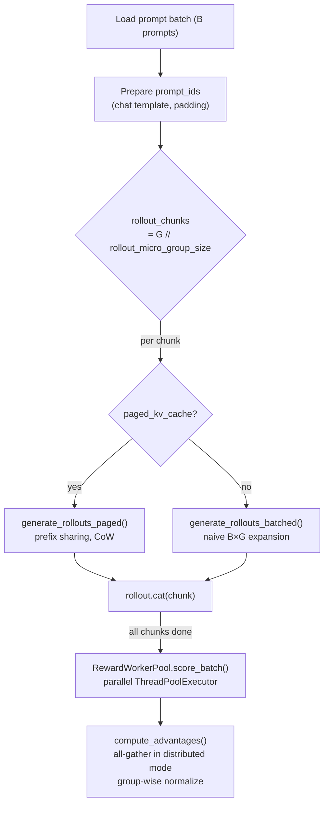
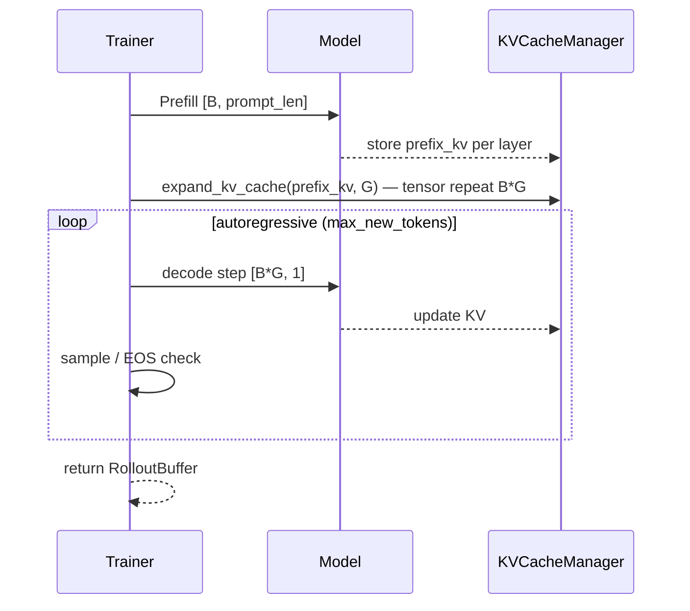
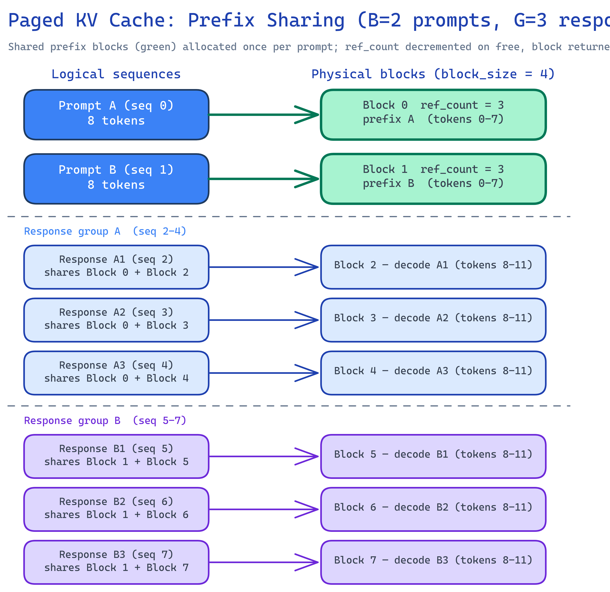
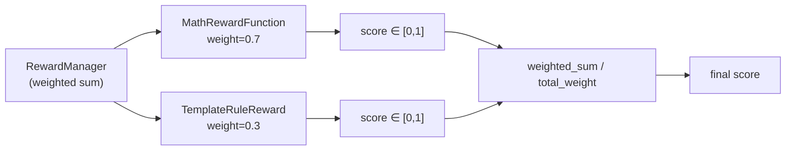

# Alignment System Design

## Overview

IronCore implements two alignment training methods on a shared infrastructure:

- **DPO (Direct Preference Optimization)** — offline, preference-pair dataset, no rollout.
- **GRPO (Group Relative Policy Optimization)** — online, rollout-based, group-relative
  advantage normalization.

Both extend `BaseTrainer` and share the reward system, KV cache infrastructure, and config.

## Target / Constraints

- Single-node, multi-GPU (TP + DP).
- GRPO rollout leverages the same `TransformerModel` in eval mode — no separate inference server.
- Prefix sharing in paged rollout assumes all G responses for a prompt are on the same node.
- Reward computation is CPU-bound and parallelized via `ThreadPoolExecutor` — not distributed
  across ranks (each rank scores its own batch).

## Architecture



## GRPO Training Loop

### Phase 1: Rollout (no_grad, model.eval())



### Phase 2: Multi-epoch policy update

For each epoch (`num_epochs`, typically 1 for pure online):

1. Shuffle `total_samples = B × G` indices.
2. Iterate micro-batches:
   - Forward: compute token log-probs for the completion.
   - KL: `kl_divergence_approx()` (Schulman k3 estimator, token-level).
   - IS ratio clip (if `old_log_probs` provided): `clip(π_θ/π_old, 1±ε)`.
   - Loss: `−A × log π_θ + β × KL − entropy_coef × entropy`.
   - Scale by `len(micro_batch) / total_samples` before `.backward()`.
3. Optimizer step after gradient accumulation.

Files: `ironcore/trainers/grpo_trainer.py`, `ironcore/alignment/loss/grpo.py`.

## Rollout Generation

Two generation paths share the same autoregressive decode loop but differ in KV cache management:

### Batched rollout (`generate_rollouts_batched`)



KV memory: `B × G × prompt_len × layers × KV_bytes` — all replicated.

### Paged rollout (`generate_rollouts_paged`)

```mermaid
sequenceDiagram
    participant T as Trainer
    participant M as Model
    participant BK as BlockKVCacheManager

    T->>M: Prefill each prompt seq_id 0..B-1 individually
    loop i in 0..B-1
        T->>BK: share_prefix(src=i, dst=[B+i*G .. B+i*G+G-1])
        Note over BK: ref_count++ on shared blocks; CoW on partial last block
    end
    loop autoregressive (all B*G seqs in parallel)
        T->>M: decode step [B*G, 1]
        M-->>BK: append KV to per-seq block tables
        T->>T: EOS check, free completed seqs
    end
    T->>BK: free all seq_ids
    T-->>T: return RolloutBuffer
```

KV memory: `1 × prompt_len × layers × KV_bytes` (shared) + `G × gen_len × layers × KV_bytes`
(independent decode) — saves `(G−1)/G` of prompt KV.

### BlockKVCacheManager internals



Key data structures (`ironcore/layers/block_kv_cache.py`):

| Structure | Shape | Purpose |
|---|---|---|
| `physical_key_caches[layer]` | `[num_blocks, block_size, kv_groups, head_dim]` | Physical KV storage, pre-allocated |
| `physical_value_caches[layer]` | same | Physical KV storage |
| `block_tables` | `[max_batch, max_blocks_per_seq]` | Logical → physical block index per sequence |
| `ref_counts` | `[num_blocks]` | Reference count; freed only when ref == 0 |
| `free_blocks` | list | Available physical block indices |

**Prefix sharing (`share_prefix`):** copies `src` block table entries to all `dst` sequences
(O(num_prefix_blocks) metadata, no tensor copy). If the last prefix block is partial, a
new physical block is allocated and the partial data is deep-copied (Copy-on-Write).

**Free:** decrements ref count; blocks return to `free_blocks` only when `ref_count == 0`.

## Advantage Computation

File: `ironcore/alignment/loss/grpo.py` — `compute_advantages()`.

```
For each group g (= one prompt, G responses):
    A_i = (R_i − mean(R_g)) / (std(R_g) + ε)

If std(R_g) < ε (all rewards identical): A_i = 0.
```

In distributed mode (`distributed=True`): before normalization, each DP rank
`all_gather`s its local rewards so every rank has the full group of G rewards
(groups can span rank boundaries). After normalization, only the local slice is kept.

**KL penalty** is computed token-level with the Schulman k3 estimator (approximation
of the KL divergence that is unbiased and low-variance):

```
k3 = exp(log_ref − log_policy) − (log_ref − log_policy) − 1
```

Added to the per-sequence loss: `total_loss = policy_loss + β × mean(k3)`.

## Reward System

### RewardManager

`RewardManager` (`ironcore/alignment/rewards/manager.py`) is a weighted registry of
`RewardFunction` implementations. It also *is* a `RewardFunction` — enabling nesting.



### RewardWorkerPool

```python
RewardWorkerPool(reward_fn, num_workers=4, timeout=30.0, default_reward=0.5)
```

Wraps any `RewardFunction` in a `ThreadPoolExecutor`. `score_batch()` submits one
`Future` per sample; after `timeout` seconds, incomplete futures are cancelled and
replaced with `default_reward`. Protects training from slow reward backends.

### Built-in reward functions

| Class | File | Scoring |
|---|---|---|
| `MathRewardFunction` | `rewards/builtin.py` | Extract answer (####, \boxed, "Answer:"), normalize, compare; 1.0 / 0.1 / 0.0 |
| `TemplateRuleReward` | `rewards/template.py` | `answer_match`: pattern extract + compare; `tag_check`: required tag penalty; `regex_match`: binary regex |
| `FormatRewardFunction` | `rewards/builtin.py` | Tag presence check with penalty per missing tag |
| `KeywordRewardFunction` | `rewards/builtin.py` | Binary: keyword in completion |
| `SoftKeywordRewardFunction` | `rewards/builtin.py` | n-gram overlap score ∈ [0, 1] |
| `RewardModelFunction` | `rewards/model.py` | Backends: `local_endpoint` (vLLM HTTP), `api` (OpenAI-compatible), `local_inference` (HF SequenceClassification) |

### TemplateRuleReward modes

| Mode | Logic |
|---|---|
| `answer_match` | Extract answer with `extract_pattern` → normalize (lower, strip) → compare to ground truth |
| `tag_check` | Count missing required tags → `max(0, 1 − missing × per_tag_penalty)` |
| `regex_match` | Full regex match → `match_score` or `no_match_score` (binary) |

## DPO

### Loss

File: `ironcore/alignment/loss/dpo.py` — `dpo_loss()`.

Bradley-Terry preference model:

```
logit = β × [(log π_θ(chosen) − log π_ref(chosen)) − (log π_θ(rejected) − log π_ref(rejected))]
loss  = −log σ(logit)  [= BCE with label=1]
```

With `label_smoothing > 0`:

```
loss = BCE(logit, target=(1 − label_smoothing))
```

Log probabilities are averaged over non-padding tokens (loss-masked).

### Reference model management

File: `ironcore/trainers/dpo_trainer.py` — `_create_reference_model()`.

- Created from the loaded checkpoint (SFT weights) immediately after `_post_checkpoint_load()`.
- Always `eval()`, `requires_grad=False`.
- **FSDP**: built from local state dict → separate FSDP instance.
- **DDP / no parallelism**: `copy.deepcopy(model)` on GPU.
- **CPU offload** (`offload_ref_model=True`): moved to CPU after creation; loaded to GPU
  only during the reference forward pass.

### Concat optimization

When `concat_forward_passes=True` (default), chosen and rejected sequences are concatenated
along the batch dimension for a single forward call, halving the number of forward passes.

## RolloutBuffer

File: `ironcore/alignment/buffer.py`.

| Field | Shape | Contents |
|---|---|---|
| `prompt_ids` | `[B, prompt_len]` | Tokenized prompts |
| `completion_ids` | `[B×G, total_len]` | Prompt + response (padded) |
| `response_ids` | `[B×G, gen_len]` | Response only |
| `old_log_probs` | `[B×G]` | Sequence log prob at rollout time (for IS ratio) |
| `rewards` | `[B×G]` | Raw reward scores |
| `advantages` | `[B×G]` | Group-normalized advantages |
| `group_ids` | `[B×G]` | Which prompt group each response belongs to |
| `response_lengths` | `[B×G]` | Actual response length (excl. padding) |

`rollout.cat(other)` accumulates chunks. `rollout.select(indices)` returns a micro-batch view.
Optional CPU pin (`to("cpu").pin_memory()`) reduces GPU pressure during long rollouts.

## Configuration Reference

| Field | Group | Description |
|---|---|---|
| `method` | `alignment` | `"dpo"` or `"grpo"` |
| `beta` | `alignment` | KL penalty coefficient (DPO) or KL weight (GRPO) |
| `group_size` | `alignment` | G — responses per prompt |
| `num_epochs` | `alignment` | Update epochs per rollout batch |
| `clip_eps` | `alignment` | IS ratio clip range (PPO-style, 0 = off) |
| `entropy_coef` | `alignment` | Entropy bonus weight |
| `rollout_micro_group_size` | `alignment.generation` | Chunk size for rollout (memory control) |
| `use_paged_kv_cache` | `alignment.generation` | Enable prefix-sharing paged rollout |
| `temperature` | `alignment.generation` | Sampling temperature |
| `top_p` | `alignment.generation` | Nucleus sampling |
| `max_new_tokens` | `alignment.generation` | Max response length |
| `use_chat_template` | `alignment.generation` | Apply tokenizer chat template to prompts |
| `reward_manager` | `alignment` | `RewardManagerConfig` — list of reward functions with weights |
| `offload_ref_model` | `alignment` | CPU-offload the reference model (DPO) |
| `label_smoothing` | `alignment` | DPO label smoothing |
| `concat_forward_passes` | `alignment` | DPO: concat chosen+rejected for one forward |

## File Index

| File | Responsibility |
|---|---|
| `ironcore/trainers/grpo_trainer.py` | `GRPOTrainer` — full GRPO loop |
| `ironcore/trainers/dpo_trainer.py` | `DPOTrainer` — DPO loop, reference model |
| `ironcore/alignment/rollout.py` | `generate_rollouts_batched()`, `generate_rollouts_paged()` |
| `ironcore/alignment/loss/grpo.py` | `grpo_loss()`, `compute_advantages()` |
| `ironcore/alignment/loss/dpo.py` | `dpo_loss()` |
| `ironcore/alignment/loss/kl.py` | `kl_divergence_approx()` — Schulman k3 |
| `ironcore/alignment/rewards/manager.py` | `RewardManager` |
| `ironcore/alignment/rewards/base.py` | `RewardFunction`, `RewardWorkerPool` |
| `ironcore/alignment/rewards/builtin.py` | Math, format, keyword reward functions |
| `ironcore/alignment/rewards/template.py` | `TemplateRuleReward` (YAML-driven) |
| `ironcore/alignment/rewards/model.py` | `RewardModelFunction` (local/API backends) |
| `ironcore/alignment/buffer.py` | `RolloutBuffer` |
| `ironcore/alignment/dataset.py` | `GRPODataset`, `GRPOSample` |
| `ironcore/layers/block_kv_cache.py` | `BlockKVCacheManager`, prefix sharing, CoW |
| `ironcore/layers/kv_cache.py` | `KVCacheManager` (non-paged, inference) |
