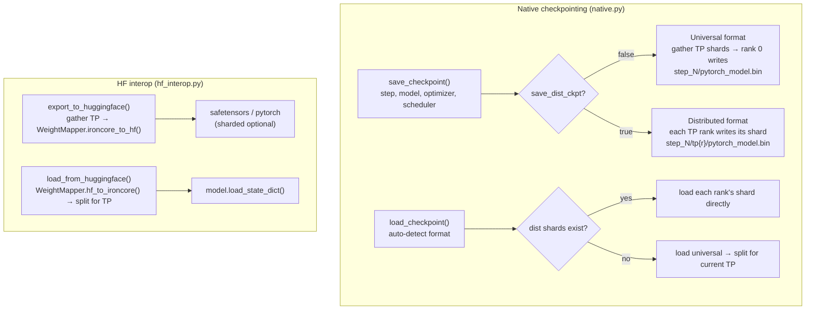
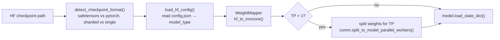

# Checkpointing System Design

## Overview

IronCore's checkpointing system has two distinct layers:

- **Native format** — IronCore's own save/load, with two sub-formats: *universal*
  (TP-agnostic single file) and *distributed* (per-rank shards). Handles model weights,
  optimizer states, LR scheduler, and step counter.
- **HuggingFace interop** — bidirectional conversion with HF checkpoints via a
  `WeightMapper` that handles QKV fusion, MLP gate+up fusion, and transpose conventions.

## Goals and Constraints

| Goal | How it is met |
|---|---|
| Resume training exactly | Saves optimizer states, LR scheduler, and step counter alongside weights |
| Change TP degree between runs | Universal format gathers/splits weights at checkpoint boundaries |
| HF model ecosystem compatibility | `hf_interop.py` + `WeightMapper` for bidirectional export/import |
| Parallel I/O | Distributed format: each TP rank writes its own shard concurrently |
| Portability | Universal format: single file, TP-degree agnostic |
| LoRA checkpoints | Adapter weights saved together with base weights (no separate file) |
| FSDP | Each FSDP rank saves its local shard independently (`LOCAL_STATE_DICT`) |
| ZeRO-1 (`DistributedOptimizer`) | Optimizer states gathered to rank 0 for universal; per-rank for distributed |

## Architecture



## Native Format

File: `ironcore/checkpointing/native.py`.

### File layout

```
{model_path}/
├── latest_step.txt              ← most recent step number (written by rank 0)
├── config.json                  ← HF-compatible config (if hf_model_type/hf_architecture set)
└── step_{N}/
    ├── pytorch_model.bin        ← universal format (rank 0 only)
    └── tp{r}/
        └── pytorch_model.bin   ← distributed format (one file per TP rank r)
```

### Checkpoint dict schema

```python
{
    "model_state_dict":     {...},   # parameter name → tensor
    "optimizer_state_dict": {        # keyed by parameter name (not integer index)
        "state": {
            "<param_name>": {
                "exp_avg":        Tensor,
                "exp_avg_sq":     Tensor,
                "max_exp_avg_sq": Tensor,  # AMSGrad only
                "step":           int,
            },
            ...
        },
        "param_groups": [...],
    },
    "lr_scheduler":         {...},   # LRScheduler.state_dict()
    "step":                 int,     # training step
    "config":               {...},   # ModelConfig as dict (dataclasses.asdict)
    "hf_config":            {...},   # HF-compatible config.json fields (if hf_model_type set)
}
```

RNG state is not saved — reproducibility is managed via `config.init.seed`.

### Universal vs distributed — when to use each

| | Universal (`save_dist_ckpt=False`) | Distributed (`save_dist_ckpt=True`) |
|---|---|---|
| File count | 1 | TP_size |
| Save speed | Slower (gather + rank 0 writes) | Faster (each rank writes in parallel) |
| TP degree change | ✅ Works — weights split for new TP | ❌ Fails if new TP ≠ saved TP |
| Recommended for | Portability, changing TP | Fixed TP, speed-sensitive |

## Universal Checkpointing

Universal checkpointing is the mechanism that makes a checkpoint TP-degree agnostic.
It activates when `save_dist_ckpt=False` and `TP > 1`.

### Save path

Both model weights and optimizer moment tensors are handled per-parameter:

| Layer type | Parameter | Action |
|---|---|---|
| `column_parallel` | `weight`, `bias`, `lora_B` | `gather_from_model_parallel_workers()` across TP ranks |
| `row_parallel` | `weight`, `lora_A` | `gather_from_model_parallel_workers()` across TP ranks |
| All others (replicated) | any | Saved as-is from rank 0 |

The same gather rule applies to optimizer moment tensors (`exp_avg`, `exp_avg_sq`,
`max_exp_avg_sq`): sharded moments are gathered in the same direction as their parameter.

Only the rank that satisfies `dp_group_rank == 0 AND tp_rank == 0` writes the file.

### Load path (universal → target TP)

Model weights and optimizer moments are split for the new TP degree:

| Layer type | Parameter | Action |
|---|---|---|
| `column_parallel` | `weight`, `bias`, `lora_B` | `split_to_model_parallel_workers()` |
| `row_parallel` | `weight`, `lora_A` | `split_to_model_parallel_workers()` |
| All others | any | Loaded as-is on every rank |

The split uses `comm.split_to_model_parallel_workers()` which divides the gathered tensor
evenly across the new TP ranks.

### DDP prefix normalization

When loading, the checkpoint's parameter names are normalized against the live model's
namespace. If the checkpoint was saved from a DDP-wrapped model (`module.` prefix) but
the current model is unwrapped (or vice versa), the prefix is added or stripped automatically.

## DistributedOptimizer (ZeRO-1) Checkpointing

`DistributedOptimizer` partitions optimizer states across DP ranks in round-robin order.
Checkpointing must reconstruct the full state for portability and correctly re-partition
it on load.

### Save (universal + DistributedOptimizer)

`_gather_distributed_optimizer_states()` is called instead of the standard path:

1. Each DP rank prepares the states it owns (`param_idx % dp_size == dp_rank`).
2. `dist.gather_object()` collects all partial dicts at DP rank 0.
3. Rank 0 merges into a single dict keyed by parameter name.

### Load (universal → DistributedOptimizer)

`_partition_optimizer_states_for_load()` slices the full gathered state back to each
DP rank's partition using `optimizer.local_param_indices`.

### Distributed checkpoint + DistributedOptimizer

Each rank saves and loads only its own partition directly — no gather/scatter needed.

## HuggingFace Interop

File: `ironcore/checkpointing/hf_interop.py`.

### Loading from HF (`load_from_huggingface`)



Before building the model, call `detect_bias_from_hf_state_dict()` to determine which
projections have biases — this informs the `BiasConfig` used during model construction.

### Exporting to HF (`export_to_huggingface`)

Only DP rank 0 (and only TP rank 0 after gather) writes output. Supports `safetensors`
(default) or `pytorch` format. Sharded output:

```
model.safetensors.index.json
model-00001-of-00003.safetensors
model-00002-of-00003.safetensors
model-00003-of-00003.safetensors
```

### HFConfigManager

File: `ironcore/checkpointing/native.py` — `HFConfigManager`.

Generates a `config.json` compatible with HuggingFace from `ModelConfig` fields.
Written to `{model_path}/config.json` when `hf_model_type` and `hf_architecture` are both
set. Also embedded in the checkpoint dict under `hf_config` for portability.

Fields written: `model_type`, `hidden_size`, `num_hidden_layers`, `num_attention_heads`,
`intermediate_size`, `max_position_embeddings`, `vocab_size`, `layer_norm_eps`,
`initializer_range`, `hidden_act`, `architectures`.

## Weight Mapper

File: `ironcore/checkpointing/weight_mapping.py` — `WeightMapper`.

### Supported architectures

```python
Architecture(Enum): GPT2, LLAMA

# LLAMA alias covers:
"llama", "llama2", "llama3", "mistral", "mixtral",
"qwen", "qwen2", "qwen3", "gemma", "gemma2"
```

### Naming conventions

| Component | IronCore name | GPT-2 HF name | LLaMA HF name |
|---|---|---|---|
| Token embedding | `embedding.word_embeddings.weight` | `transformer.wte.weight` | `model.embed_tokens.weight` |
| Input norm | `model.layers.{i}.input_layernorm.layernorm.weight` | `transformer.h.{i}.ln_1.weight` | `model.layers.{i}.input_layernorm.weight` |
| QKV (fused K+V) | `linear_q.weight` + `linear_kv.weight` | `attn.c_attn.weight` (fused QKV) | `self_attn.q/k/v_proj.weight` (separate) |
| Attn output | `attn_output.weight` | `attn.c_proj.weight` | `self_attn.o_proj.weight` |
| MLP up (+ gate for GLU) | `mlp.up_proj.weight` | `mlp.c_fc.weight` | `mlp.gate_proj.weight` + `mlp.up_proj.weight` |
| MLP down | `mlp.down_proj.weight` | `mlp.c_proj.weight` | `mlp.down_proj.weight` |
| Final norm | `output_layernorm.layernorm.weight` | `transformer.ln_f.weight` | `model.norm.weight` |

### Key transformations

**GPT-2 → IronCore:**
- HF `c_attn.weight [hidden, 3×hidden]` → split into Q `[hidden, hidden]` and fused KV
  `[hidden, 2×hidden]`. GPT-2 uses Conv1D → already in `[in, out]` shape, no transpose.

**LLaMA → IronCore:**
- HF linear layers are `[out, in]`; IronCore is `[in, out]` → transpose all.
- Separate `k_proj` and `v_proj` → concatenate then transpose:
  `cat([k.t(), v.t()], dim=1)` → `[hidden, 2×groups×head_dim]`.
- Separate `gate_proj` and `up_proj` → concatenate then transpose:
  `cat([gate.t(), up.t()], dim=1)` → `[hidden, 2×d_ffn]` (SwiGLU fused).

**IronCore → LLaMA (reverse):**
- Transpose all weights.
- Split fused KV → separate K, V; split fused gate+up → separate gate, up.

## LoRA Checkpoints

LoRA adapter weights are saved **together** with base model weights — there is no
separate LoRA file. Parameter names include the adapter:

```
model.layers.{i}.linear_q.weight      ← base weight
model.layers.{i}.linear_q.lora_A      ← LoRA A (row-parallel direction)
model.layers.{i}.linear_q.lora_B      ← LoRA B (column-parallel direction)
```

TP gather/split rules: `lora_B` follows the column-parallel gather rule; `lora_A`
follows the row-parallel gather rule. This is identical to the base weight rule — the
split dimension matches the direction of the linear layer the adapter is attached to.

## FSDP Checkpoints

When the model is wrapped with FSDP, `LOCAL_STATE_DICT` is used — each rank saves and
loads only its own shard:

```python
with FSDP.state_dict_type(model, StateDictType.LOCAL_STATE_DICT):
    state = model.state_dict()
```

This produces the same per-rank file layout as distributed TP checkpoints:
`step_{N}/tp{r}/pytorch_model.bin`.

## Offload Integration

When optimizer offload is enabled, moment tensors are stored on CPU. The load path
respects this: after splitting optimizer moments for TP, each tensor is routed to the
correct device using the same per-parameter criteria as the optimizer step
(`_should_offload_param(param, offload_min_elements)`). Tensors for offloaded parameters
land on CPU; others land on the parameter's CUDA device.

## Trainer Integration

File: `ironcore/trainers/base_trainer.py`.

- **Save:** `save_checkpoint()` called when `step % save_checkpoint_steps == 0`
  (or on training end). Suppressed when `config.operation.no_save = True`.
- **Resume:** `_pre_train_setup()` calls `load_checkpoint()` at the start of `train()`.
  Returns the last saved step; training resumes from `step = last_step + 1`.
  `latest_step.txt` provides the step number without loading the full checkpoint.

## Checkpoint Inspector

File: `ironcore/checkpointing/inspect.py` — `inspect_checkpoint()`.

Reports: format (native/safetensors/pytorch), parameter count + human-readable size,
dtype breakdown, training step, TP shard count. With `--verbose`: per-layer shapes and
stats. With `--compare`: per-layer `max_abs_diff` and `mean_abs_diff` between two
checkpoints. CLI: `ironcore inspect-checkpoint --path <dir>`.

## Configuration Reference

| Field | Group | Description |
|---|---|---|
| `model_path` | `trainer` | Root directory for checkpoints |
| `save_checkpoint_steps` | `trainer` | Save every N steps |
| `no_save` | `operation` | Disable checkpoint saving |
| `save_dist_ckpt` | `operation` | `false` = universal, `true` = distributed per-rank |
| `load_checkpoint_optim_state` | `optim` | Restore optimizer state on resume (default: `true`) |
| `load_checkpoint_lr_scheduler` | `optim` | Restore LR scheduler state on resume |
| `hf_model_type` | `model` | HF model type string; also enables `config.json` generation |
| `hf_architecture` | `model` | HF architecture class name |

## File Index

| File | Responsibility |
|---|---|
| `ironcore/checkpointing/native.py` | `save_checkpoint()`, `load_checkpoint()`, `HFConfigManager`, `_gather_distributed_optimizer_states()`, `_partition_optimizer_states_for_load()` |
| `ironcore/checkpointing/hf_interop.py` | `export_to_huggingface()`, `load_from_huggingface()`, `detect_bias_from_hf_state_dict()` |
| `ironcore/checkpointing/weight_mapping.py` | `WeightMapper`, `Architecture`, `get_architecture()` |
| `ironcore/checkpointing/inspect.py` | `inspect_checkpoint()` |
