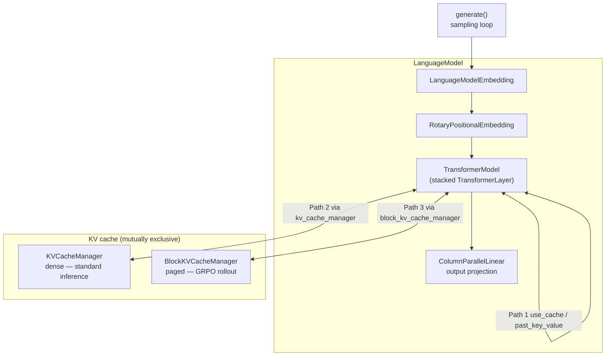
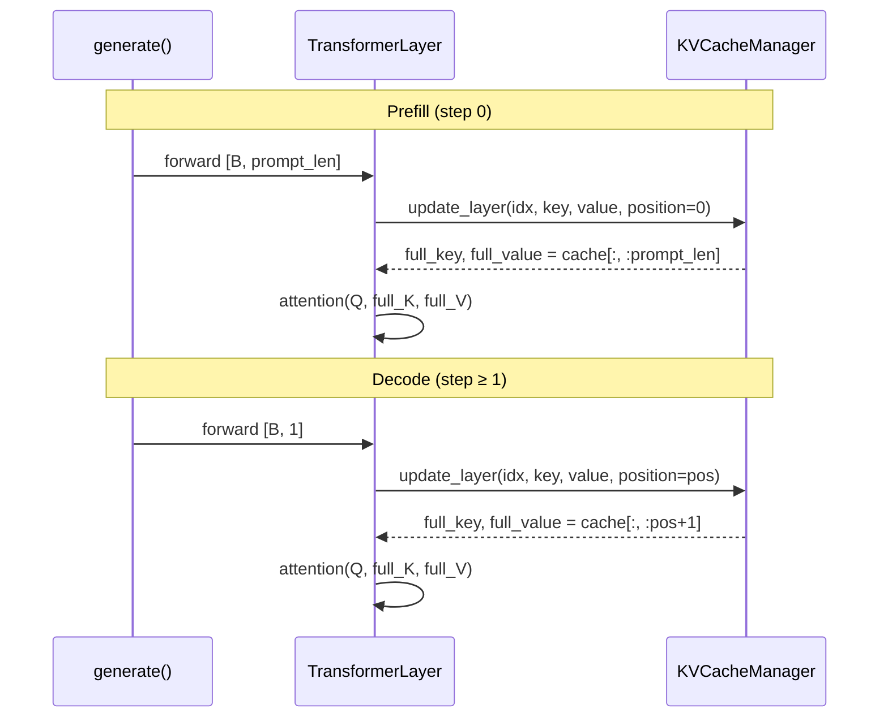
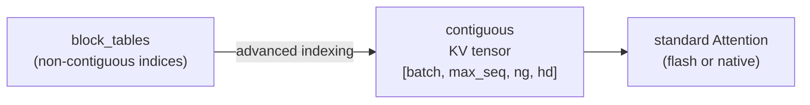

# KV Cache & Inference System Design

## Overview

IronCore provides two KV cache implementations for different workloads, plus a full
autoregressive generation loop:

- **`KVCacheManager`** — dense, pre-allocated cache for standard inference.
- **`BlockKVCacheManager`** — paged, block-based cache with reference-counted prefix
  sharing for GRPO rollout generation.

A `LanguageModel` wrapper owns the active cache and exposes a unified `generate()` API.

## Target / Constraints

- Single-node inference (TP supported, no pipeline parallelism).
- Each TP rank stores only its local KV head partition (`num_groups / TP`).
- PagedAttention uses gather-then-attend (no custom CUDA kernels) — optimized for
  GRPO throughput, not latency-critical serving.
- `BlockKVCacheManager` is exclusively for GRPO rollout; standard inference uses
  `KVCacheManager`.

## Architecture



### Three-path KV handling per `TransformerLayer`

Each `TransformerLayer.forward()` picks one path based on which arguments are present:

| Path | Arguments | Use case |
|---|---|---|
| **Functional** | `use_cache=True` / `past_key_value` | Legacy; stateless tensor accumulation |
| **Stateful** | `kv_cache_manager` + `cache_position` | Standard inference (KVCacheManager) |
| **Paged** | `block_kv_cache_manager` + `seq_id` | GRPO rollout (BlockKVCacheManager) |

File: `ironcore/models/transformer.py`.

## KVCacheManager

File: `ironcore/layers/kv_cache.py`.

### Data layout

```
key_caches[layer_idx]:    [batch, max_seq_len, num_local_kv_groups, head_dim]
value_caches[layer_idx]:  [batch, max_seq_len, num_local_kv_groups, head_dim]
cache_positions:          [batch]  — fill pointer per sequence
```

All buffers pre-allocated on first `initialize_cache()` call.

### Key API

| Method | Signature | Effect |
|---|---|---|
| `initialize()` | `(batch, num_layers, device, dtype)` | Allocate dense buffers |
| `update_layer()` | `(layer_idx, key, value, position=None, positions=None)` → `(full_key, full_value)` | Write at position; return full cached slice. `positions` ([batch] tensor) enables per-sequence writes for continuous batching. |
| `reset()` | `(batch_indices)` | Clear positions for sequences |
| `get_cache_position()` | `(batch_idx)` → `int` | Current fill pointer |
| `set_sequence_position()` | `(batch_idx, position)` | External position control |

### Prefill → decode flow



Position auto-increments after each `update_layer()` call.

### TP partitioning

Each rank stores only `num_groups / TP` KV groups:

```
num_local_kv_groups = num_attention_groups // tensor_model_parallel_size
```

No cross-rank communication needed during attention — each rank computes attention
for its local head partition using its local KV slice.

## BlockKVCacheManager

File: `ironcore/layers/block_kv_cache.py`.

### Data layout

```
physical_key_caches[layer]:  [num_physical_blocks, block_size, num_local_kv_groups, head_dim]
physical_value_caches[layer]: same shape
block_tables:                 [max_batch, max_blocks_per_seq]  → physical block indices (-1 = unused)
ref_counts:                   [num_physical_blocks]
free_blocks:                  list[int]  — stack of available indices
token_positions:              [max_batch]  — tokens to attend over per sequence
tokens_written:               [max_batch]  — tokens physically written
```

For spatial layout and prefix sharing behavior, see the alignment design doc diagram.

### Key API

| Method | Signature | Effect |
|---|---|---|
| `allocate_blocks()` | `(seq_id, count)` | Allocate physical blocks from `free_blocks` |
| `write_prefill()` | `(layer_idx, seq_id, key, value)` | Write full prompt KV (pre-allocated blocks) |
| `write_decode()` | `(layer_idx, seq_id, key, value)` | Write one decode token, auto-allocate if needed |
| `write_decode_batched()` | `(layer_idx, seq_ids, key, value)` | Vectorized single-token write |
| `get_layer_kv_gathered_batched()` | `(layer_idx, seq_ids)` → `(K, V)` | Gather non-contiguous blocks → padded `[batch, max_seq_len, …]` |
| `share_prefix()` | `(src_seq_id, dst_seq_ids)` | Copy block-table metadata + bump ref counts; CoW on partial last block |
| `free_sequence()` | `(seq_id)` | Decrement ref counts; return blocks with `ref_count == 0` |
| `advance_position()` | `(seq_id, tokens)` | `token_positions[seq_id] += tokens` |

### PagedAttention gather

File: `ironcore/layers/paged_attention.py` — `gather_kv_blocks_batched()`.

Two-phase design (no custom CUDA kernel):



Full blocks gathered via a single advanced-indexing operation (`physical_cache[flat_idx]`)
over the physical cache; partial last block concatenated separately.

### Prefix sharing

See [Alignment system design — BlockKVCacheManager](alignment.md#blockkvcachemanager-internals) for
the full description of `share_prefix()` / CoW / `ref_count` semantics. The spatial diagram
lives at `docs/design/assets/alignment-prefix-sharing.png`.

**Memory saved per GRPO rollout:** `(G − 1) / G` of prompt KV (only one copy of prefix blocks
regardless of group size `G`).

## Inference Loop

File: `ironcore/language_model.py` — `LanguageModel.generate()`.

> **Paged path limitation:** when `BlockKVCacheManager` is active, `generate()` only supports
> `batch_size=1`. For batched GRPO generation use `generate_rollouts_paged()` in
> `ironcore/alignment/rollout.py`.

### Signature

```python
@torch.no_grad()
def generate(
    self,
    input_ids: torch.Tensor,   # [B, prompt_len]
    max_new_tokens: int = 128,
    temperature: float = 1.0,
    top_p: float = 1.0,
    top_k: int = 0,
    do_sample: bool = False,
    eos_token_id: int | None = None,
) -> torch.Tensor  # [B, prompt_len + generated_len]
```

### Sampling

`_sample()` applies filters in order: temperature → top-k → top-p → multinomial.
Greedy decoding (`do_sample=False`) uses `argmax`.

### TP synchronization

When `TP > 1`, `gather_from_model_parallel_workers` performs an **all-gather** (`dist.all_gather`)
so all TP ranks receive the complete logits. Sampling then runs on all ranks:

```mermaid
sequenceDiagram
    participant R0 as TP rank 0
    participant Ri as TP rank i (i > 0)

    Note over R0,Ri: Each decode step
    R0->>R0: all_gather logit shards
    Ri->>Ri: all_gather logit shards
    Note over R0,Ri: All ranks now hold identical complete logits
    R0->>R0: _sample(logits) → next_token
    Ri->>Ri: _sample(logits) → next_token (stochastic only)
    R0->>Ri: dist.broadcast(next_token, src=0) — stochastic only
    Note over R0,Ri: Greedy: argmax on identical logits gives same result on all ranks; no broadcast needed
```

For stochastic sampling (`do_sample=True`), multinomial sampling is non-deterministic so rank 0
samples and broadcasts. For greedy (`do_sample=False`), all ranks independently compute `argmax`
on identical logits — the result is identical without a broadcast.

## LanguageModel Wrapper

File: `ironcore/language_model.py`.

Wraps `TransformerModel` with:
- `LanguageModelEmbedding` (vocab + positional)
- `RotaryPositionalEmbedding`
- `ColumnParallelLinear` output projection (optionally untied from embedding)
- Active KV cache manager (`KVCacheManager` or `BlockKVCacheManager`)

Delegate methods for cache management:

| Method | Delegates to |
|---|---|
| `initialize_cache(batch, device, dtype)` | active cache `initialize()` |
| `reset_cache(batch_indices)` | `KVCacheManager.reset()` |
| `share_prefix_cache(src, dsts)` | `BlockKVCacheManager.share_prefix()` |
| `free_sequence_cache(seq_id)` | `BlockKVCacheManager.free_sequence()` |
| `advance_cache_position(seq_id, tokens)` | `BlockKVCacheManager.advance_position[_batched]()` |

## Configuration

| Field | Default | Description |
|---|---|---|
| `kv_cache.enabled` | `true` | Activate stateful KV cache |
| `kv_cache.use_paged` | `false` | `false` → KVCacheManager, `true` → BlockKVCacheManager |
| `kv_cache.block_size` | `16` | Tokens per physical block (paged only) |
| `kv_cache.max_batch_size` | `32` | Max concurrent sequences |
| `kv_cache.max_seq_length` | `2048` | Max sequence length. Dense: cache buffer size. Paged: used to compute `max_num_blocks_per_seq = ceil(max_seq_length / block_size)`. |
| `kv_cache.gpu_memory_utilization` | `0.9` | Fraction of free VRAM (after model weights) to use for the block pool. Default 0.9 leaves ~10% headroom for fragmentation. |

## Future Directions

### True paged attention via FlashAttention block-sparse kernel

The current gather-then-attend design materialises a contiguous
`[B×G, max_seq_len, ng, hd]` tensor at every layer of every decode step before
calling standard attention. This has two costs:

1. **Memory allocation overhead** — a fresh temporary tensor per layer per step,
   regardless of how full the sequence actually is.
2. **Copy bandwidth** — physical blocks are copied into the temporary before the
   kernel can run.

The natural next step is to replace the gather-then-attend path with a kernel that
operates directly on the block table, without materialising the contiguous tensor.
FlashAttention-2 exposes a `varlen` / block-sparse interface that supports this
pattern. The implementation would:

- Pass `block_tables`, `block_size`, and per-sequence token counts directly to the
  attention kernel.
- Eliminate `gather_kv_blocks_batched()` from the hot path entirely.
- Reduce peak activation memory by `O(B×G × max_seq_len × ng × hd)` per decode step.

This is the approach used by vLLM's PagedAttention (Kwon et al., 2023,
[arXiv:2309.06180](https://arxiv.org/abs/2309.06180)). The rest of the
`BlockKVCacheManager` API (block tables, ref counts, CoW prefix sharing) is
already compatible with such a kernel — only the attention call site in
`TransformerLayer.custom_forward` and the `paged_attention.py` gather step would
change.

## File Index

| File | Responsibility |
|---|---|
| `ironcore/layers/kv_cache.py` | `KVCacheManager` — dense stateful cache |
| `ironcore/layers/kv_cache_utils.py` | Shared helpers: `compute_memory_mb()`, `compute_utilization()` |
| `ironcore/layers/block_kv_cache.py` | `BlockKVCacheManager` — paged cache, prefix sharing, CoW |
| `ironcore/layers/paged_attention.py` | `gather_kv_blocks_batched()` — non-contiguous block gather |
| `ironcore/layers/attention.py` | `Attention` — KV expand, GQA, flash/standard path |
| `ironcore/models/transformer.py` | `TransformerLayer` — three-path KV cache dispatch |
| `ironcore/language_model.py` | `LanguageModel` — wraps model + cache, `generate()` loop |
| `ironcore/generate.py` | Public `generate()` API (CLI and Python) |
| `ironcore/alignment/rollout.py` | `generate_rollouts_batched/paged()` — GRPO-specific rollout |
