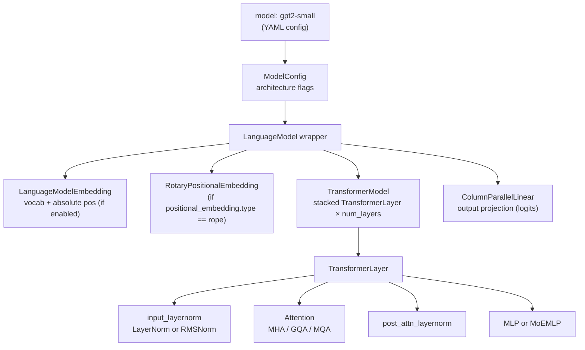
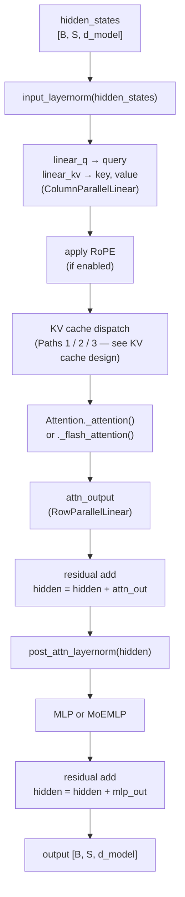
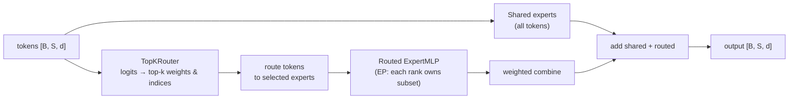

# Models & Layers System Design

## Overview

A single `TransformerModel` class covers GPT-2/3, LLaMA, Gemma, Qwen, Phi, and MoE
variants entirely through **config-driven differentiation** — no subclassing. Architecture
differences (norm type, activation, positional embedding, attention grouping) are encoded
in `ModelConfig` fields that are resolved at construction time.

## Target / Constraints

- TP-aware by construction: every projection uses `ColumnParallel` / `RowParallel` linear layers.
- MoE is optional and orthogonal — `MoEMLP` replaces `MLP` at the layer level; the rest of
  the model is unchanged.
- Flash attention is a drop-in replacement for the standard path; fall-through to standard if
  the library is absent.
- `DummyModel` (simple 2-layer MLP, no attention) exists for CI speed and infrastructure testing.

## Architecture



## TransformerModel — Single-Class Design

File: `ironcore/models/transformer.py`.

`get_model_provider_func()` (`ironcore/models/__init__.py`) routes by name prefix:
`GPT` / `LLAMA` / `GEMMA1` / `QWEN` / `PHI1` / `PHI2` → all return `TransformerModel`.
`DUMMY` → `DummyModel`.

### Architecture-controlling `ModelConfig` fields

| Field | Type | Controls |
|---|---|---|
| `ln_type` | `"layernorm"` \| `"rmsnorm"` | Norm class (via `get_norm()`) |
| `activation_type` | `"gelu"` \| `"swiglu"` \| … | MLP path + GLU gating |
| `positional_embedding.type` | `"absolute"` \| `"rope"` | Embedding addition vs per-token rotation |
| `positional_embedding.base` | int (default 10000) | RoPE frequency base θ |
| `num_attention_heads` | int | Total Q heads |
| `num_attention_groups` | int | K/V groups: `== heads` = MHA, `< heads` = GQA, `1` = MQA |
| `bias` | `BiasConfig` | Per-projection bias flags (q, k, v, o, gate, up, down) |
| `post_ln` | bool | Pre-norm (False) vs post-norm (True) intent — currently pre-norm in use |
| `moe.use_moe` | bool | Replace `MLP` with `MoEMLP` |
| `hf_model_type` | str \| None | HF model_type for checkpoint interop |

**Architecture comparison:**

| | GPT-2 | LLaMA | Qwen 2.5 (0.5B) |
|---|---|---|---|
| `ln_type` | `layernorm` | `rmsnorm` | `rmsnorm` |
| `activation_type` | `gelu` | `swiglu` | `gelu` |
| `positional_embedding.type` | `absolute` | `rope` | `rope` |
| `num_attention_groups` | = heads (MHA) | = heads (MHA) | 2 (GQA, 14 heads) |
| `bias` | all True | none | all True (default) |
| `max_seq_len` | 1024 | 2048 | 32768 |

Config YAML resolution: explicit fields override dataclass defaults; unset fields keep
defaults. See `configs/model/gpt2-small.yaml`, `configs/model/llama.yaml`,
`configs/model/qwen2.5-0.5B.yaml`.

## TransformerLayer

File: `ironcore/models/transformer.py`.

### Forward flow (pre-norm, no cache)



**TP awareness:** Q uses `ColumnParallelLinear` (splits output dim); KV uses fused
`ColumnParallelLinear` with `concatenated_weights=2`; output projection uses
`RowParallelLinear`. Each rank computes `heads / TP` local heads.

**Activation recompute:** When `operation.activation_recompute=True` and training,
`checkpoint(layer.custom_forward, …)` wraps each layer. Disabled when KV cache is active
or activation spilling is enabled (spilling replaces recompute).

## Attention

File: `ironcore/layers/attention.py` — `Attention`.

### MHA / GQA / MQA

All three share the same code path. GQA/MQA expand K/V to match Q's head count
before the dot product:

```python
# expand_for_gqa: repeat K/V groups to fill num_heads
if key.size(2) != query.size(2):
    key   = expand_for_gqa(key,   num_groups, num_heads, kv_dim=2)
    value = expand_for_gqa(value, num_groups, num_heads, kv_dim=2)
```

### Flash attention switching

```python
if config.trainer.use_flash_attn and flash_attn_varlen_func is not None:
    return self._flash_attention(query, key, value, ...)  # flash_attn_varlen_func
else:
    return self._attention(query, key, value, ...)        # torch.einsum SDPA
```

Flash path flattens `[B, S, …]` → `[B×S, …]`, passes `cu_seqlens` for variable-length
batches, and always uses `causal=True`.

### RoPE application

Applied in `TransformerLayer` before attention, on the reshaped
`[B, S, num_local_heads, head_dim]` tensors:

```python
if rotary_pos_emb:
    query = rotary_pos_emb.forward(query, position_ids)
    key   = rotary_pos_emb.forward(key,   position_ids)
```

## MLP

Files: `ironcore/layers/mlp.py`, `ironcore/layers/parallel_mlp.py`.

### GLU vs non-GLU

Determined by `activation_type`:

| Activation | GLU? | up_proj output dim | Example |
|---|---|---|---|
| `gelu`, `silu`, `relu`, `gelu_new` | No | `d_ffn` | GPT-2 |
| `swiglu`, `geglu`, `glu`, `siglu` | Yes | `d_ffn × 2` | LLaMA |

For GLU activations, `up_proj` outputs `[gate ‖ up]` concatenated; `activation(x)`
splits and applies gating (`SiLU(gate) × up` for SwiGLU). `down_proj` sees `d_ffn`.

### Forward

```python
x = self.up_proj(x)        # ColumnParallel: [B, S, d_ffn] or [B, S, 2×d_ffn]
x = self.activation(x)     # split+gate (GLU) or elementwise (non-GLU)
x = self.down_proj(x)      # RowParallel: [B, S, d_model]
```

`async_communication=True` overlaps the RowParallel all-reduce with the next layer's
pre-norm using a `finalize()` two-phase call.

## MoE (Mixture of Experts)

Files: `ironcore/layers/moe/moe_layer.py`, `router.py`, `expert.py`, `load_balance_loss.py`.

Enabled by `config.model.moe.use_moe = True`; `MoEMLP` replaces `MLP` in
`TransformerLayer`.

### Architecture



### TopKRouter

```
router_logits = x @ W_router           # [B, S, num_experts]
+ jitter noise (training only)
top_k_weights, top_k_indices = topk(router_logits, k)
top_k_weights = softmax(top_k_weights) # normalize selected experts
```

### Auxiliary losses

**Load balance loss** (DeepSeek-MoE style):
```
L_aux = α × E × Σᵢ fᵢ × Pᵢ
```
where `fᵢ` = fraction of tokens routed to expert `i`, `Pᵢ` = mean routing probability.
Minimized when routing is uniform. Retrieved via `moe_layer.get_aux_loss()` and added
to the main loss in the trainer.

### Expert Parallelism

When `moe.expert_model_parallel_size > 1`, each EP rank instantiates
`num_routed_experts / ep_size` experts starting at `ep_rank × local_count`.
Communication dispatched via `AllToAllDispatcher` (see
[Parallelism design — Expert Dispatch](parallelism.md#expert-dispatch)).

## Embedding

File: `ironcore/layers/embedding.py` — `LanguageModelEmbedding`.

- **Token embedding:** `VocabParallelEmbedding` — vocab sharded across TP ranks.
- **Positional embedding:** dense learnable `nn.Embedding` added to token embeddings
  **only** when `positional_embedding.type == "absolute"`. For RoPE, embeddings are
  position-agnostic; rotation is applied per-token inside attention.

## Positional Embeddings

File: `ironcore/layers/positional_embedding/rotary.py`.

### RoPE

Pre-computed sin/cos cache for positions `[offset, offset + max_seq_len)`:

```
θᵢ = 1 / base^(2i / head_dim)   for i ∈ [0, head_dim/2)
sin_cache[pos, i] = sin(pos × θᵢ)
cos_cache[pos, i] = cos(pos × θᵢ)
```

Applied to consecutive halves of each head:
```
[x₁, x₂] → [x₁·cos − x₂·sin, x₁·sin + x₂·cos]
```

Cache extends on-demand if a sequence exceeds `max_seq_len`. Config knobs:
`positional_embedding.base` (default 10000), `scaling_factor` (position scaling),
`offset` (starting position index — used in some LLaMA configs).

## Normalization

Factory: `get_norm(config)` → `LayerNorm` or `RmsNorm` based on `config.model.ln_type`.

| `ln_type` | Class | Formula | Typical use |
|---|---|---|---|
| `"layernorm"` | `nn.LayerNorm` | normalize to μ=0, σ=1 | GPT-2 |
| `"rmsnorm"` | `nn.RMSNorm` | `x / √(mean(x²) + ε) × γ` | LLaMA, Qwen, modern LLMs |

## DummyModel

File: `ironcore/models/dummy.py`.

A stack of simple `Linear → ReLU → Linear` layers (no attention, no KV cache). Useful for:
- Testing training loop, data pipeline, grad flow without transformer overhead.
- CI/CD — much faster than a real model.
- Parallelism infrastructure validation.

Activated by `config.model.name = "dummy"` (or `DUMMY` prefix in model name).

## Configuration Reference

| Field | Default | Description |
|---|---|---|
| `ln_type` | `"layernorm"` | `"layernorm"` \| `"rmsnorm"` |
| `ln_eps` | `1e-5` | Norm epsilon |
| `activation_type` | `"gelu"` | Activation; GLU variants double d_ffn internally |
| `positional_embedding.type` | `"absolute"` | `"absolute"` \| `"rope"` |
| `positional_embedding.base` | `10000` | RoPE θ base |
| `num_attention_heads` | `8` | Total Q heads |
| `num_attention_groups` | `1` | K/V groups (`1`=MQA, `n`=GQA, `==heads`=MHA) |
| `head_dim` | `128` | Per-head dimension |
| `d_model` | `512` | Hidden dimension |
| `d_ffn` | `2048` | FFN intermediate (before GLU doubling) |
| `num_layers` | `2` | Number of transformer layers |
| `max_seq_len` | `512` | Context window length |
| `dropout_embd / attn / mlp` | `0.1` | Dropout rates |
| `moe.use_moe` | `false` | Enable Mixture of Experts |
| `moe.num_routed_experts` | — | Total routed expert count |
| `moe.num_experts_per_token` | — | Top-k routing |
| `moe.aux_loss_alpha` | — | Load-balance loss coefficient |
| `hf_model_type` | `null` | HF model_type (for checkpoint export) |

## File Index

| File | Responsibility |
|---|---|
| `ironcore/models/transformer.py` | `TransformerModel`, `TransformerLayer` |
| `ironcore/models/__init__.py` | `get_model_provider_func()` — name→class routing |
| `ironcore/models/dummy.py` | `DummyModel`, `DummyModelLayer` |
| `ironcore/layers/attention.py` | `Attention` — MHA/GQA/MQA, flash/standard path |
| `ironcore/layers/mlp.py` | `MLP` (LoRA-aware) |
| `ironcore/layers/parallel_mlp.py` | `ParallelMLP` — TP-aware base class |
| `ironcore/layers/embedding.py` | `LanguageModelEmbedding` |
| `ironcore/layers/positional_embedding/rotary.py` | `RotaryPositionalEmbedding` |
| `ironcore/layers/activations/activations.py` | `NewGELU`, `GLUActivation` variants |
| `ironcore/layers/layernorm/__init__.py` | `get_norm()` factory |
| `ironcore/layers/moe/moe_layer.py` | `MoEMLP` |
| `ironcore/layers/moe/router.py` | `TopKRouter` |
| `ironcore/layers/moe/expert.py` | `ExpertMLP` |
| `ironcore/layers/moe/load_balance_loss.py` | `LoadBalanceLoss` |
| `ironcore/config/config_model.py` | `ModelConfig`, `BiasConfig`, `PositionalEmbeddingConfig`, `MoEConfig` |
