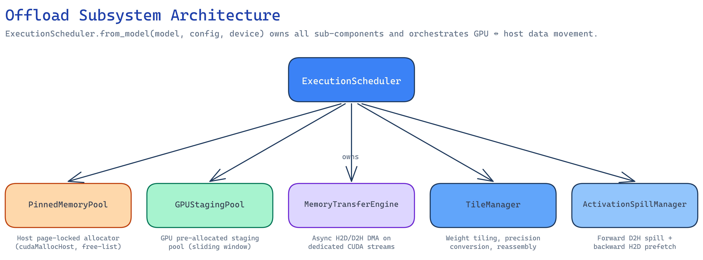
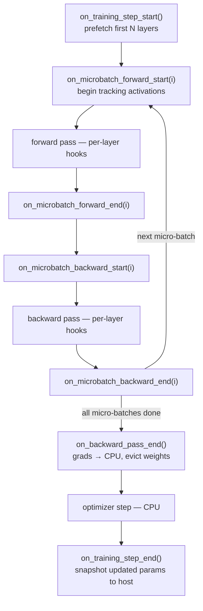
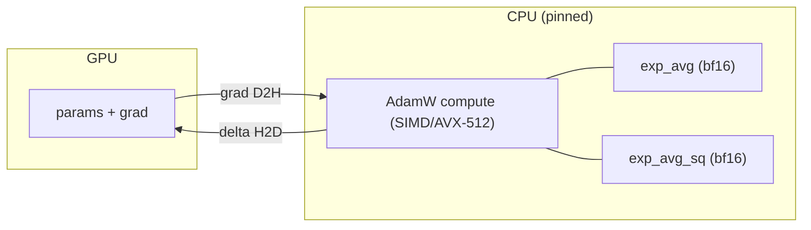
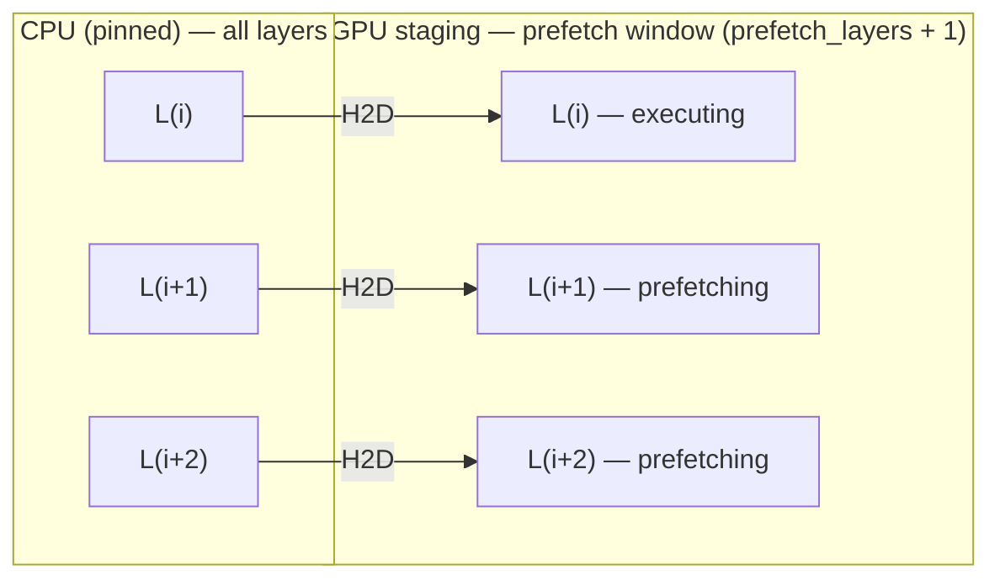
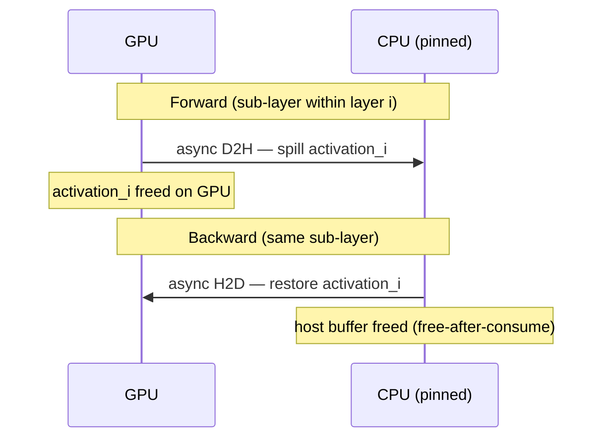
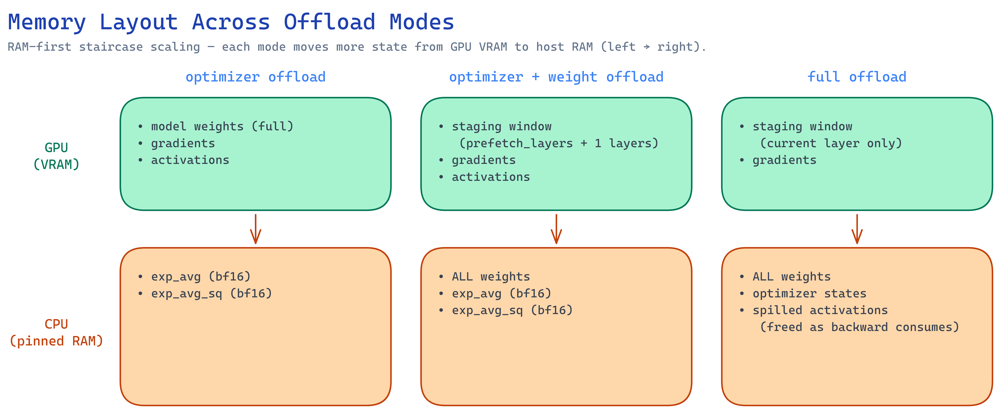
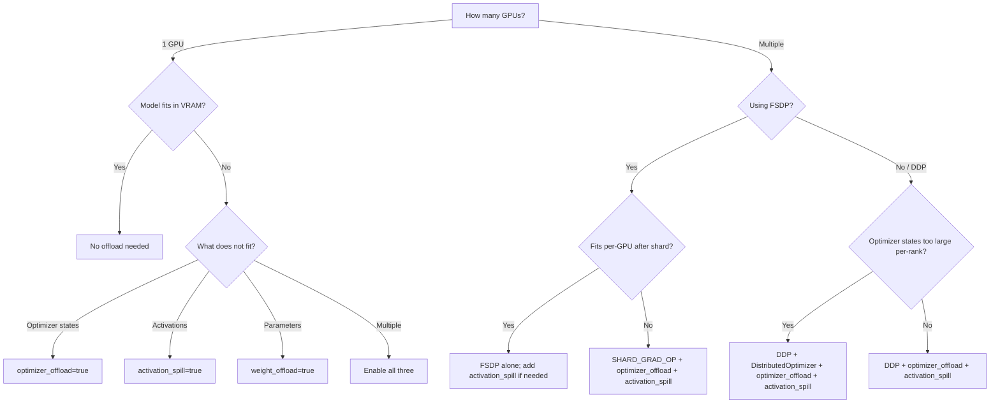

# Offload System Design

## Overview

The offload subsystem enables training models that exceed GPU VRAM by moving optimizer states, model weights, and activations between GPU and host RAM. Three independent mechanisms — optimizer offload, weight streaming, activation spilling — can be combined orthogonally.

## Target Hardware

Consumer desktop with single GPU (8–24 GB VRAM), 32–128 GB host RAM. Single-node only. No cross-node communication.

## Architecture



### ExecutionScheduler

Created via `ExecutionScheduler.from_model(model, config, device)`. Owns all sub-components and orchestrates data movement across the training loop. The trainer calls hooks at each phase:



### PinnedMemoryPool

Host-side allocator using `cudaMallocHost` (page-locked memory for async DMA). Fixed-size chunks with free-list coalescing. Shared by weight tiles and spilled activations. Budget enforced — allocation fails hard if exceeded. Thread-safe via `threading.Lock`.

### GPUStagingPool

GPU-side mirror of PinnedMemoryPool. Auto-sizes to hold `prefetch_layers + 1` consecutive layer weights using a sliding-window max over layer sizes. Staging buffers are borrowed by TileManager, used as temporary `param.data`, then returned.

### MemoryTransferEngine

Manages async DMA transfers on dedicated CUDA streams. Each transfer creates a `TransferHandle` with a `torch.cuda.Event` for synchronization. Stream barriers ensure DMA does not race with compute on the default stream.

### TileManager

Manages per-layer `WeightGroup` objects. Each parameter in a layer becomes one `WeightTile`. Allocates pinned host buffers in `weight_storage_precision` (e.g., bf16) and copies initial weights with precision conversion. During forward/backward, borrows GPU staging buffers and swaps `param.data` to GPU views while preserving `nn.Parameter` identity.

### ActivationSpillManager

Tracks spilled activations keyed by `(microbatch_idx, layer_idx, sub_layer)`. Forward: allocates pinned buffer, submits async D2H. Backward: waits for D2H, submits H2D to restore, frees buffer immediately (free-after-consume). Peak host memory bounded because activations are freed as backward consumes them.

---

## Optimizer State Offload

Moves optimizer states (momentum, variance) to CPU RAM. Parameters remain on GPU.

### Data flow



### Implementation

File: `ironcore/offload/optimizer_helpers.py`

Two compute paths in `_adamw_offloaded_step()`:

1. **GPU params (optimizer offload only):** Grad transferred GPU→CPU, AdamW math on CPU (SIMD/AVX-512), delta transferred CPU→GPU. States never leave CPU.

2. **CPU params (optimizer + weight offload combined mode):** Both params and states on CPU. `.to()` is a no-op. Math runs natively on CPU. After update, states written back to host in `state_dtype`.

Shared by both `AdamWOptimizer.step()` and `MuonOptimizer._step_adamw()`.

### Config

| Field | Default | Description |
|-------|---------|-------------|
| `optimizer_offload` | `false` | Enable optimizer offload |
| `optimizer_state_precision` | `"fp32"` | Storage dtype: `"fp32"` \| `"bf16"` \| `"fp16"` |
| `optimizer_min_param_elements` | `65536` | Skip offload for params smaller than this |

### VRAM savings

Removes optimizer states from GPU. For `P` parameters: fp32 states = `2 × P × 4` bytes = 2× the fp32 model size; bf16 states = `2 × P × 2` bytes = 1× the fp32 model size (= 2× the bf16 model size).

### Measured performance

| Model | Mode | Step Time | Throughput |
|-------|------|-----------|------------|
| 3B | optimizer offload | 11.2s | 5.4/min |

---

## Weight Streaming

Streams model weights to GPU layer-by-layer during forward/backward, keeping them on CPU between uses. Only the current layer + prefetch window reside on GPU simultaneously.

### Data flow



After layer `i` completes: `L(i)` is evicted from GPU (buffer returned to the staging pool) and
`L(i+3)` is prefetched from CPU — the window slides forward by one layer.

### Implementation

Files: `scheduler.py`, `tile_manager.py`, `gpu_staging_pool.py`

1. **Init:** Model stays on CPU. TileManager registers all layers, allocates pinned host buffers in `weight_storage_precision`, copies initial weights.

2. **Forward:** `on_layer_start(i)` waits for prefetch transfer, swaps `param.data` to GPU staging buffer view, prefetches next N layers. `on_layer_end(i)` optionally evicts weights.

3. **Backward:** Layers traversed in reverse. `on_backward_layer_start(i)` reloads weights. `on_backward_layer_end(i)` evicts and prefetches previous layers.

4. **Step end:** `snapshot_params_to_host()` copies updated params back to host tiles.

**TP rank independence.** Each TP rank holds its own parameter shard (a column- or
row-parallel slice of each weight matrix). `TileManager` is instantiated per rank and streams
only that rank's shard — there is no cross-rank coordination during streaming. The GPU staging
pool is sized to the local shard dimensions, not the full-weight dimensions, so VRAM overhead
scales as `(prefetch_layers + 1) × local_layer_bytes` independent of TP degree.

### Config

| Field | Default | Description |
|-------|---------|-------------|
| `weight_offload` | `false` | Enable weight streaming |
| `weight_prefetch_layers` | `2` | Forward lookahead depth |
| `backward_weight_prefetch_layers` | `1` | Backward prefetch depth |
| `weight_storage_precision` | `"bf16"` | Host storage dtype |
| `gpu_staging_pool_mb` | `0` | Max GPU staging (0 = auto) |
| `gpu_staging_chunk_mb` | `256` | GPU staging chunk size |

### VRAM savings

Removes model weights from GPU: ~1× model size. GPU only needs `prefetch_layers + 1` layers at a time.

### Measured performance

These figures are from **full offload mode** (optimizer + weight + activation combined); pure
weight-streaming-only numbers are not isolated separately.

| Model | Mode | Step Time | Throughput |
|-------|------|-----------|------------|
| 7B | Full (full offload) | 23.8s | 2.5/min |
| 13B | Full (full offload, bf16 optim) | 61.7s | 1.0/min |

---

## Activation Spilling

Saves the **input** activation of each sub-block to CPU during forward; in backward, restores that saved input and recomputes only the sub-block (not the full forward pass) under `torch.enable_grad()` to obtain gradients. Compared with standard activation checkpointing — which discards all intermediate tensors and recomputes the entire forward pass — spilling reduces recomputation to one sub-block at a time while trading GPU VRAM for host RAM bandwidth.

### Data flow



### Implementation

File: `ironcore/offload/hooks.py`

`_SpillCheckpointFn` is a `torch.autograd.Function`:

- **Forward:** Saves activation metadata (shape, dtype). Submits async D2H via ActivationSpillManager. Computes sub-block under `torch.no_grad()`. Saves RNG state for dropout consistency.
- **Backward:** Ensures weights are on GPU. Restores activation from host (H2D prefetch). Recomputes sub-block with `torch.enable_grad()` using saved RNG state. Calls `torch.autograd.backward()` for gradients. Evicts weights after last sub-block.

Two granularity modes:
- `"sub_layer"`: Two spills per layer (hidden_states before attention, norm_input before MLP).
- `"full_layer"`: One spill per layer (attention + MLP together).

**Async TP interaction.** When `sequence_chunk_size` is set (async TP mode),
`RowParallelLinear.forward(async_communication=True)` returns a `(partial_output, handle)` pair;
the all-reduce is still in flight when control returns to the layer. The activation spill hook
must wait on that handle before submitting the D2H transfer, otherwise the host buffer may
capture a partial (unreduced) tensor. The current implementation resolves the handle inside
`TransformerLayer.custom_forward()` before calling into `_SpillCheckpointFn`, so async TP and
activation spilling are safe to combine — but enabling both simultaneously is not yet validated
by a dedicated multi-GPU test. Treat the combination as experimental.

### Config

| Field | Default | Description |
|-------|---------|-------------|
| `activation_spill` | `false` | Enable activation spilling |
| `activation_spill_granularity` | `"sub_layer"` | Spill granularity |

### VRAM savings

Removes activation memory from GPU. Peak activation memory is the largest single sub-layer, not the full forward pass.

### Effect on context length

With activation spilling, steady-state VRAM is constant regardless of seq_len because activations are spilled to CPU. Measured on 13B:

| Seq Len | Steady-state VRAM | Status |
|---------|-------------------|--------|
| 512 | 1.59 GB | OK |
| 1024 | 1.59 GB | OK |
| 2048 | 1.59 GB | OK |

---

## Component Interactions

The three mechanisms compose into a staircase of memory layouts — each step moves more state from
GPU VRAM to host RAM:



### optimizer offload

Simplest mode. No scheduler needed. Optimizer states allocated on CPU; parameters stay on GPU;
AdamW runs on CPU. **Best for:** models where weights fit in GPU but optimizer states don't.

### optimizer + weight offload

Weights stream to GPU layer-by-layer; optimizer states on CPU. When weight streaming is active,
params are on CPU during the optimizer step, so the GPU→CPU grad transfer becomes a no-op.
**Best for:** models where weights alone exceed GPU VRAM.

### full offload (optimizer + weight + activation)

All three mechanisms active: weights stream in/out, activations spill to CPU, optimizer states on
CPU. **Best for:** maximum model size on minimum GPU VRAM.

---

## Configuration Reference

Full config example for 13B on 24 GB GPU:

```yaml
offload:
  enabled: true
  optimizer_offload: true
  optimizer_state_precision: bf16
  weight_offload: true
  weight_prefetch_layers: 2
  weight_storage_precision: bf16
  activation_spill: true
  activation_spill_granularity: sub_layer
  pinned_memory_pool_gb: 80.0
  gpu_staging_pool_mb: 0.0
```

| Field | Type | Default | Description |
|-------|------|---------|-------------|
| `enabled` | bool | `false` | Master switch |
| `optimizer_offload` | bool | `false` | offload optimizer states to CPU |
| `optimizer_state_precision` | str | `"fp32"` | `"fp32"` \| `"bf16"` \| `"fp16"` |
| `optimizer_min_param_elements` | int | `65536` | Min param size for offload |
| `weight_offload` | bool | `false` | per-layer weight streaming |
| `weight_prefetch_layers` | int | `2` | Forward lookahead depth |
| `backward_weight_prefetch_layers` | int | `1` | Backward prefetch depth |
| `weight_storage_precision` | str | `"bf16"` | Host weight dtype |
| `gpu_staging_pool_mb` | float | `0` | GPU staging budget (0 = auto) |
| `gpu_staging_chunk_mb` | float | `256` | GPU staging chunk size |
| `activation_spill` | bool | `false` | activation D2H/H2D |
| `activation_spill_granularity` | str | `"sub_layer"` | `"sub_layer"` or `"full_layer"` |
| `pinned_memory_pool_gb` | float | `-1` | Pinned host memory budget (-1 = auto) |
| `pinned_chunk_gb` | float | `4` | Pinned chunk size |
| `prefetch_streams` | int | `1` | CUDA streams for async transfers |

---

## Trainer Integration

The offload system integrates with `BaseTrainer` via lifecycle hooks:

```python
# base_trainer.py — initialization
if config.offload.enabled and (weight_offload or activation_spill):
    scheduler = ExecutionScheduler.from_model(model, config, device)
    model._offload_scheduler = scheduler

# base_trainer.py — training loop
scheduler.on_training_step_start()
for mb in range(grad_accum_steps):
    scheduler.on_microbatch_forward_start(mb)
    loss = forward_step(model, data_iter)
    scheduler.on_microbatch_forward_end(mb)
    scheduler.on_microbatch_backward_start(mb)
    scaled_loss.backward()
    scheduler.on_microbatch_backward_end(mb)
scheduler.on_backward_pass_end()
optimizer.step()
scheduler.on_training_step_end()
```

The model (`TransformerModel`) calls per-layer hooks during forward:

```python
# transformer.py — forward pass
for i, layer in enumerate(self.layers):
    if scheduler:
        scheduler.on_layer_start(i)
    hidden = layer(hidden, ...)
    if scheduler:
        scheduler.on_layer_end(i)
```

---

## Multi-GPU Compatibility

| Mode | DDP | FSDP shard_grad_op | FSDP full_shard | TP |
|------|-----|---------------------|-----------------|-----|
| optimizer offload | Supported | Supported (use_orig_params=True) | Blocked (duplicated states) | Supported |
| weight streaming | Supported | Skipped (FSDP manages param lifecycle) | Skipped (FSDP manages param lifecycle) | Supported |
| activation spilling | Supported | Supported | Supported | Supported |
| full offload | Supported | Partial (act spill + opt offload; weight streaming skipped) | Partial (act spill only; weight streaming skipped, opt offload blocked) | Supported |

Config validation guards prevent invalid combinations:
- optimizer offload + FSDP full_shard: raises ValueError (duplicated optimizer states on host)
- optimizer offload + FSDP CPUOffload: raises ValueError (redundant)
- optimizer offload + FSDP without use_orig_params: raises ValueError (FlatParameter breaks optimizer refs)

> **Note — FSDP2 / `torch.distributed._composable.fsdp`:** The current weight streaming
> implementation conflicts with FSDP because both systems manage `param.data`. FSDP2 exposes a
> `CPUOffloadPolicy` with pinned-memory support that could make this combination coherent.
> Migration to FSDP2 (tracked in [parallelism.md](parallelism.md#future-directions)) would also
> require updating the activation-checkpointing hook API.

---

## Offload vs FSDP and Distributed Training

Offload (placement of states across GPU/host) is orthogonal to FSDP and `DistributedOptimizer`
(partitioning of states across ranks). This section captures the design-level relationship; the
exhaustive multi-GPU configuration catalog and historical notes live in the archived
[Offload + Distributed Training Architecture](https://github.com/haanjack/ironcore/blob/main/docs/archive/offload_fsdp_architecture.md).

### Capability matrix

| Capability | FSDP FULL_SHARD | FSDP SHARD_GRAD_OP | Optimizer offload | Weight streaming | Activation spilling |
|---|---|---|---|---|---|
| Parameter / gradient sharding | Yes (ZeRO-3) | Yes (ZeRO-2) | No | No | No |
| Optimizer state sharding | Yes (ZeRO-3) | No (replicated) | No | No | No |
| Optimizer state CPU offload | No | No | **Yes** | N/A | N/A |
| Configurable state precision | No (fp32) | No (fp32) | **Yes (fp32/bf16/fp16)** | N/A | N/A |
| Per-param offload threshold / LoRA exclusion | No | No | **Yes** | No | No |
| Weight streaming w/ GPU staging | No | No | No | **Yes** | No |
| Activation D2H/H2D spill | No | No | No | No | **Yes** |
| Multi-GPU required | Yes | Yes | No | No | No |
| Gradient accumulation | Yes | Yes | Yes | Yes | Yes |

Activation spilling and configurable optimizer-state precision are unique to IronCore — neither
FSDP nor DeepSpeed ZeRO provides CPU activation spill, and both are essentially fp32-only for
optimizer states.

### Memory formulas

For `P` parameters, `N` ranks, dtype bytes `D` (2 = bf16, 4 = fp32):

| Component | Formula | Notes |
|---|---|---|
| Parameters (full / sharded) | `P*D` / `P*D/N` | sharded = per-rank with FSDP |
| Gradients (full / sharded) | `P*D` / `P*D/N` | same size as params |
| Optimizer states (fp32 AdamW) | `2*P*4` | exp_avg + exp_avg_sq |
| Optimizer states (bf16 AdamW) | `2*P*2` | optimizer offload, bf16 precision |
| Optimizer states (ZeRO-1 + offload bf16) | `2*P*2/N` | DistributedOptimizer + offload |
| GPU staging pool (weight streaming) | `(prefetch_layers+1) * layer_bytes` | sliding window |
| Activations | `batch*seq*hidden*layers*k` | k = 1–5 (checkpointing) |

**Host-memory avoidance rule (critical).** Never duplicate optimizer states on the host. FSDP
FULL_SHARD already keeps a per-rank optimizer shard, so combining it with optimizer offload
creates a *second* full host copy (`2*P*4/N + 2*P*2`) — hence the config-validation block above.
Safe combinations keep exactly one host copy: `DDP + optimizer offload (bf16) = 2*P*2`;
`DDP + DistOpt + optimizer offload (bf16) = 2*P*2/N`; `SHARD_GRAD_OP + optimizer offload (bf16) = 2*P*2`.

Worked comparison (13B model, 4 GPUs, bf16 params):

| Configuration | GPU per rank | Host per rank |
|---|---|---|
| No offload, DDP | 112–132 GB | ~0 GB |
| Full offload, DDP | ~27 GB | 30–50 GB |
| Full offload + DistOpt, DDP | ~27 GB | 37–43 GB |
| FSDP FULL_SHARD | 60–72 GB | ~0 GB |
| FSDP SHARD_GRAD_OP + optimizer offload + activation spill | ~39 GB | 30–36 GB |

### Choosing a configuration



| Scenario | Recommended config |
|---|---|
| Single GPU, 7B, 24 GB VRAM | full offload (optimizer + weight + activation) |
| Single GPU, 7B, 48 GB VRAM | optimizer offload + activation spilling |
| 4× GPU, FSDP, 13B, 48 GB each | FSDP SHARD_GRAD_OP + optimizer offload + activation spilling (`fsdp_use_orig_params=true`) |
| 4× GPU, DDP, 13B, 48 GB each | DDP + DistOpt + optimizer offload + activation spilling |
| 8× GPU, FSDP, 70B | FSDP FULL_SHARD + activation spilling |

### DistributedOptimizer + optimizer offload

`DistributedOptimizer` (ZeRO-1) shards optimizer **states** across DP ranks so each rank owns
`1/N` of the parameters. When optimizer offload is also enabled, the CPU AdamW step runs on that
same `1/N` shard — not duplicating any work.

However, `DistributedOptimizer` broadcasts updated `param.data` on the GPU after each step. With
optimizer offload the params are updated on CPU, so an H2D transfer must precede the broadcast:

```
CPU step (rank's 1/N shard)  →  H2D param transfer  →  GPU broadcast (all DP ranks)
```

This H2D transfer is handled by `_adamw_offloaded_step()` writing the delta back to the GPU
parameter buffer before the broadcast loop in `DistributedOptimizer.step()`. The net result:
each rank holds `2 × P × 2 / N` bytes of optimizer state on host, giving the lowest per-rank
host footprint of any DDP configuration.

---

## Loss Parity

All offload modes produce numerically identical training results (1000-step convergence, same seed):

| Mode | Steps | Final Loss | Delta vs Baseline |
|------|-------|------------|-------------------|
| Baseline (no offload) | 1000 | 5.827 | — |
| optimizer offload | 1000 | 5.832 | +0.005 |
| weight streaming | 1000 | 5.838 | +0.011 |
| activation spilling | 1000 | 5.835 | +0.008 |
| Full (full offload) | 1000 | 5.842 | +0.015 |

Delta < 0.015 across all modes — within bf16 floating-point tolerance. Offloading does not affect convergence behavior.

Source: `tests/unit/offload/test_pairwise_*.py`, `tests/unit/offload/test_activation_spill_convergence.py`

### Multi-GPU parity

TP=2 + optimizer offload + activation spilling also converges correctly across both ranks (50-step test).

Source: `tests/multi_gpu/offload/test_tp_offload.py`

---

## Known Bottleneck

CPU AdamW is the dominant throughput bottleneck for full offload on consumer hardware. GPU utilization is ~10% at grad_accum=1 (idle ~90% of step time). Longer context does not help — GPU compute is negligible relative to CPU optimizer.

Root cause: DDR5 dual-channel (~96 GB/s) memory bandwidth limits the ~104 GB data movement per AdamW step. Server hardware with 8-channel DDR5 ECC (~200+ GB/s) is needed for production throughput.

### Mitigation: gradient accumulation amortizes CPU optimizer cost

The optimizer step takes a fixed ~52s regardless of grad_accum. Forward/backward takes ~5s per microbatch. With high GBS (grad_accum=64-128), GPU forward/backward dominates the step, raising GPU utilization to 85-92%.

Measured on 13B full offload (RTX 3090, seq_len=512, MBS=1):

| grad_accum | GBS | Step Time | GPU Util | CPU Avg |
|------------|-----|-----------|----------|---------|
| 1 | 1 | 58s | ~10% | 37% |
| 8 | 8 | 92s | ~43% | 29% |
| 64 | 64 | 356s | ~85% | 14% |
| 128 | 128 | 659s | ~92% | 12% |

GPU util derived as `(step_time - optimizer_time) / step_time` where optimizer_time ≈ 52s.

CPU utilization drops with higher grad_accum because the fixed optimizer window (CPU-heavy) becomes a smaller fraction of total step time. During forward/backward, CPU is mostly idle (DMA scheduling only).

Source: `scripts/benchmark_grad_accum_gpu_util.py`

### CPU thread scaling is not the bottleneck

Thread scaling test on AdamW (7 tensors per layer, 13B model distribution):

| Threads | Time | Effective BW |
|---------|------|-------------|
| 1 | 1722ms | 1.3 GB/s |
| 8 | 894ms | 2.5 GB/s |
| 12 (physical cores) | 886ms | 2.5 GB/s |
| 16 (best) | 869ms | 2.5 GB/s |
| 24 (all HT) | 1122ms | 2.0 GB/s |

CPU AdamW compute throughput saturates at ~2.5 GB/s **effective parameter-update bandwidth** with 8+ threads — well below the DDR5 bus ceiling (~96 GB/s). The gap is expected: each AdamW update touches 7 tensors per parameter (read param, grad, exp\_avg, exp\_avg\_sq; write param, exp\_avg, exp\_avg\_sq), and the strided multi-tensor access pattern cannot sustain peak DRAM bandwidth. Hyperthreading (24 threads) causes 27% regression. `torch.set_num_threads(12)` (default, physical cores) is near-optimal.

### Conclusion

- For production training with GBS 64-128: offload system achieves 85-92% GPU utilization
- CPU optimizer remains the bottleneck but is effectively hidden at high GBS
- Further improvement requires server hardware (8-channel DDR5) or GPU-resident optimizer

---

## File Index

| File | Responsibility |
|------|---------------|
| `ironcore/offload/scheduler.py` | ExecutionScheduler — training loop orchestration |
| `ironcore/offload/memory_pool.py` | PinnedMemoryPool — host page-locked allocator |
| `ironcore/offload/gpu_staging_pool.py` | GPUStagingPool — GPU pre-allocated allocator |
| `ironcore/offload/transfer_engine.py` | MemoryTransferEngine — async H2D/D2H |
| `ironcore/offload/tile_manager.py` | TileManager — weight tiling and reassembly |
| `ironcore/offload/hooks.py` | ActivationSpillManager — activation D2H/H2D |
| `ironcore/offload/optimizer_helpers.py` | optimizer — CPU-side AdamW with offloaded states |
| `ironcore/offload/config.py` | Deprecated re-export of OffloadConfig |
| `ironcore/config/config_offload.py` | OffloadConfig dataclass |
| `ironcore/utils/offload_visualizer.py` | Live training metrics display |
| `ironcore/utils/offload_metrics.py` | Metrics collection utilities |
