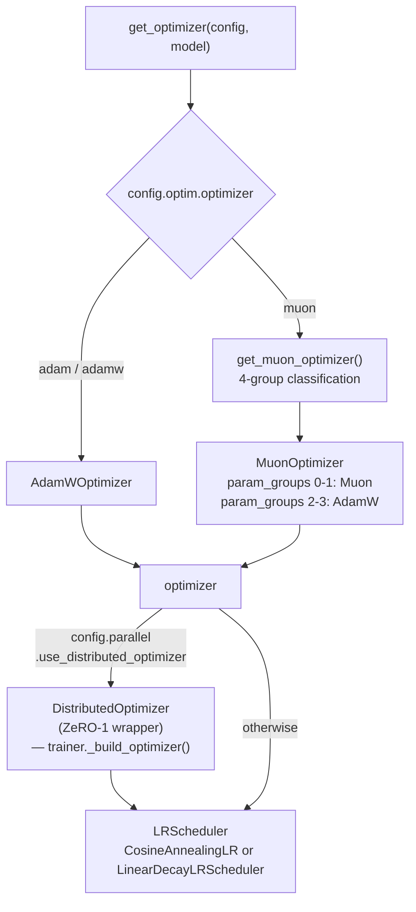
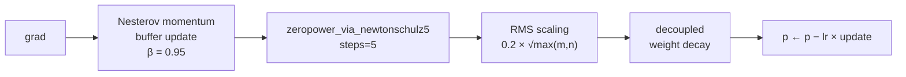
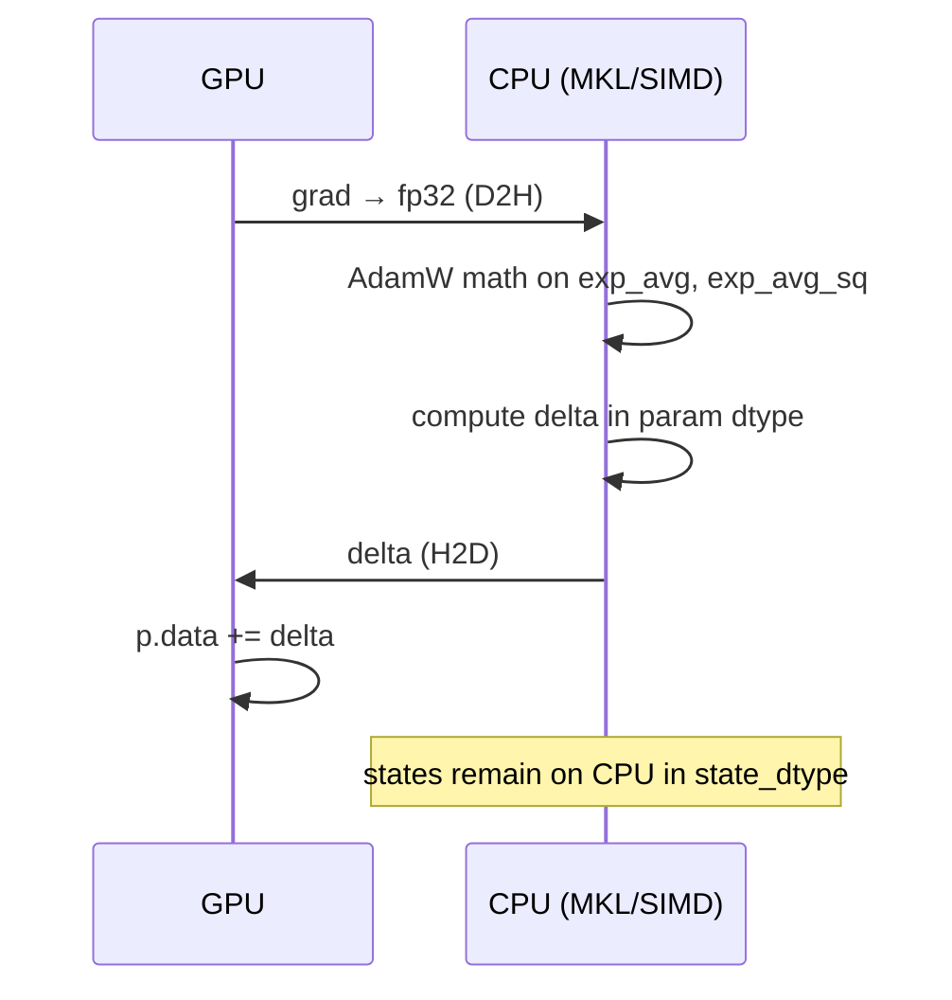

# Optimizer System Design

## Overview

IronCore uses a **Muon + AdamW hybrid optimizer**: Muon with Newton-Schulz
orthogonalization applies to 2D weight matrices (attention projections, MLP weights),
while AdamW handles everything else (embeddings, biases, norms). A single
`MuonOptimizer.step()` drives both in one call via internal param-group routing.

`DistributedOptimizer` wraps any inner optimizer to shard optimizer states across DP
ranks (ZeRO-1) without changing model weight layout.

## Target / Constraints

- Single-node multi-GPU; Muon momentum buffers always live on-device (GPU).
- Only AdamW states can be offloaded to CPU RAM — Muon's orthogonalization requires
  on-device computation.
- `DistributedOptimizer` is incompatible with FSDP (both own the `step()` boundary).
- LR scheduler is stepped once per optimizer step (not per micro-batch).

## Architecture



## Muon Algorithm

File: `ironcore/optimizer/muon.py` — `MuonOptimizer`.

### Newton-Schulz orthogonalization

Function: `zeropower_via_newtonschulz5(G, steps=5, eps=1e-7)`.

Approximates the orthogonal factor in the polar decomposition of the gradient matrix
via 5 iterations of a 5th-order polynomial recurrence (Moonshot AI, arXiv 2502.16982):

```
x ← G.bfloat16()           # convert to bf16 for efficient GPU matmuls
x ← x / (‖x‖_F + ε)       # normalize so singular values ∈ [0, 1]
if x.shape[0] > x.shape[1]:
    x ← xᵀ                 # orient tall → wide

for _ in range(5):
    A = x xᵀ
    x ← a·x + (b·A + c·A²)·x   # a=3.4445, b=−4.7750, c=2.0315

if transposed: x ← xᵀ
```

Output is a semi-orthogonal matrix with operator norm ≈ 1.

### Muon step



Non-2D parameters within a Muon group fall back to SGD with momentum (`_step_sgd_fallback()`).

### State

```python
state = {"step": int, "momentum_buffer": Tensor}
# stored in state_dtype (default: fp32, controlled by optimizer_state_precision config)
```

### `is_muon_param()` decision rule

File: `ironcore/optimizer/muon.py`.

A parameter uses Muon if it passes a **two-stage filter**:

1. **Basic filter** (both required): `.dim() == 2` AND name ends with `.weight`
2. **Exclusion patterns**: name contains `embedding`, `output_layer`, `lm_head`,
   `position_embedding`, or `pos_embedding` → AdamW
3. **Inclusion patterns**: name matches one of the explicit `muon_patterns` list (attention
   projections — `linear_q`, `linear_kv`, `attn_output`, etc. — and MLP projections —
   `up_proj`, `down_proj`, `gate_proj`) → Muon

Norm parameters (`LayerNorm`, `RMSNorm`) are excluded implicitly: they hold 1D weights
(bias) or don't match any `muon_patterns` entry, so they fall through to AdamW.

## 4-Parameter-Group Classification

File: `ironcore/optimizer/__init__.py` — `get_muon_optimizer()`.

Parameters are split on two orthogonal axes:

| Axis | Muon | AdamW |
|---|---|---|
| **Groups 0 / 2** (weight decay) | `is_muon_param()=True` + `should_decay=True` | `is_muon_param()=False` + `should_decay=True` |
| **Groups 1 / 3** (no decay) | `is_muon_param()=True` + `should_decay=False` | `is_muon_param()=False` + `should_decay=False` |

**Weight decay exclusions** (`should_decay = False`):
- `bias` parameters
- `LayerNorm` / `RMSNorm` weight and bias
- `lora_A` (LoRA down-projection)
- Embedding weight if `optim.no_decay_on_embedding: true` (default)

## AdamW

File: `ironcore/optimizer/adamw.py` — `AdamWOptimizer` (custom implementation).

Standard decoupled AdamW with optional AMSGrad:

```
exp_avg     ← β₁·exp_avg + (1−β₁)·grad
exp_avg_sq  ← β₂·exp_avg_sq + (1−β₂)·grad²
step_size   = lr · √(1−β₂ᵗ) / (1−β₁ᵗ)
p           ← p · (1 − lr·λ)              # decoupled weight decay
p           ← p − step_size · exp_avg / (√exp_avg_sq + ε)
```

Within `MuonOptimizer`, AdamW groups are dispatched to `_step_adamw()` — same math,
driven by the hybrid `step()`.

## LR Schedulers

File: `ironcore/optimizer/lr_scheduler.py`.

### CosineAnnealingLR

```
step ≤ warmup_steps:
    lr = base_lr × (step / warmup_steps)

warmup < step < warmup + annealing:
    progress = (step − warmup) / annealing
    lr = min_lr + (base_lr − min_lr) × (1 + cos(π · progress)) / 2

step ≥ warmup + annealing:
    lr = min_lr
```

### LinearDecayLRScheduler

```
step ≤ warmup:   lr = base_lr × (step / warmup)
step > warmup:   lr = base_lr × (1 − (step − warmup) / (total − warmup))
```

`get_lr_scheduler(config, optimizer)` selects based on `config.optim.lr_scheduler`.
Scheduler is stepped once per optimizer step from `BaseTrainer._optimizer_step()`.

## DistributedOptimizer (ZeRO-1)

File: `ironcore/optimizer/distributed_optimizer.py`.

See [Parallelism design — DistributedOptimizer](parallelism.md#distributedoptimizer-zero-1)
for the full round-robin partitioning, broadcast bucketing, and memory model.

Key relationship to Muon: `DistributedOptimizer` wraps any inner optimizer, so
`MuonOptimizer` can be ZeRO-1-sharded transparently:

```python
optimizer = get_muon_optimizer(config, model)  # MuonOptimizer
optimizer = DistributedOptimizer(optimizer, ...)  # ZeRO-1 wrapper
```

## Optimizer State Offload

File: `ironcore/offload/optimizer_helpers.py`.

**Only AdamW states** can be offloaded. Muon momentum buffers remain on GPU (Newton-Schulz
requires on-device matrix ops).

### Offload decision

`_should_offload_param(p, min_param_elements)`:
- `getattr(p, "offloadable", True)` must be `True` (LoRA adapters use `offloadable=False`)
- `param.numel() ≥ optimizer_min_param_elements` (after TP correction)

### CPU compute path

When a parameter's AdamW state is on CPU:



This avoids the `2 × P × 4` bytes per-parameter VRAM cost for fp32 AdamW states.

## Gradient Clipping

File: `ironcore/parallel/grad_norm.py` — `clip_grad_norm()`.

Called from `BaseTrainer._compute_grad_and_param_norms()`, after GradScaler unscale,
before `optimizer.step()`. Correctly handles the TP/EP/DP norm reduction.

See [Parallelism design — Gradient Norm](parallelism.md#gradient-norm) for the full
multi-axis reduction algorithm.

Muon does **not** apply its own gradient norm constraint. Newton-Schulz orthogonalization
changes the *direction* of the update (not its scale), so clipping still matters.

## Configuration Reference

| Field | Group | Description |
|---|---|---|
| `optimizer` | `optim` | `"adam"` \| `"muon"` |
| `lr_scheduler` | `optim` | `"cosine"` \| `"linear"` |
| `max_lr` | `optim` | Peak learning rate |
| `min_lr` | `optim` | Floor LR after annealing |
| `warmup_steps` | `optim` | Linear warmup duration |
| `annealing_steps` | `optim` | Cosine decay window (default: `train_steps`) |
| `weight_decay` | `optim` | L2 weight decay coefficient |
| `adam_beta1 / beta2 / eps` | `optim` | AdamW hyperparameters |
| `no_decay_on_embedding` | `optim` | Exclude embedding from weight decay (default: `true`) |
| `muon_momentum` | `optim` | Muon Nesterov momentum (default: `0.95`) |
| `muon_newton_schulz_steps` | `optim` | Newton-Schulz iterations (default: `5`) |
| `muon_lr_scale` | `optim` | Muon LR = `max_lr × muon_lr_scale` |
| `adamw_lr_scale` | `optim` | AdamW LR = `max_lr × adamw_lr_scale` |
| `clip_grad` | `optim` | Global gradient clip norm (`0` = off) |
| `use_distributed_optimizer` | `parallel` | ZeRO-1 state sharding |
| `dist_opt_bucket_cap_mb` | `parallel` | Broadcast bucket size (default: `25` MB) |
| `optimizer_offload` | `offload` | Offload AdamW states to CPU |
| `optimizer_state_precision` | `offload` | `"fp32"` \| `"bf16"` \| `"fp16"` |
| `optimizer_min_param_elements` | `offload` | Min elements to trigger offload (default: `65536`) |

## File Index

| File | Responsibility |
|---|---|
| `ironcore/optimizer/__init__.py` | `get_optimizer()`, `get_muon_optimizer()` — factory |
| `ironcore/optimizer/muon.py` | `MuonOptimizer`, `is_muon_param()`, `zeropower_via_newtonschulz5()` |
| `ironcore/optimizer/adamw.py` | `AdamWOptimizer` — custom decoupled AdamW |
| `ironcore/optimizer/distributed_optimizer.py` | `DistributedOptimizer` — ZeRO-1 wrapper |
| `ironcore/optimizer/lr_scheduler.py` | `CosineAnnealingLR`, `LinearDecayLRScheduler`, `get_lr_scheduler()` |
| `ironcore/offload/optimizer_helpers.py` | `_adamw_offloaded_step()` — CPU-compute AdamW |
| `ironcore/parallel/grad_norm.py` | `clip_grad_norm()` — multi-axis global norm |
| `ironcore/trainers/base_trainer.py` | `_optimizer_step()`, `_compute_grad_and_param_norms()` |
