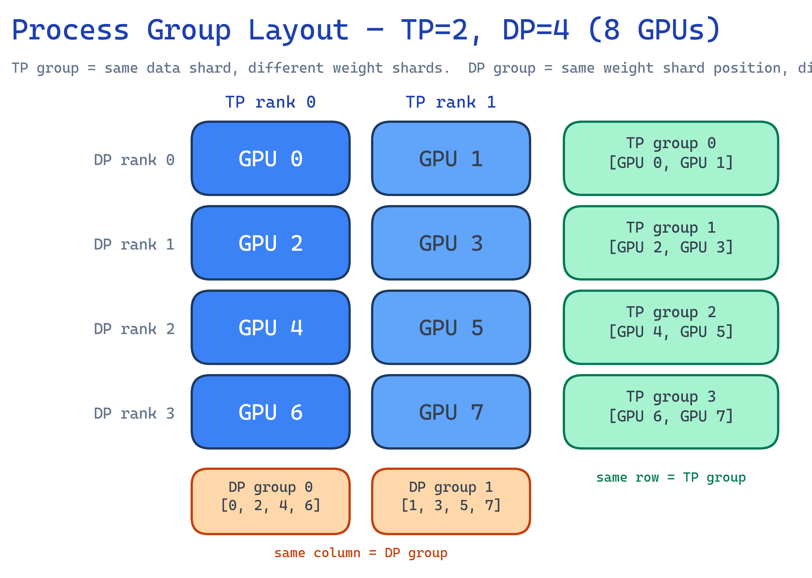
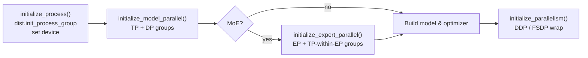
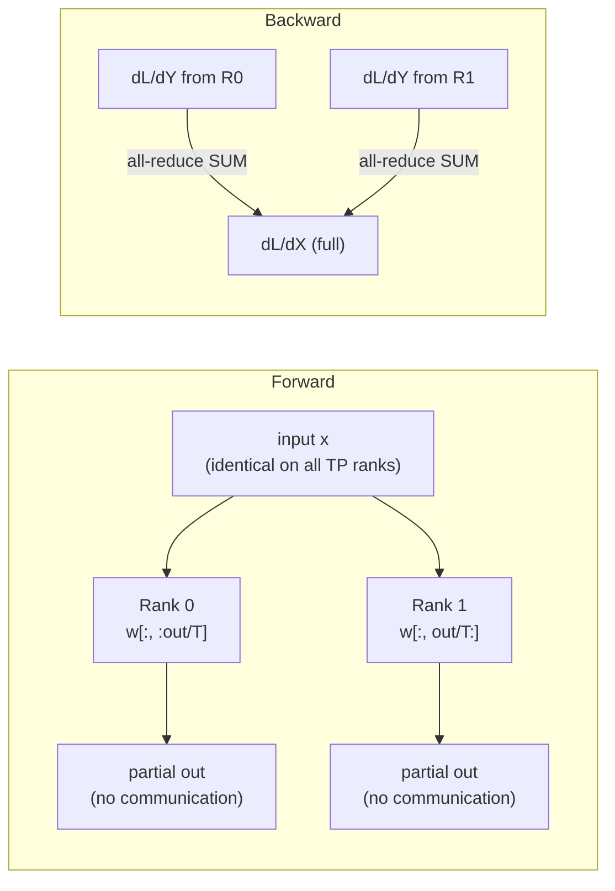
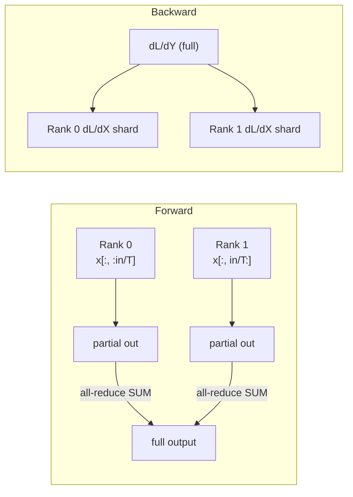
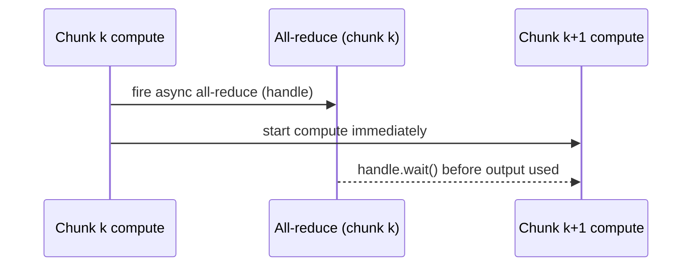
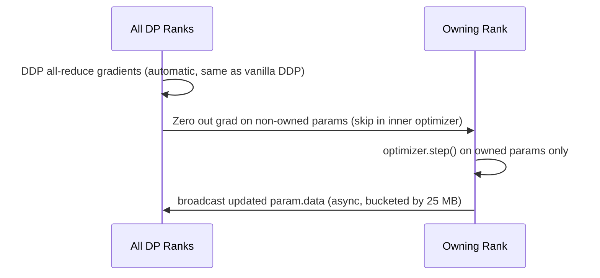
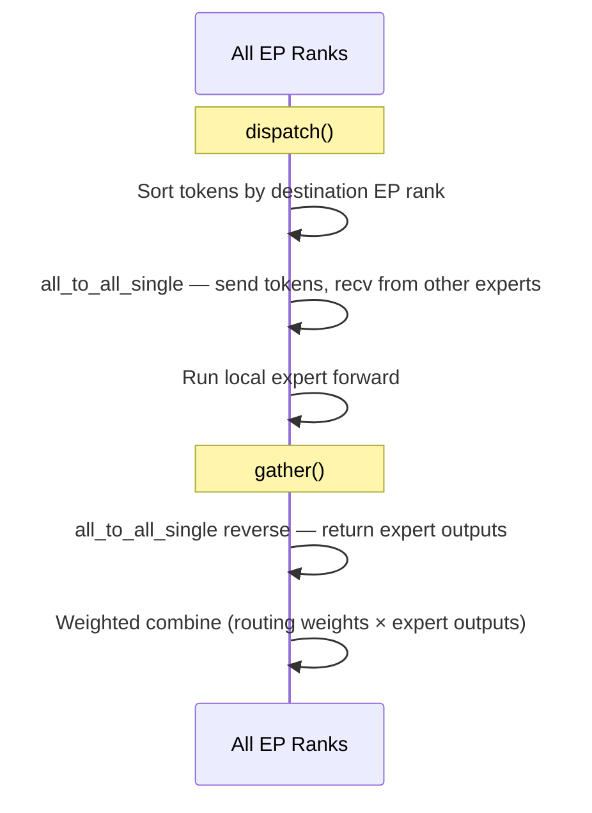

# Parallelism System Design

## Overview

IronCore supports four orthogonal parallelism axes — Tensor Parallelism (TP), Data Parallelism
(DP), Expert Parallelism (EP), and FSDP — that can be combined freely. A single
`DistributedOptimizer` provides ZeRO-1 optimizer state sharding on top of DDP without the
overhead of full FSDP wrapping.

## Target / Constraints

- Single-node or multi-node CUDA (NVLink or PCIe); ROCm via Docker.
- TP requires fast intra-node links (NVLink preferred — collective-heavy within TP group).
- EP is MoE-only; TP and EP can be active simultaneously.
- `DistributedOptimizer` is mutually exclusive with FSDP (both own the optimizer step).
- LoRA adapters are always **replicated across TP ranks**, not sharded — TP correctness is
  handled at the parallel-linear boundaries, not inside the adapter.

## Architecture



### Process group layout

For `world_size = W`, `tp_size = T`, `dp_size = W / T`:

- **TP groups** (T ranks each): `[i*T, i*T+1, …, i*T+T-1]` for `i ∈ [0, dp_size)`.
  All ranks in a TP group process the *same* data shard and hold *different* weight shards.
- **DP groups** (dp_size ranks each): `[j, j+T, j+2T, …]` for `j ∈ [0, T)`.
  All ranks in a DP group hold *different* data shards and *identical* weight shards (same TP position).

Example — 8 GPUs, TP=2, DP=4:

| DP rank | TP rank 0 | TP rank 1 |
|---------|-----------|-----------|
| 0 | GPU 0 | GPU 1 |
| 1 | GPU 2 | GPU 3 |
| 2 | GPU 4 | GPU 5 |
| 3 | GPU 6 | GPU 7 |

TP groups: `[0,1]`, `[2,3]`, `[4,5]`, `[6,7]` — DP groups: `[0,2,4,6]`, `[1,3,5,7]`.

### Initialization order (must be followed exactly)



Files: `ironcore/parallel/parallel_states.py`, `ironcore/parallel/expert_parallel/parallel_states.py`,
`ironcore/parallel/parallel.py`.

## Tensor Parallelism

TP splits weight matrices across ranks and uses collective operations to produce the same
result as a single-GPU forward pass. Two conjugate linear layer types handle the math:

### ColumnParallelLinear

Splits the **output** dimension: each rank holds weight `[in, out/T]`.



- Forward: **no communication** — input is already identical across TP ranks (replicated).
- Backward: `all_reduce(SUM)` on input gradient `dL/dX`.
- File: `ironcore/parallel/tensor_parallel/layers.py` — `ColumnParallelLinear`.

### RowParallelLinear

Splits the **input** dimension: each rank holds weight `[in/T, out]`.



- Forward: `all_reduce(SUM)` on partial outputs to produce the full output.
- Backward: **no communication** — `dL/dY` is already full; each rank computes its own input
  gradient shard via local matmul.

**`input_is_parallel` optimization.** When `RowParallelLinear` follows `ColumnParallelLinear`
(the standard transformer layout), the constructor is called with `input_is_parallel=True`.
The ColumnParallel output is already split across ranks, so no scatter is needed before the
Row matmul. This reduces the Column→Row pair to **exactly one all-reduce per forward pass**
and one per backward pass — the theoretical minimum for this decomposition.

- File: `ironcore/parallel/tensor_parallel/layers.py` — `RowParallelLinear`.

### Attention

QKV projections use `ColumnParallelLinear`; the output projection uses `RowParallelLinear`
with `input_is_parallel=True`. Heads are split evenly:

```
num_local_heads    = num_attention_heads    // tp_size
num_local_kv_groups = num_attention_groups // tp_size  # GQA / MQA
```

The constraint `num_attention_groups % tp_size == 0` is validated at model init.
For MHA (`groups == heads`) and GQA both work identically — the local KV group count
determines how many K/V tensors each rank maintains.

K and V projections are concatenated into a single `ColumnParallelLinear` (`linear_kv`,
`concatenated_weights=2`) so that one kernel handles both, then split via `torch.chunk`.

### Vocab and cross-entropy

`VocabParallelEmbedding` shards the vocabulary across TP ranks; tokens outside a rank's shard
produce zero embeddings and are reduced via `all_reduce(SUM)`. The loss function
`vocab_parallel_cross_entropy` (`ironcore/parallel/tensor_parallel/cross_entropy.py`) handles
numerically stable CE across sharded logits:

1. Share max logit for numerical stability (all_reduce MAX).
2. Extract target logit per rank; all_reduce SUM to find the one non-zero value.
3. Compute exp-sum via all_reduce SUM for normalization.

### Async TP (sequence chunking)

Standard TP blocks on the all-reduce before the next layer can start. Async TP hides this
latency by splitting the sequence into chunks and overlapping the all-reduce for chunk *k*
with the compute for chunk *k+1*.



The mechanism is exposed through `RowParallelLinear.forward(async_communication=True)` and
`MLP.forward(async_communication=True)`, which return `(partial_output, handle)`. The caller
invokes `mlp.finalize(x, handle)` — which calls `handle.wait()` and adds bias/dropout — only
after the next chunk's compute has been issued.

Config: `trainer.sequence_chunk_size` (number of tokens per chunk; `null` disables chunking).
File: `ironcore/parallel/tensor_parallel/comm.py` — `reduce_async()`;
`ironcore/layers/mlp.py` — `MLP.forward()` / `MLP.finalize()`.

## Data Parallelism

### DDP

Standard PyTorch DDP wraps the model over the DP process group. Gradients are
`all_reduce`d (averaged) automatically at backward end. Enabled when `use_fsdp=False` and
`world_size > 1`.

### DistributedOptimizer (ZeRO-1)

`DistributedOptimizer` (`ironcore/optimizer/distributed_optimizer.py`) partitions optimizer
**states** (momentum, variance) across DP ranks without sharding parameters or gradients.
This is the ZeRO-1 point on the memory-communication tradeoff curve.

Assignment: round-robin — rank `r` owns parameters at indices `{i | i % dp_size == r}`.

Step sequence:



- Each rank holds `2 × P × state_bytes / N` bytes of optimizer states (vs `2 × P × state_bytes`
  per rank without ZeRO-1), where `state_bytes` = 4 for fp32, 2 for bf16.
- Compatible with DDP only — not with FSDP (FSDP owns the optimizer step internally).
- Config: `parallel.use_distributed_optimizer: true`, `parallel.dist_opt_bucket_cap_mb: 25`.

See [optimizer design](../optimizer.md) for the full distributed optimizer spec.

### FSDP

`initialize_parallelism()` (`ironcore/parallel/parallel.py`) wraps the model after it is built:

- **No parallelism / single GPU**: no wrapping.
- **DDP**: `torch.nn.parallel.DistributedDataParallel` over the DP group.
- **FSDP**: `torch.distributed.fsdp.FullyShardedDataParallel` over the DP group, with
  `transformer_auto_wrap_policy` for per-layer sharding.

Supported `fsdp_sharding_strategy` values: `FULL_SHARD` (ZeRO-3), `SHARD_GRAD_OP` (ZeRO-2),
`NO_SHARD`, `HYBRID_SHARD`.

When TP > 1, FSDP forward prefetch is disabled (`forward_prefetch=False`) to avoid contention
with async TP all-reduce handles still in flight from the previous layer.

### Choosing between DDP, DistributedOptimizer, and FSDP

| | DDP | DistributedOptimizer | FSDP (full shard) |
|---|---|---|---|
| ZeRO stage | 0 | 1 | 3 |
| Params sharded | no | no | yes |
| Gradients sharded | no | no | yes |
| Optimizer states sharded | no | yes | yes |
| Extra communication | none | broadcast after step | all-gather on forward, reduce-scatter on backward |
| TP compatible | yes | yes | yes (prefetch disabled) |
| Optimizer offload compatible | yes | yes | Blocked for `FULL_SHARD` (duplicated host states); requires `fsdp_use_orig_params=True` for `SHARD_GRAD_OP` |
| When to use | small models, full GPU fit | large models, avoid FSDP overhead | very large models, gradient memory pressure |

## Expert Parallelism (MoE)

EP distributes expert weight shards across EP ranks. Each rank holds `num_experts / ep_size`
experts.

### EP group layout

For `ep_size = E`, `tp_size = T`, each TP position gets its own EP group:

```
World = E × T ranks, laid out as [ep_rank * T + tp_rank]

EP group for TP position j: [j, j+T, j+2T, …, j+(E-1)*T]
```

Example — EP=2, TP=2, 4 GPUs:

| | TP rank 0 | TP rank 1 |
|---|---|---|
| EP rank 0 | GPU 0 | GPU 1 |
| EP rank 1 | GPU 2 | GPU 3 |

EP groups: `[0, 2]`, `[1, 3]`.  TP-within-EP groups: `[0, 1]`, `[2, 3]`.

### Expert dispatch

`AllToAllDispatcher` (`ironcore/parallel/expert_parallel/comm.py`) routes tokens to the
correct EP rank via two `all_to_all_single` calls:



File: `ironcore/parallel/expert_parallel/comm.py` — `AllToAllDispatcher.dispatch()` /
`gather()`.

## Gradient Norm

`clip_grad_norm()` (`ironcore/parallel/grad_norm.py`) computes the true global gradient norm
across all parallelism axes. The challenge: TP-sharded parameters hold partial gradients (must
sum across ranks), while replicated parameters hold full gradients (summing would overcount).

1. **Local power sum**: compute `||grad||^p` per parameter, split into:
   - *sharded* params (`is_tp_sharded=True` — TP-split or EP-split)
   - *replicated* params (identical across ranks)
2. **TP all_reduce** (`SUM`) on all four buckets; divide replicated sums by `tp_size`
   (each rank holds an identical copy, so raw sum overcounts by T).
3. **EP all_reduce** (`SUM`) on expert-sharded power sum only (non-expert params are already
   replicated across EP ranks — no correction needed).
4. **DP all_reduce** (`SUM`) on combined norm; divide by `dp_size` for DDP
   (replicated gradients); no division for FSDP ZeRO-3 (each rank holds a shard, detected
   by checking `p.grad.numel() < p.numel()`).
5. Compute `total_norm = (sum_all) ** (1/p)`; apply clip coefficient if `total_norm > max_norm`.

## LoRA with Tensor Parallelism

LoRA adapters are **replicated** across TP ranks — the same A and B matrices exist on every
rank. TP correctness is handled at the boundary of each parallel linear:

| Base layer | LoRA A | LoRA B | Correctness mechanism |
|---|---|---|---|
| ColumnParallelLinear | replicated | shard output dim | B inherits the TP output split |
| RowParallelLinear | shard input dim | replicated | A partial × B replicated, combined before all_reduce |
| ConcatenatedColumn (Q+K or K+V) | replicated per portion | shard per portion | LoRAConcatenatedColumnParallel handles each portion |

The `RowParallelLinear` variant fuses the base and LoRA partial outputs *before* the
all_reduce, saving one collective.

File: `ironcore/peft/lora.py` — `LoRAColumnParallelLinear`, `LoRARowParallelLinear`,
`LoRAConcatenatedColumnParallel`.

## Offloading Compatibility

IronCore's offload subsystem (`ironcore/offload/`) is a **purpose-built RAM↔GPU streaming
layer**, distinct from PyTorch's `CPUOffload` inside FSDP. The target scenario is a single
GPU with large host RAM, or DDP without FSDP overhead — cases where FSDP sharding is not
applicable or not desirable. For the full design see [offload.md](offload.md); this section
covers how the three offload modes interact with each parallelism axis.

### FSDP compatibility

FSDP and the custom offload subsystem address different problems:

- **FSDP**: multi-GPU parameter sharding (ZeRO-2/3) via all-gather / reduce-scatter.
- **Custom offloading**: single-node RAM↔GPU streaming with prefetch, staging pools, and
  async DMA — applicable to single-GPU or DDP setups where FSDP sharding adds unnecessary
  overhead.

| Offload mode | DDP | FSDP | TP | EP |
|---|---|---|---|---|
| **Weight streaming** | ✓ DP-aware | ✗ skipped | ✓ transparent | ✓ |
| **Activation spilling** | ✓ | ✓ | ✓ | ✓ |
| **Optimizer offload** | ✓ | ✓ (requires `fsdp_use_orig_params`) | ✓ | ✓ |

**Weight streaming** pages weights to GPU one layer at a time, N layers ahead of compute.
With DDP it is DP-aware: `TileManager` receives `dp_group` so each rank streams only its
local shard. With FSDP it is **skipped** at scheduler creation — FSDP all-gathers
parameters into temporary buffers it manages internally; streaming the same tensors
externally would conflict with that lifecycle.

**Activation spilling** hooks into `TransformerLayer.custom_forward()` to save layer
inputs to pinned host RAM and restore during backward. Activations are local tensors with
no distributed state, so this is transparent to all parallelism axes including FSDP.

**Optimizer offload** runs the CPU optimizer step after gradients are transferred to host.
With FSDP, `fsdp_use_orig_params=True` is required so the optimizer holds references to
the original parameter tensors rather than FSDP's internal flat parameters.

### FSDP + custom offloading together

Combining FSDP sharding with IronCore's activation spilling and optimizer offload is a
coherent strategy because each mechanism targets a distinct memory pool:

| Mechanism | What it reduces | Data scope |
|---|---|---|
| FSDP ZeRO-3 | GPU memory for parameters and gradients | sharded across DP ranks |
| Activation spilling | GPU memory for forward activations | **per-rank local** — each rank spills its own micro-batch activations independently |
| Optimizer offload | GPU memory for optimizer states | **per-rank local** — each rank runs the CPU step on its own `1/N` parameter shard |

Activation and optimizer data are not sharded by FSDP — they live on each rank
independently. FSDP already distributed parameters to `1/N` per rank, so when optimizer
offload runs its CPU step it is operating on that reduced shard, not duplicating any work.
The three mechanisms stack without overlap, making the combination particularly effective
for very large models on memory-constrained hardware:

```
FSDP      → reduce parameter + gradient peak memory (1/N per rank via sharding)
+ act spill → reduce activation peak memory (RAM↔GPU per rank, independently)
+ opt offload → reduce optimizer state peak memory (CPU step on rank's 1/N shard)
```

The one constraint: weight streaming remains incompatible with FSDP regardless, since both
systems manage `param.data` and conflict on the same tensors.

## Dataset Sampling

In DP training, each DP rank must consume a **disjoint shard** of the dataset, otherwise
gradient accumulation conflates duplicate samples. The dataset layer uses DP group membership
directly:

```python
self.rank = parallel_states.get_data_parallel_group_rank()
self.world_size = parallel_states.get_data_parallel_world_size()
```

Sharding is deterministic: rank `r` owns global sample indices where
`(index % world_size) == rank`. TP ranks within the same DP group share the rank (they are
in the same DP group at the same position), so they receive identical data — which is required
because TP ranks process the same batch.

Epoch-level shuffling uses a seeded RNG (`seed + epoch`) so the shuffled order is reproducible
from any rank given the same seed, and consistent across TP ranks within a DP group.

The **global batch size** is:
```
global_batch_size = micro_batch_size × gradient_accumulation_steps × dp_size
```

## torch.compile Compatibility

`torch.compile` (dynamo + inductor) is **incompatible with TP>1** in the current architecture.
The root cause is that TP communication is implemented via custom `torch.autograd.Function`
subclasses that wrap `dist.all_reduce` / `dist.all_gather` calls. When dynamo traces through
these functions, it produces an incorrect computation graph — even with the `eager` backend
(no optimization), proving the issue is in dynamo's wrapping, not inductor's codegen.

| TP size | `torch.compile` | Status |
|---------|-----------------|--------|
| TP=1 | ✓ enabled | +42-53% throughput (inductor) |
| TP>1 | ✗ skipped | Falls back to eager execution |

The compile guard is in `ironcore/trainers/base_trainer.py` — `torch.compile` only activates
when `tp_size == 1`. TP>1 runs without compilation and logs an informational message.

**Implication**: For multi-GPU scaling, use **DP** (not TP) with `torch.compile` to get both
correctness and the compile speedup. TP scaling loses inductor optimizations.

See `docs/experiments/torch_compile.md` for the full investigation and benchmark data.

## Trade-offs and Known Bottlenecks

**TP communication overhead.** Each transformer sub-block has two all-reduce collectives
(one in forward, one in backward), regardless of sequence length. This cost is fixed per
layer, so TP scaling efficiency decreases as model compute-to-communication ratio drops —
small models or short sequences on slow interconnects (PCIe) see significant overhead.
NVLink is strongly recommended for TP > 2.

**DistributedOptimizer broadcast.** The post-step broadcast of updated parameters adds
`P × 2 / N` bytes of communication per step (where P = parameter bytes, N = DP size).
For very large models with many optimizer steps, this can exceed the savings from state
sharding. The `dist_opt_bucket_cap_mb` knob controls broadcast granularity (default 25 MB).

**FSDP + TP contention.** FSDP forward prefetch speculatively all-gathers the next layer's
parameters while the current layer runs. When TP > 1, this races with async TP all-reduces
still in flight. IronCore disables forward prefetch (`forward_prefetch=False`) when TP > 1,
trading FSDP's prefetch benefit for stability. Backward prefetch (`BACKWARD_PRE`) is kept
because it does not race with TP.

**EP all-to-all serialization.** Expert dispatch requires two synchronous `all_to_all_single`
calls per MoE layer. Unlike TP all-reduce (which scales with hidden size), the all-to-all
volume scales with sequence × top-k, and does not benefit from NVLink topology awareness.
This becomes a bottleneck at high EP degrees or long sequences.

**Grad norm correctness under mixed parallelism.** The multi-axis norm reduction in
`clip_grad_norm()` adds three collective operations per backward pass (TP, EP, DP
reductions). This is unavoidable for correctness; users who profile communication should
account for this overhead separately from the model collectives.

## Future Directions

**DTensor-based TP migration.** Migrate TP communication from custom `autograd.Function`
wrappers (`comm.py`) to `torch.distributed.tensor.parallel` (DTensor). DTensor handles
collective communication through the tensor dispatcher mechanism instead of custom autograd
Functions, making it compatible with `torch.compile`. This is the same direction Megatron-Core
is moving. The migration would replace `ColumnParallelLinear` / `RowParallelLinear` /
`VocabParallelEmbedding` with DTensor-based primitives, enabling compile + TP simultaneously.
Async TP overlap would shift from manual `async_op=True` handles to compiler-scheduled async
collectives. Requires significant refactoring of `ironcore/parallel/tensor_parallel/`.

**Sequence parallelism (SP).** Distributes LayerNorm and Dropout activations along the
sequence dimension *within the existing TP group* — no new process groups required. In
standard TP, these operations are replicated across all TP ranks (same computation on
identical inputs). SP avoids this by keeping activations sequence-sharded between
Column→Row pairs: `RowParallelLinear` would emit a reduce-scatter instead of all-reduce
(producing a sequence shard), and `ColumnParallelLinear` would all-gather the shard before
the matmul. LayerNorm then operates on the sharded slice. This changes communication volume
from `2 × all-reduce` per sub-block to `all-gather + reduce-scatter`, which is identical
bandwidth but unlocks proportional activation memory savings with TP degree. Since TP
infrastructure already exists, SP is an extension of the existing Column/Row layer pair
rather than a new parallelism axis.

**Context parallelism (CP).** Ring attention distributes the attention computation itself
across a new CP group, enabling very long context windows. Unlike SP (sequence-dim
distribution within TP for activation memory), CP adds a dedicated parallel axis where
each rank holds a contiguous sequence slice and exchanges KV blocks in a ring pattern.
Would require new CP process groups, ring-attention communication, and changes to the
attention kernel. Beneficial when per-head activation memory dominates (>32K tokens).

**Pipeline parallelism (PP).** Micro-batch pipelining across model-depth partitions. Would
add a fourth parallelism axis (PP groups) and require inter-stage send/recv. Current
architecture does not have stage boundaries; adding PP would require splitting `TransformerModel`
into pipeline stages and introducing a schedule (GPipe, 1F1B, etc.).

**GPU-initiated EP dispatch.** Current AllToAll uses CPU-initiated NCCL. GPU-initiated
collectives (NVSHMEM, UCC with GPU-side triggers) could eliminate launch latency for
expert dispatch and enable finer-grained overlap with expert computation.

**FSDP2.** `parallel.py` notes that `torch.distributed._composable.fsdp` (FSDP2) provides
better CPU offload support (pinned memory via `CPUOffloadPolicy`). Migration would require
updating the state-dict type API and the activation checkpointing hook.

**Async TP full integration.** Infrastructure exists (`sequence_chunk_size` config,
`RowParallelLinear.async_communication`, `MLP.finalize()`), but `TransformerModel.forward()`
does not yet split sequences into chunks. Completing this would overlap all-reduce latency
with compute for every transformer sub-block.

## Configuration Reference

| Field | Location | Description |
|---|---|---|
| `tensor_model_parallel_size` | `trainer` | TP degree (default: 1) |
| `sequence_chunk_size` | `trainer` | Tokens per chunk for async TP (`null` = disabled) |
| `use_fsdp` | `parallel` | Enable FSDP wrapping |
| `fsdp_sharding_strategy` | `parallel` | `"full"` \| `"shard_grad_op"` \| `"no_shard"` \| `"hybrid"` |
| `fsdp_use_orig_params` | `parallel` | Required when combining FSDP with optimizer offload |
| `fsdp_mixed_precision` | `parallel` | `"mixed"` forces reduce in fp32 |
| `use_distributed_optimizer` | `parallel` | ZeRO-1 state sharding (DDP only) |
| `dist_opt_bucket_cap_mb` | `parallel` | Broadcast bucket size (default: 25 MB) |
| `expert_model_parallel_size` | `model.moe` | EP degree (MoE only, default: 1) |

## File Index

| File | Responsibility |
|---|---|
| `ironcore/parallel/parallel_states.py` | TP/DP group init and accessors |
| `ironcore/parallel/parallel.py` | `initialize_parallelism()` — DDP/FSDP wrap |
| `ironcore/parallel/tensor_parallel/layers.py` | `ColumnParallelLinear`, `RowParallelLinear`, `VocabParallelEmbedding` |
| `ironcore/parallel/tensor_parallel/comm.py` | Low-level collective primitives; `reduce_async()` for async TP |
| `ironcore/parallel/tensor_parallel/cross_entropy.py` | `vocab_parallel_cross_entropy` |
| `ironcore/parallel/expert_parallel/parallel_states.py` | EP/TP-within-EP group init |
| `ironcore/parallel/expert_parallel/comm.py` | `AllToAllDispatcher` |
| `ironcore/parallel/grad_norm.py` | `clip_grad_norm()` — global norm across TP/DP/EP |
| `ironcore/optimizer/distributed_optimizer.py` | `DistributedOptimizer` — ZeRO-1 |
| `ironcore/peft/lora.py` | LoRA variants for each parallel linear type |
| `ironcore/layers/mlp.py` | `MLP.forward()` / `MLP.finalize()` — async TP path |
| `ironcore/dataloader/dataset.py` | DP-aware data sharding (`get_data_parallel_group_rank`) |
