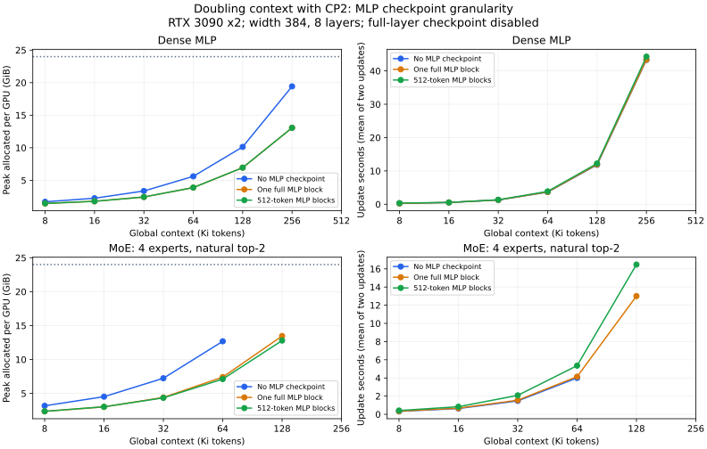

# Doubling context: MLP checkpoint block size

Measured 2026-10-09 on two RTX 3090 24-GiB GPUs, PyTorch 2.14.0+cu130.
Baseline implementation: `7d49f6a`. The experiment asks whether smaller MLP
checkpoint blocks save additional memory or extend the supported training context.

On the doubling grid, Dense completes through 262144 tokens in all three modes.
MoE completes through 65536 without MLP checkpoints and 131072 with either
checkpoint granularity. At MoE 131072, 512-token blocks save another 4.97% peak
versus a full block but cost 26.7% more update time. Dense has almost no additional
peak saving from smaller blocks. Neither architecture gains another successful
doubling step from granularity alone. Intermediate lengths are untested, so these
results do not establish the exact context threshold or rule out a smaller increase.

## Controlled comparison

Two random-initialized decoders: width 384, eight layers, six MHA heads, SwiGLU
FFN width 1024, vocabulary 49152, untied embeddings. Dense uses a single MLP;
MoE uses four routed experts, natural top-2, one shared expert and the batched
backend. Every expert receives tokens. No router is forced to a subset. The
SmolLM2-135M tokenizer is reused; its pretrained weights are not used. Comparisons
are within each architecture, not between their different parameter counts.

CP2/TP1/EP1, global batch 2, microbatch 1, gradient accumulation 2, BF16 compute,
FP32 master parameters, Adam at constant 1e-4, seed 42, zero dropout and no
whole-layer checkpointing. Linear-CE recomputation uses chunk 128. Only context
length, matching RoPE/model capacity and the MLP execution mode vary:

- `none`: no MLP checkpoint or token split.
- `full`: MLP checkpoint enabled with `mlp_chunk_size = context / CP`; each shared
  MLP and routed expert fits into a single block per microbatch.
- `blocked`: same per-block checkpoint machinery with `mlp_chunk_size = 512`.

Start at 8192 to reestablish the control, then double independently until every
architecture/mode records a real CUDA out-of-memory exception. A fresh two-process
torchrun job is used for every point. GPU count and microbatch are not reduced
when a mode fails. RoPE capacity is extended for a systems experiment; these
runs do not evaluate long-context model quality or pretraining convergence.

Each successful point completes three production `LanguageModelTrainer` updates
including forward, backward, gradient checks and Adam state allocation. Peak is
maximum allocated memory across ranks over all three updates. Time is the mean
of updates 2 and 3, taking the slower CUDA-synchronized rank per update. These are
short timing samples, especially at small contexts; use them as cost estimates,
not evidence of small kernel-speed differences. Outside-step logging is excluded.



## Dense MLP

| Context tokens | No MLP checkpoint: MiB / s | One full MLP block: MiB / s | 512-token blocks: MiB / s |
|---:|---:|---:|---:|
| 8192 | 1740 / 0.246 | 1479 / 0.250 | 1479 / 0.351 |
| 16384 | 2299 / 0.522 | 1818 / 0.530 | 1814 / 0.549 |
| 32768 | 3441 / 1.289 | 2495 / 1.303 | 2494 / 1.343 |
| 65536 | 5742 / 3.652 | 3973 / 3.687 | 3978 / 3.860 |
| 131072 | 10375 / 11.838 | 7108 / 11.949 | 7110 / 12.228 |
| 262144 | 19896 / 43.320 | 13382 / 43.395 | 13380 / 44.289 |
| 524288 | OOM | OOM | OOM |

## MoE with natural routing

| Context tokens | No MLP checkpoint: MiB / s | One full MLP block: MiB / s | 512-token blocks: MiB / s |
|---:|---:|---:|---:|
| 8192 | 3252 / 0.323 | 2410 / 0.344 | 2424 / 0.416 |
| 16384 | 4630 / 0.637 | 3092 / 0.675 | 3103 / 0.836 |
| 32768 | 7412 / 1.477 | 4509 / 1.553 | 4452 / 2.085 |
| 65536 | 12989 / 4.002 | 7586 / 4.139 | 7284 / 5.351 |
| 131072 | OOM | 13785 / 13.004 | 13100 / 16.473 |
| 262144 | — | OOM | OOM |

## Observed ceilings

| Architecture | MLP mode | Largest completed context | Next doubled context: OOM | OOM phase |
|---|---|---:|---:|---|
| dense | No MLP checkpoint | 262144 | 524288 | forward |
| dense | One full MLP block | 262144 | 524288 | forward |
| dense | 512-token MLP blocks | 262144 | 524288 | forward |
| moe | No MLP checkpoint | 65536 | 131072 | forward |
| moe | One full MLP block | 131072 | 262144 | forward |
| moe | 512-token MLP blocks | 131072 | 262144 | forward |

These are observed bounds on the doubling grid for this model, optimizer and hardware.
Lengths between the largest success and the next doubled OOM were not tested.
An OOM row is a failed execution rather than a measured successful peak. Its
failure JSON retains the allocation exception, rank, completed-update count and
phase; the launcher terminates peers rather than waiting at a failed teardown barrier.
A missing `—` entry means that mode had already reached its observed OOM ceiling.
Actual available memory is below nominal VRAM because CUDA/NCCL and allocator
reservations also consume device memory. Allocator settings use the container defaults.

## Additional effect of smaller blocks

This isolates **full MLP checkpoint versus 512-token checkpoint blocks**, rather
than conflating checkpoint activation savings with token granularity.

| Architecture | Context | Peak reduction from full to 512 | Update-time change from full to 512 |
|---|---:|---:|---:|
| dense | 8192 | 0.00% | +40.6% |
| dense | 16384 | 0.21% | +3.5% |
| dense | 32768 | 0.04% | +3.1% |
| dense | 65536 | -0.13% | +4.7% |
| dense | 131072 | -0.02% | +2.3% |
| dense | 262144 | 0.02% | +2.1% |
| moe | 8192 | -0.58% | +20.9% |
| moe | 16384 | -0.36% | +23.8% |
| moe | 32768 | 1.26% | +34.3% |
| moe | 65536 | 3.99% | +29.3% |
| moe | 131072 | 4.97% | +26.7% |

Full hidden-size inputs/outputs, attention state, routing/combination buffers,
parameters, gradients and Adam state still scale or remain resident. A block
budget bounds expanded FFN working rows, not total training memory. The results
above determine the practical value of granularity for this configuration;
they do not imply the same ceiling for a different FFN width or layer count.

## Validation and artifacts

32 successful fresh GPU jobs complete 96 global Adam updates;
6 additional jobs establish CUDA OOM ceilings. All successful metrics are finite.
Each MoE layer on each rank records exactly `steps * accumulation * local_tokens * top_k`
assignments and has nonzero counts for all four experts. Maximum paired loss
difference is 4.77e-06; maximum relative gradient-norm difference is 0.000136.
These scalar checks complement the existing individual-gradient regression tests.

[CSV results](context_block_scaling.csv) include timing, memory and model TFLOPS/s/GPU.
The FLOPs estimate uses `MFUCalculator` and its `6*N*tokens` approximation with
active MoE FFN width `(shared + top_k) * expert_width`. Quadratic attention,
checkpoint recomputation and MoE padding are excluded, so this is not measured
hardware utilization and undercounts long-context attention work.

The benchmark reports exact config snapshots, both ranks' records, expert
counts, parameter counts and endpoint memory breakdowns. Endpoint gradients
have been cleared; residual allocation estimates are not peak activations.
Ignored `.local/context-block-scaling/` contains the raw JSON, OOM diagnostics,
summary and PNG/PDF plots. `.local/context-block-scaling-study.html` is a
standalone Korean study artifact excluded from Git.

## Reproduce one point

```bash
PYTHONPATH=. torchrun --standalone --nproc_per_node=2 \
  scripts/benchmark_context_blocks.py \
  --config configs/experiments/moe_scaling_cp2.yaml \
  --tokenizer .local/models/SmolLM2-135M \
  --model-type moe --checkpoint-mode blocked --block-size 512 \
  --context 32768 --steps 3 --warmup 1 \
  --report .local/context-block-scaling/example.json
```

Use `--model-type dense` for the dense control and `--checkpoint-mode none|full`
for its baselines. Double `--context` in fresh jobs until each mode records OOM.
