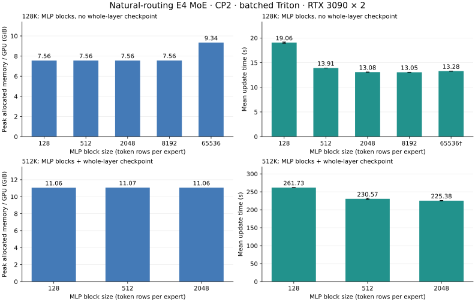

# Whole-layer checkpointing and MLP block-size validation

These measurements predate retirement of `virtual_block_size`. Current grouped
execution plans groups directly from `grouped_token_budget`; historical tile
values below describe the measured implementation and are not current options.

This extends [scheduled MoE validation](scheduled_moe_validation.md) with actual
CP2 trainer runs at 512K and a controlled MLP/block-budget sweep at 128K.
All measurements use natural top-2 routing over four experts plus one shared
expert. The 128K block-512 batched and grouped reference rows were rerun in this stage. Only the 256K success and previous 512K/block-512 OOM are reused records.
Source paths are identified in the [CSV](layer_checkpoint_block_validation.csv).

512K completes three training updates with whole-layer checkpointing: 11.07 GiB/GPU, 230.572 s/update at MLP block 512. This validates the existing recomputation path; no fused RMSNorm was added.

Increasing the batched block from 128 to 8192 at 128K changes peak from 7.56 to 7.56 GiB/GPU and time from 19.062 to 13.050 s/update. The MLP block controls bounded transient work; it does not remove full-length saved layer state.

At the same 128K context and MLP block 512, whole-layer checkpointing reduces peak from 7.56 to 3.80 GiB/GPU (49.7%). Time changes from 13.913 to 17.554 s/update.

A full-local-sequence MLP block (65536 rows at 128K/CP2) completes with 9.34 GiB/GPU and 13.283 s/update including dynamic-width JIT. This brackets the sweep with one shared-MLP block and no token splitting within each routed expert.

512K still fails before its first update with layer checkpointing off and an MLP block of 128. Reducing that block fourfold from the previous 512-token OOM baseline alone does not cross this capacity threshold.

The grouped 128K row-budget/virtual-tile sweep has peak values from 7845.1 to 7860.5 MiB/GPU. Reducing the group budget or virtual tile does not yield a substantial peak reduction in this tested range.

## Method

Two RTX 3090 GPUs with NVLink, CP2/TP1/EP1, width 384, eight layers, six MHA heads,
expert FFN width 1024, untied vocabulary 49152, BF16 compute with FP32 master
weights, Adam, seed 42, microbatch 1, batch 2, accumulation 2. Random-initialized
weights; SmolLM2-135M provides only the cached tokenizer. Linear CE recomputation
uses chunk 128 in every run. Every successful run completes three optimizer
updates. Peak is maximum PyTorch allocated CUDA memory across ranks over all
three updates. Time averages updates 2 and 3, selecting the slower rank for each.
Allocated peak excludes unallocated allocator reservations and non-PyTorch CUDA
storage such as NCCL buffers; device-monitor occupancy can therefore be higher.
These short timing samples are exploratory; they do not establish universal
speedups. Failed allocated peaks are retained only in the CSV as failure
diagnostics, never as successful training peaks.

`--layer-checkpoint standard` enables the existing non-reentrant whole transformer
layer checkpoint. `none` retains the previous benchmark default. Whole-layer
recomputation also covers attention and both normalization operations, and retains
layer boundary inputs. It does not implement fused normalization or split the
CP attention sequence into MLP-sized pieces.

The equivalent training YAML controls are:

```yaml
operation:
  activation_recompute: true
  recompute_strategy: standard
trainer:
  mlp_chunk_size: 512
```

For `expert_backend=batched`, `--block-size` sets the maximum token rows **per
expert** in a batched projection and the shared MLP's token chunk. Natural routing
counts and padded rows still determine the actual batched work. For `grouped`,
this argument controls the shared MLP; routed expert GEMMs instead use
`virtual_block_size` and `grouped_token_budget`. The latter caps physical rows in
one execution group; a virtual tile is a logical scheduling unit, not necessarily
a separate GEMM. Each grouped sweep changes only one routed scheduling control,
holding shared MLP chunks at 512.

## Batched expert results

| Context | Layer checkpoint | MLP block | Peak MiB / GPU | Update s | Updates |
|---:|---|---:|---:|---:|---:|
| 131072 | none | 128 | 7740.2 | 19.062 | 3 |
| 131072 | none | 512 | 7743.1 | 13.913 | 3 |
| 131072 | none | 2048 | 7741.1 | 13.084 | 3 |
| 131072 | none | 8192 | 7745.1 | 13.050 | 3 |
| 131072 | none | 65536 | 9563.6 | 13.283† | 3 |
| 131072 | standard | 512 | 3891.5 | 17.554 | 3 |
| 262144 | none | 512 | 14079.6 | 46.960 | 3 |
| 524288 | none | 128 | OOM (0 updates) | — | 0 |
| 524288 | none | 512 | OOM (0 updates) | — | 0 |
| 524288 | standard | 128 | 11321.4 | 261.730 | 3 |
| 524288 | standard | 512 | 11333.7 | 230.572 | 3 |
| 524288 | standard | 2048 | 11327.3 | 225.382 | 3 |

† The full-local-sequence block (65536) creates 92 new Triton pack-kernel variants, including 60 after the excluded warmup update. Cache snapshots across both ranks confirm this. Batched packing uses `width = min(max(expert_counts), mlp_chunk_size)` and specializes the pack kernel on that width. When the configured chunk exceeds the routed capacity, width can change each microbatch. The full-block time therefore includes ongoing JIT work and is not a compile-free throughput comparison. Its measured peak and completed updates remain valid. The 128–8192 bounded block sizes are below the largest expert count in these 128K/E4 runs and keep their packing width fixed.



The chart uses the same rows as the table. Memory is peak allocated storage;
time is the average of two post-warmup updates. The axes start at zero.
Time error bars show the sample standard deviation of those two updates.

## Grouped expert scheduling results

| Context | Layer checkpoint | MLP block | Virtual tile | Group row budget | Peak MiB / GPU | Update s | Updates |
|---:|---|---:|---:|---:|---:|---:|---:|
| 131072 | none | 512 | 128 | 1024 | 7854.3 | 14.785 | 3 |
| 131072 | none | 512 | 128 | 4096 | 7845.1 | 13.924 | 3 |
| 131072 | none | 512 | 512 | 4096 | 7847.5 | 13.940 | 3 |
| 131072 | none | 512 | 128 | 8192 | 7860.5 | 13.864 | 3 |

## Training checks

This stage executes 13 fresh successful runs (39 new updates)
and 1 fresh allocation failure. The remaining records are reused baselines.

The combined table contains 14 successful runs (42 updates) and
2 allocation failures, including the reused baseline records. Every
successful rank has finite loss, gradient norm, and parameter norm on all updates.
Each of the eight MoE layers uses all four experts. Selection-counter totals
match exactly `3 * accumulation * local_tokens * top_k`, including whole-layer
recomputation, so replay is not counted as additional training routing.
Against the same-seed 128K batched/block-512/no-layer-checkpoint baseline, maximum
absolute loss difference is 1.4305115e-06; maximum absolute gradient-norm
difference is 2.4549663e-06. These are trainer-level checks in addition to the
previous forward/backward correctness tests, not a claim of bitwise equality.
Both absolute differences must remain below 1e-4 in the report validation.
For the 512K checkpointed block-size comparisons against block 512, maximum
absolute loss difference is 9.5367432e-07; maximum gradient-norm
difference is 3.5762787e-06, with the same 1e-4 acceptance thresholds.

The CSV retains estimated model TFLOPS/s/GPU from `MFUCalculator`. Its
`6*N*tokens` estimate omits quadratic attention, recomputation, padding and routing;
it must not be read as measured hardware utilization. Raw records contain the
same production `get_detailed_memory_breakdown` after-update snapshots as before;
post-update activation storage is not a training-peak decomposition.

The CPU suite for this stage passes 915 tests, with 30 skips and 289 deselected
CUDA/distributed/e2e/Hub items (`not cuda and not mp and not e2e and not hf_hub`).
Ruff check and format checks pass. CUDA validation here consists of the actual
two-GPU trainer runs above; the scheduled/routing and CP numerical tests are
documented in the preceding validation report.

## Reproduction

Run each measurement in a fresh two-GPU container process, with the offline
tokenizer available:

```bash
HF_HUB_OFFLINE=1 torchrun --standalone --nproc_per_node=2 \
  scripts/benchmark_context_blocks.py \
  --config configs/experiments/moe_scaling_cp2.yaml \
  --tokenizer .local/models/SmolLM2-135M --model-type moe \
  --checkpoint-mode blocked --layer-checkpoint standard \
  --context 524288 --experts 4 --expert-backend batched \
  --blockwise-backend triton --block-size 512 \
  --report .local/layer-checkpoint-blocks/reproduction.json
```

For the MLP sweep use `--context 131072 --layer-checkpoint none` and
`--block-size 128|512|2048|8192|65536`. For routed grouped scheduling use
`--expert-backend grouped --block-size 512` and independently adjust
`--grouped-token-budget`. The historical virtual-tile sweep cannot be rerun
with the retired option on the current implementation.
