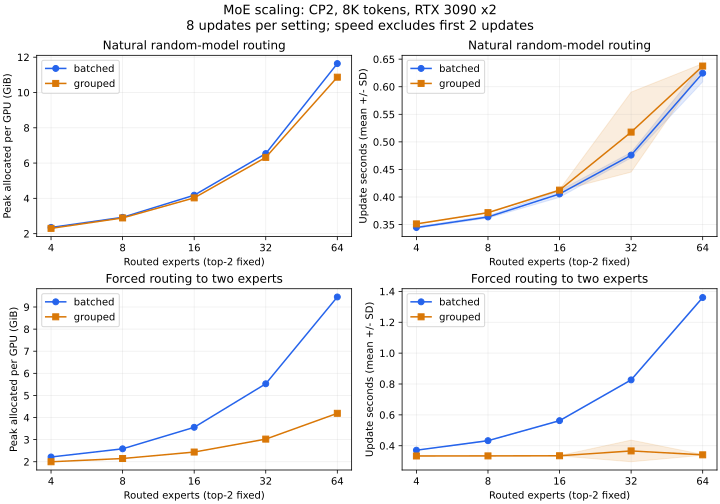

# MoE expert-count scaling with CP2

These measurements predate retirement of `virtual_block_size`. Current grouped
execution plans groups directly from `grouped_token_budget`; historical tile
values below describe the measured implementation and are not current options.

Measured 2026-10-08 on two RTX 3090 24-GiB GPUs, PyTorch 2.14.0+cu130.
Implementation baseline: `c3bbbf2`. This is expert-count scaling at a fixed GPU
count, rather than distributed strong scaling.

## Method

Twenty fresh two-process CUDA jobs: routed experts 4, 8, 16, 32 and 64; batched
and grouped backends; natural random-model routing and routing forced to two experts.
Every job completes eight production `LanguageModelTrainer` Adam updates, with the
first two excluded from time measurements. Across the sweep this is 160 optimizer
updates. Times synchronize CUDA and take the slower rank for each update before
averaging; peaks take the maximum allocated memory across ranks over all updates.
Logging and checkpoint handling outside `train_step` are excluded. Timing bands
in the figure are sample standard deviations, not confidence intervals.

Fixed width 384, eight layers, six attention heads, SwiGLU expert width 1024,
one shared expert, top-2, vocabulary 49152, untied embeddings, BF16 compute and FP32
master parameters. CP2/TP1/EP1, 8192 sequence length, global batch 2, microbatch 1,
accumulation 2, no whole-layer checkpointing, linear-CE recomputation with chunk
128, shared/batched MLP chunk 4096, virtual tile 128 and grouped budget 4096.
Seed 42, learning rate 1e-4. Both routing regimes have router bias enabled.
The forced case zeros router weights, sets the first two biases to 4 and 3 and
all remaining biases to -4 before training. Routing and the auxiliary loss still
train normally; the resulting routing counts are checked afterward.

These are randomly initialized small decoders and random tokens. The tokenizer
comes from SmolLM2-135M; pretrained SmolLM2 weights are not used.



## Natural routing

| Routed experts | Batched peak (MiB) | Grouped peak (MiB) | Batched update (s) | Grouped update (s) |
|---|---:|---:|---:|---:|
| 4 | 2410.0 | 2354.9 | 0.345 | 0.351 |
| 8 | 2996.0 | 2960.6 | 0.364 | 0.372 |
| 16 | 4280.4 | 4124.4 | 0.406 | 0.413 |
| 32 | 6694.3 | 6474.8 | 0.476 | 0.518 |
| 64 | 11917.7 | 11127.5 | 0.625 | 0.638 |

Grouped has limited memory savings and no demonstrated speed advantage for natural
routing. At 64 experts peak falls from 11.64
to 10.87 GiB, but update time remains similar.
All experts receive tokens over the run, so parameters, gradients and Adam states
grow with expert count even though top-2 is fixed. The helper reports approximately
2502 MiB of parameters and
5005 MiB of Adam states on each rank at E64.
Those states are replicated with EP1 and are not bounded by `grouped_token_budget`.

A separate 16-update repeat (first four excluded) of natural E32 measured batched 0.489 +/- 0.007 s and grouped 0.517 +/- 0.098 s. The main eight-update grouped E32 run includes a 0.666 s step, and the longer repeat also has variable timing. These short measurements do not establish precise small throughput differences.
Forced E32 repeats measured batched 0.832 +/- 0.003 s and grouped 0.354 +/- 0.052 s. All four repeats completed 16 updates each, bringing total completed updates to 224.

## Routing concentrated in two experts

| Routed experts | Batched peak (MiB) | Grouped peak (MiB) | Batched update (s) | Grouped update (s) |
|---|---:|---:|---:|---:|
| 4 | 2268.5 | 2046.8 | 0.371 | 0.334 |
| 8 | 2646.9 | 2197.0 | 0.433 | 0.334 |
| 16 | 3643.3 | 2496.9 | 0.562 | 0.335 |
| 32 | 5659.3 | 3096.3 | 0.827 | 0.366 |
| 64 | 9680.8 | 4291.1 | 1.360 | 0.341 |

At 64 experts grouped reduces peak by 55.7% and update time by
74.9% (3.99x tokens/s).
Batched expands all 64 experts to local capacity 4096: 262144 padded rows per
microbatch/layer versus 8192 valid assignment rows. Grouped skips idle experts
and keeps the expanded FFN within its execution budget. Increasing expert count
still adds stored weights; inactive experts retain `grad=None` and do not acquire
Adam states. The forced E64 grouped endpoint has approximately
2502 MiB of parameters and
541 MiB of Adam states.
This combines padding removal, idle-expert skipping and checkpoint scheduling;
it does not isolate grouped-GEMM kernel speed.

## Checks and practical limits

All 20 jobs complete without OOM or nonfinite loss/gradient/parameter norms.
Every layer on every rank records exactly 131072 routed assignments, and forced
runs record only the two intended experts. Across all paired backends, maximum
loss difference is 2.57e-05, and maximum relative gradient-norm difference
is 0.00421. Scalar comparisons complement the previously established
output/individual-gradient tests; they do not replace them or establish training quality.

[CSV results](moe_scaling_cp2.csv) include mean/standard-deviation update time,
tokens/s and approximate model TFLOPS/s/GPU. FLOPs use `MFUCalculator.from_config`
with `(shared + top_k) * expert_width` as active FFN width and the `6*N*tokens`
approximation. Padding, recomputation, routing and quadratic attention are excluded.
Memory breakdown is sampled after training when gradients have been cleared;
its `estimated_activations` entry describes endpoint residual allocations, not
peak live training activations. Peak allocated memory is measured separately.

The grouped advantage grows with routing imbalance; expert count alone is not
sufficient. For naturally active experts the next memory bottleneck is expert
parameter/gradient/optimizer storage. Grouped remains EP1-only. No four-GPU
or multi-node scaling claim follows from these two-GPU measurements.

## Reproduce

Install IronCore inside a GPU container. The supplied config downloads only the
SmolLM2 tokenizer; cache it first for offline runs, or replace both tokenizer paths
with `.local/models/SmolLM2-135M` as in the measured environment.

```bash
PYTHONPATH=. torchrun --standalone --nproc_per_node=2 \
  scripts/benchmark_moe_scaling.py \
  --config configs/experiments/moe_scaling_cp2.yaml \
  --experts 64 --backend grouped --routing forced \
  --steps 8 --warmup 2 --report .local/moe-scaling/example.json
```

Run each combination in a fresh process and with a new report path. Reports retain
both ranks' step records, expert counts, memory breakdowns and parameter counts.
Raw JSON, PNG/PDF plots and a Korean standalone study HTML are ignored under `.local/`.
