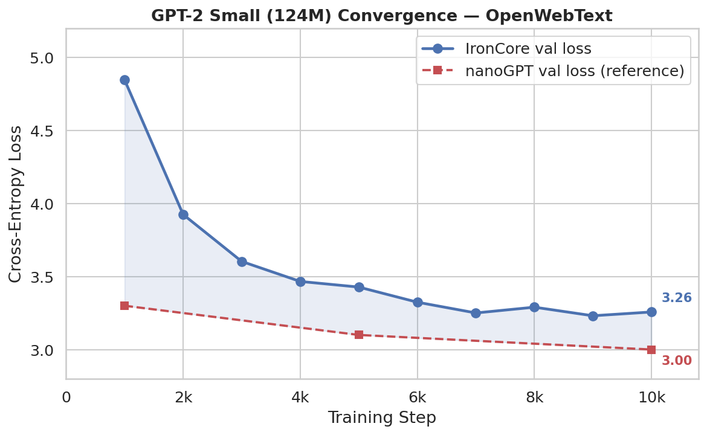

# Convergence Validation: GPT-2 small vs nanoGPT

**Status:** Complete (10k steps)  
**Config:** `configs/experiments/nanogpt_convergence_dp2.yaml` + `configs/model/nanogpt-small.yaml`  
**Hardware:** 2× RTX 3090 (NVLink), DP=2, torch.compile (inductor)  
**Reference:** [karpathy/nanoGPT](https://github.com/karpathy/nanoGPT) — `configs/train_gpt2.py`

## Goal

Verify that IronCore's pretraining loss curve matches the nanoGPT reference implementation
on identical hyperparameters. A close match confirms that the training loop, optimizer, and
data pipeline produce numerically equivalent results.

## Setup

| | IronCore | nanoGPT |
|---|---|---|
| Model | GPT-2 small (124M) | GPT-2 small (124M) |
| Dataset | OpenWebText (99/1 train/val split) | OpenWebText (99/1 train/val split) |
| Tokens/step | 491,520 (480 seq × 1024) | 491,520 |
| Peak LR | 6e-4 | 6e-4 |
| Min LR | 6e-5 | 6e-5 |
| LR schedule | Cosine | Cosine |
| Warmup | 2,000 steps | 2,000 steps |
| Weight decay | 0.1 | 0.1 |
| Optimizer | AdamW (β₁=0.9, β₂=0.95) | AdamW (β₁=0.9, β₂=0.95) |
| Grad clip | 1.0 | 1.0 |
| Seed | 1337 | 1337 |
| Bias | **None** (bias=False) | None (bias=False) |
| LayerNorm bias | **None** | None |
| GELU variant | **`gelu_new`** (tanh approx.) | `gelu_new` |

## Reference values (nanoGPT)

| Tokens processed | Steps | nanoGPT val loss | Est. time (RTX 3090) |
|---|---|---|---|
| ~500M | 1,000 | ~3.30 | ~45 min |
| ~2.5B | 5,000 | ~3.10 | ~3.5 h |
| **~5B** | **10,000** | **~3.00** | **~7 h** |
| ~10B | 20,000 | ~2.97 | ~14 h |
| ~25B | 50,000 | ~2.90 | ~35 h |
| convergence | 200,000+ | ~2.85 | — |

**Recommended run:** 10k steps — enough to validate the loss curve against multiple reference points in ~7 hours.

> **LR schedule note:** `annealing_steps` is set to 600,000 (matching nanoGPT's `lr_decay_iters`)
> regardless of `train_steps`. This ensures the LR at step N is identical to nanoGPT's LR at step N.

## IronCore results

10k steps, DP=2, torch.compile, bf16. Validation loss measured post-hoc via
`scripts/eval_checkpoints.py` (40 batches × 12 sequences = 480 val sequences per checkpoint).

| Step | Tokens | Train Loss | Val Loss | PPL | nanoGPT Val | Δ |
|------|--------|------------|----------|-----|-------------|---|
| 1,000 | ~500M | 4.81 | 4.85 | 127.2 | ~3.30 | +1.55 |
| 2,000 | ~1B | 3.88 | 3.92 | 50.6 | ~3.20 | +0.72 |
| 3,000 | ~1.5B | 3.55 | 3.60 | 36.7 | ~3.15 | +0.45 |
| 5,000 | ~2.5B | 3.40 | 3.43 | 30.8 | ~3.10 | +0.33 |
| 7,000 | ~3.5B | 3.30 | 3.25 | 25.8 | ~3.06 | +0.19 |
| 10,000 | ~5B | 3.20 | 3.26 | 26.0 | ~3.00 | +0.26 |

**Training throughput:** ~90K tok/s, ~33.4 TFLOPS/s/GPU, 5.46s/step



WandB: https://wandb.ai/haanjack/ironcore/runs/3zx28xv6

## How to run

```bash
# Preprocess OpenWebText (one-time)
ironcore preprocess --config configs/data/nanogpt_owt.yaml

# Train (single GPU, ~14h on RTX 3090 for 100k steps)
ironcore train --config configs/experiments/nanogpt_convergence.yaml

# Resume if interrupted
ironcore train --config configs/experiments/nanogpt_convergence.yaml
# (auto-resumes from latest_step.txt in outputs/nanogpt_convergence/)
```

Logs go to the run's WandB project (or stdout if WandB is not configured).
Track `val_loss` vs `tokens_processed` for direct comparison with nanoGPT.

## Notes on differences

- **FlashAttention:** IronCore uses FlashAttention by default; nanoGPT has an optional FA path. Both give numerically equivalent outputs.
- **Vocab padding:** `vocab_padding_unit: 128` pads the vocabulary from 50,257 to 50,304 for CUDA efficiency. The extra embeddings are zero-initialized and not reachable from the tokenizer — no effect on loss.
- **Dropout:** nanoGPT supports configurable dropout; this run uses 0.0 (no dropout) matching the nanoGPT default training config.
- **Model config:** `nanogpt-small.yaml` differs from the general-purpose `gpt2-small.yaml` in three ways: `bias=False` for all linear projections, `layernorm_bias=False`, and `activation_type=gelu_new`. These match nanoGPT's `train_gpt2.py` exactly.

## Analysis: val loss gap (~0.26 at 10k steps)

ironcore's val loss is consistently higher than nanoGPT. The gap narrows from +1.55
at step 1k to +0.26 at step 10k. Contributing factors:

1. **Data sampling (primary):** ironcore uses IID shuffling with a shuffle buffer;
   nanoGPT reads documents sequentially. Different document ordering leads to different
   gradient trajectories, especially early in training.
2. **Train/val split:** nanoGPT splits at document level (first 99% of documents → train,
   last 1% → val). ironcore's `WeightedMixingDataset` may split differently (token-level
   or shard-level), resulting in a different validation set distribution.
3. **Cosine annealing range:** ironcore uses `annealing_steps=600000` vs nanoGPT's
   `lr_decay_iters=598000` (= 600000 − warmup 2000). Minor LR difference at all steps.

The gap is expected to narrow further at longer training (50k+ steps).
