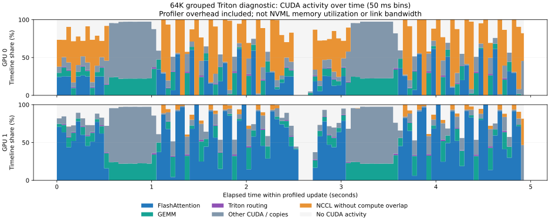

# Scheduled MoE backward and optional Triton routing

Validated 2026-10-09 on two RTX 3090 GPUs connected by NVLink (`NV4`),
PyTorch 2.14.0+cu130 and Triton 3.8.0. The default Torch baseline preserves
`8435831` expert execution. All routing in the trainer measurements is natural
top-2; every configured expert receives tokens. The 64-expert comparison checks
the wide-expert case separately from the four-expert long-context case.

At 128K grouped context, peak allocated memory falls from
9097 to 7845
MiB/GPU (13.8% less).
The 64-expert 8K case has essentially unchanged peak memory; the improvement is
not a universal reduction in model/optimizer storage.

## Behavior

`model.moe.blockwise_backend` selects `torch` (default), `scheduled`, or `triton`.
Both new backends support padded batched GEMM and padding-free grouped GEMM.
The scheduler wraps the whole routed-expert computation in one autograd Function.
Backward gathers one bounded tile, recomputes it with detached Parameter views,
differentiates that local graph, and scatters its input derivatives into one shared
full-hidden buffer. It returns each original Parameter's VJP once. This avoids
per-block full-hidden gradient materialization without writing directly to `.grad`
or firing original Parameter hooks inside nested recomputation. Idle experts remain
absent from the Function's differentiable Parameter inputs and keep `grad=None`.

Triton fuses permutation lookup, input/weight gather and padding; weighted output
scatter; upstream-gradient gather; input-gradient scatter; and weight-gradient
stores. Verified single-expert groups use ordinary stores; groups with possible
duplicate token destinations use FP32 atomic addition. Caller-provided duplicate
expert slots are checked and retain the atomic fallback. GEMMs and activation
derivatives remain native PyTorch operations, including public CUDA grouped-mm.

Variable execution-group row counts are runtime kernel arguments rather than
compile-time constants. This prevents new store-kernel variants as routing changes
between updates. Batched tail tiles keep the same bounded width as other tiles.
The `start` offset is also runtime metadata. First-update exclusion alone would
not remove later compilation caused by variable routing tails.

The new backends support first-order training gradients; double backward raises
an explicit error. Keep `torch` for higher-order derivatives. They require
parameter-free activations, EP1, synchronous TP and zero MLP/LoRA dropout;
the existing FSDP/offload exclusions apply. Triton is loaded only for the explicit
CUDA option, rejects deterministic-algorithm mode, and supports FP32/FP16/BF16.
CPU execution uses the scheduler's reference operations and is not Triton acceleration.
Parameter names and checkpoint keys are unchanged.

## Correctness

- Default offline CPU suite: 949 passed, 280 skipped, five deselected. Includes
  Float64 gradcheck, saved-storage identity checks, frozen inputs, bias/idle-expert
  contracts and explicit double-backward rejection.
- Actual single-GPU suite: 59 passed. FP32/FP16/BF16 outputs and all input,
  router and expert derivatives match the existing references, including top-3,
  strided tensors, masked tails, duplicate destinations, unique stores and a
  weight-gradient tile boundary.
- Distributed CUDA suite: 36 passing tests per rank. Includes CP2, both GEMM
  backends, ordinary and reentrant outer recomputation, frozen-base MoE LoRA,
  and the existing EP2 loop path.
- Four-process CPU TP2+CP2 and CP2+DP2 trainer executions verify composition,
  including empty objectives and dynamic DDP unused Parameters. These do not
  establish four-GPU NCCL performance.
- Paired large trainer runs complete three updates with finite loss, gradient
  and Parameter norms. Maximum paired loss difference is
  5.72e-06; maximum gradient-norm
  difference is 3.19e-05.

## Production-trainer measurements

Same random-initialized decoder: width 384, eight layers, six MHA heads, SwiGLU
expert FFN width 1024, top-2 plus one shared expert, vocabulary 49152, untied
embeddings, BF16 compute, FP32 master weights, Adam, batch 2, microbatch 1,
accumulation 2, CP2/TP1/EP1, seed 42. SmolLM2-135M supplies only the offline
tokenizer. Whole-layer checkpointing is off; recomputed linear CE uses chunk 128.
Batched routed blocks and shared MLPs use 512 tokens; grouped execution uses
virtual tiles of 128 and a 4096-row total group budget. Compare before/after
within each GEMM backend because their physical FFN row budgets differ.

| Experts | Context | Expert GEMM | Torch: peak MiB / update s | Scheduled | Triton |
|---:|---:|---|---:|---:|---:|
| 4 | 65536 | batched | 4594 / 4.777 | 4586 / 4.806 | 4588 / 4.534 |
| 4 | 65536 | grouped | 5269 / 4.659 | 4671 / 4.682 | 4676 / 4.561 |
| 4 | 131072 | batched | 7764 / 14.679 | 7748 / 14.219 | 7743 / 13.672 |
| 4 | 131072 | grouped | 9097 / 14.096 | 7853 / 14.058 | 7845 / 13.767 |
| 64 | 8192 | grouped | 11005 / 0.677 | 11019 / 0.703 | 11011 / 0.686 |

Peak is maximum allocated CUDA memory across ranks for three actual trainer
updates. Times average updates 2 and 3, taking the slower synchronized rank.
Short samples do not establish small throughput differences or general speedups.
The CSV includes dispersion and model TFLOPS/s/GPU from `MFUCalculator` with
active FFN width. Its `6*N*tokens` approximation excludes quadratic attention,
recomputation and routing; it is not measured hardware utilization.

Four-expert batched Triton also completes 262144 context with
14079.6 MiB/GPU and 46.960 s/update.
524288 fails on the first forward at a 384-MiB CP K/V receive-buffer allocation.
These are doubling-grid observations, not an exact context threshold. Blocking
still leaves full-length hidden/attention/normalization state and optimizer
storage resident. The 64-expert short-context case is dominated by weight/gradient/
Adam storage and does not demonstrate the long-context memory saving.

The production benchmark calls `get_detailed_memory_breakdown(model, optimizer)`.
Its rank-0 after-update snapshots confirm that resident Parameter and Adam storage
remain the same across backends:

| Experts / context | Backend | Parameters MiB | Adam state MiB | Post-update CUDA allocated MiB |
|---|---|---:|---:|---:|
| 4 / 131072 | torch | 342 | 684 | 1113 |
| 4 / 131072 | triton | 342 | 684 | 1115 |
| 64 / 8192 | torch | 2502 | 5005 | 7714 |
| 64 / 8192 | triton | 2502 | 5005 | 7714 |

Gradients have been cleared at this snapshot (`gradients = 0`); these numbers
are not a decomposition of training peak. Per-rank peak/reserved memory and full
helper results remain in the raw reports.

[CSV measurements](scheduled_moe_validation.csv) select the final code's fresh
measurements under `.local/scheduled-context/final/`, with unchanged Torch/grouped
scheduled baselines retained from the preceding runs. Earlier kernel prototypes
are kept as raw evidence under the parent and `optimized/` directories and are
not substituted for final Triton timings.

## Temporal utilization diagnosis

This is a diagnostic CUDA activity trace from one 64K grouped Triton trainer update,
not a sample of NVML memory-controller utilization. GPU kernel activity can vary
over time as GEMM, FlashAttention, recomputation, casts, scatter, loss/head chunks,
collectives and host launch gaps alternate. EP1/TP1 MoE tiles have no inter-GPU
expert dispatch; CP K/V exchange and replicated-gradient synchronization still
communicate between GPUs.

The surrounding experiment sweep starts a fresh torchrun worker job per setting,
performs three updates and exits. Monitoring that whole sweep also includes
initialization/compilation/teardown and idle gaps between jobs. The chart isolates
one actual trainer update rather than that orchestration envelope.



| GPU | Window s | Flash s | GEMM s | Routing s | Other CUDA/copies s | NCCL without compute overlap s | No CUDA activity s |
|---:|---:|---:|---:|---:|---:|---:|---:|
| 0 | 4.928 | 0.691 | 0.591 | 0.025 | 1.092 | 1.616 | 0.913 |
| 1 | 4.928 | 2.166 | 0.619 | 0.026 | 1.117 | 0.108 | 0.893 |

The chart partitions the recorded CPU update window into nonoverlapping 50-ms
bins. Kernel names identify attention, GEMM and routing; other CUDA kernels,
copies and memset comprise the remaining compute category. Compute takes priority
where it overlaps NCCL, and the NCCL column shows time without compute overlap.
The no-CUDA category includes periods without a recorded kernel/copy/memset;
it does not uniquely identify their CPU cause. Profiling overhead is included,
and neither kernel duration nor NCCL waiting time measures link saturation.

The trace makes temporal gaps visible rather than inferring a communication
bottleneck from a monitoring percentage. Small-kernel launch/recompute overhead
and the token-chunk loss/head also merit profiling; causal rank imbalance can
lengthen NCCL waits even when the NVLink transport is not saturated. According to
[NVIDIA's metric definition](https://docs.nvidia.com/deploy/nvidia-smi/index.html),
memory utilization measures the sampled time when device memory is read/written,
not transferred bytes or peak bandwidth. [Timeline bins](scheduled_moe_timeline.csv)
preserve the displayed values; raw Chrome traces and summary tables are ignored.

## Reproduction and remaining scope

Use `configs/experiments/cs336_55m_moe_cp2_triton.yaml` as an opt-in example.
Run a fresh uninstrumented job for each backend:

```bash
python3 -m torch.distributed.run --standalone --nproc_per_node=2 \
  scripts/benchmark_context_blocks.py \
  --config configs/experiments/moe_scaling_cp2.yaml \
  --tokenizer .local/models/SmolLM2-135M --model-type moe \
  --checkpoint-mode blocked --context 65536 --experts 4 \
  --expert-backend grouped --blockwise-backend triton \
  --report .local/example-grouped-triton.json
```

For a separate diagnostic, replace the benchmark entry with
`scripts/profile_context_blocks.py --trace-directory .local/example-trace`.
It reuses `LanguageModelTrainer`, exports each rank's Chrome trace/table, and
clearly labels instrumentation/export overhead. Those timing results must not
be used as benchmark comparisons.

GPU-only expert planning, CUDA graph capture, fused expert activation backward,
expert-parallel dispatch and changes to attention/normalization saved-state
lifetimes remain separate work. Keep the default backend until measurements on
the intended model justify an opt-in change.
