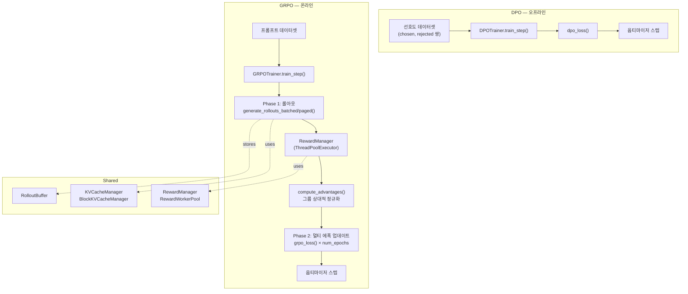
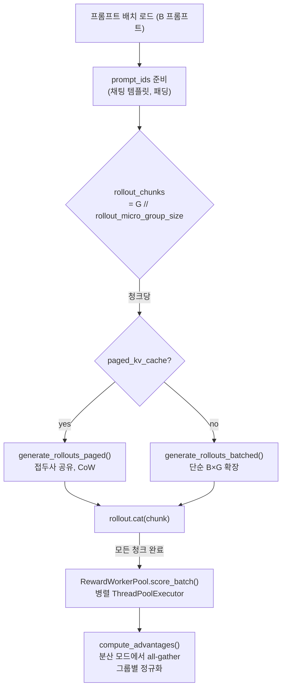

# 정렬 시스템 설계

## 개요

IronCore는 공유 인프라 위에 두 가지 정렬 훈련 방법을 구현합니다:

- **DPO (Direct Preference Optimization)** — 오프라인, 선호도 쌍 데이터셋, 롤아웃 없음.
- **GRPO (Group Relative Policy Optimization)** — 온라인, 롤아웃 기반, 그룹 상대적 어드밴티지 정규화.

두 방법 모두 `BaseTrainer`를 상속하며, 보상 시스템, KV 캐시 인프라, 설정을 공유합니다.

## 대상 / 제약 조건

- 단일 노드, 멀티 GPU (TP + DP).
- GRPO 롤아웃은 eval 모드의 같은 `TransformerModel`을 활용합니다 — 별도의 추론 서버 없음.
- Paged 롤아웃에서의 접두사 공유는 프롬프트의 G개 응답 모두가 같은 노드에 있다고 가정합니다.
- 보상 계산은 CPU 바운드이며 `ThreadPoolExecutor`로 병렬화됩니다 — 랭크 간에 분산되지 않음 (각 랭크가 자신의 배치를 채점).

## 아키텍처



## GRPO 훈련 루프

### Phase 1: 롤아웃 (no_grad, model.eval())



### Phase 2: 멀티 에폭 정책 업데이트

각 에폭 (`num_epochs`, 순수 온라인은 일반적으로 1):

1. `total_samples = B × G` 인덱스 셔플.
2. 마이크로 배치 반복:
   - 순전파: 완성에 대한 토큰 로그 확률 계산.
   - KL: `kl_divergence_approx()` (Schulman k3 추정기, 토큰 레벨).
   - IS 비율 클리핑 (`old_log_probs` 제공 시): `clip(π_θ/π_old, 1±ε)`.
   - 손실: `−A × log π_θ + β × KL − entropy_coef × entropy`.
   - `.backward()` 전에 `len(micro_batch) / total_samples`로 스케일링.
3. 그레이디언트 누적 후 옵티마이저 스텝.

## 롤아웃 생성

두 생성 경로는 같은 자기회귀 디코드 루프를 공유하지만 KV 캐시 관리가 다릅니다:

### 배치 롤아웃 (`generate_rollouts_batched`)

KV 메모리: `B × G × prompt_len × layers × KV_bytes` — 모두 복제.

### Paged 롤아웃 (`generate_rollouts_paged`)

KV 메모리: `1 × prompt_len × layers × KV_bytes` (공유) + `G × gen_len × layers × KV_bytes` (독립 디코드) — 프롬프트 KV의 `(G−1)/G` 절약.

### BlockKVCacheManager 내부 구조

주요 데이터 구조 (`ironcore/layers/block_kv_cache.py`):

| 구조 | 셰이프 | 목적 |
|---|---|---|
| `physical_key_caches[layer]` | `[num_blocks, block_size, kv_groups, head_dim]` | 물리적 KV 저장소, 사전 할당 |
| `physical_value_caches[layer]` | 같은 셰이프 | 물리적 KV 저장소 |
| `block_tables` | `[max_batch, max_blocks_per_seq]` | 시퀀스당 논리적 → 물리적 블록 인덱스 |
| `ref_counts` | `[num_blocks]` | 참조 카운트; ref == 0일 때만 해제 |
| `free_blocks` | list | 사용 가능한 물리적 블록 인덱스 |

**접두사 공유 (`share_prefix`):** 블록 테이블 항목을 모든 `dst` 시퀀스에 복사 (O(num_prefix_blocks) 메타데이터, 텐서 복사 없음). 마지막 접두사 블록이 부분적이면 새 물리적 블록을 할당하고 부분 데이터를 deep-copy (Copy-on-Write).

## 어드밴티지 계산

```
각 그룹 g (= 하나의 프롬프트, G개 응답)에 대해:
    A_i = (R_i − mean(R_g)) / (std(R_g) + ε)

std(R_g) < ε인 경우 (모든 보상 동일): A_i = 0.
```

분산 모드에서는 정규화 전 각 DP 랭크가 로컬 보상을 `all_gather`합니다.

**KL 패널티**는 Schulman k3 추정기 (편향 없고 분산이 낮은 KL 발산 근사)로 토큰 레벨에서 계산됩니다:

```
k3 = exp(log_ref − log_policy) − (log_ref − log_policy) − 1
```

## DPO

### 손실

Bradley-Terry 선호도 모델:

```
logit = β × [(log π_θ(chosen) − log π_ref(chosen)) − (log π_θ(rejected) − log π_ref(rejected))]
loss  = −log σ(logit)  [= BCE with label=1]
```

### 참조 모델 관리

- 로드된 체크포인트(SFT 가중치)에서 `_post_checkpoint_load()` 직후 생성.
- 항상 `eval()`, `requires_grad=False`.
- **FSDP**: 로컬 state dict → 별도 FSDP 인스턴스.
- **DDP / 병렬화 없음**: GPU에서 `copy.deepcopy(model)`.
- **CPU 오프로드** (`offload_ref_model=True`): 생성 후 CPU로 이동; 참조 순전파 패스 중에만 GPU로 로딩.

## RolloutBuffer

| 필드 | 셰이프 | 내용 |
|---|---|---|
| `prompt_ids` | `[B, prompt_len]` | 토크나이즈된 프롬프트 |
| `completion_ids` | `[B×G, total_len]` | 프롬프트 + 응답 (패딩됨) |
| `response_ids` | `[B×G, gen_len]` | 응답만 |
| `old_log_probs` | `[B×G]` | 롤아웃 시 시퀀스 로그 확률 (IS 비율용) |
| `rewards` | `[B×G]` | 원시 보상 점수 |
| `advantages` | `[B×G]` | 그룹 정규화된 어드밴티지 |
| `group_ids` | `[B×G]` | 각 응답이 속한 프롬프트 그룹 |
| `response_lengths` | `[B×G]` | 실제 응답 길이 (패딩 제외) |

## 파일 인덱스

| 파일 | 역할 |
|---|---|
| `ironcore/trainers/grpo_trainer.py` | `GRPOTrainer` — 전체 GRPO 루프 |
| `ironcore/trainers/dpo_trainer.py` | `DPOTrainer` — DPO 루프, 참조 모델 |
| `ironcore/alignment/rollout.py` | `generate_rollouts_batched()`, `generate_rollouts_paged()` |
| `ironcore/alignment/loss/grpo.py` | `grpo_loss()`, `compute_advantages()` |
| `ironcore/alignment/loss/dpo.py` | `dpo_loss()` |
| `ironcore/alignment/loss/kl.py` | `kl_divergence_approx()` — Schulman k3 |
| `ironcore/alignment/rewards/manager.py` | `RewardManager` |
| `ironcore/alignment/buffer.py` | `RolloutBuffer` |
| `ironcore/layers/block_kv_cache.py` | `BlockKVCacheManager`, 접두사 공유, CoW |
