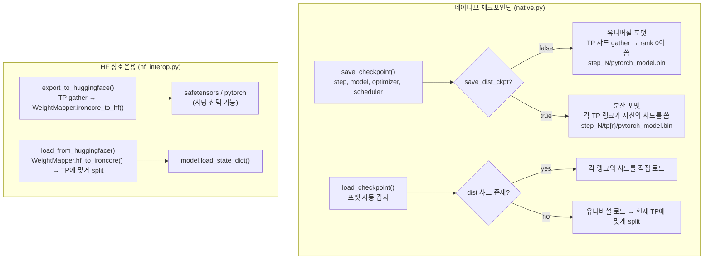
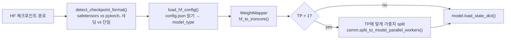

# 체크포인팅 시스템 설계

## 개요

IronCore의 체크포인팅 시스템은 두 가지 레이어로 구성됩니다:

- **네이티브 포맷** — IronCore 고유의 저장/로딩으로, 두 가지 하위 포맷이 있습니다: *유니버설* (TP 무관 단일 파일)과 *분산* (랭크별 샤드). 모델 가중치, 옵티마이저 상태, LR 스케줄러, 스텝 카운터를 처리합니다.
- **HuggingFace 상호운용** — QKV 융합, MLP gate+up 융합, 전치 관례를 처리하는 `WeightMapper`를 통한 HF 체크포인트 양방향 변환.

## 목표 / 제약 조건

| 목표 | 구현 방법 |
|---|---|
| 훈련 정확히 재개 | 가중치와 함께 옵티마이저 상태, LR 스케줄러, 스텝 카운터 저장 |
| 실행 간 TP 차수 변경 | 유니버설 포맷이 체크포인트 경계에서 가중치를 gather/split |
| HF 모델 에코시스템 호환성 | `hf_interop.py` + `WeightMapper`로 양방향 내보내기/가져오기 |
| 병렬 I/O | 분산 포맷: 각 TP 랭크가 자신의 샤드를 동시에 씀 |
| 이식성 | 유니버설 포맷: 단일 파일, TP 차수 무관 |
| LoRA 체크포인트 | 어댑터 가중치가 기본 가중치와 함께 저장 (별도 파일 없음) |
| FSDP | 각 FSDP 랭크가 로컬 샤드를 독립적으로 저장 (`LOCAL_STATE_DICT`) |
| ZeRO-1 (`DistributedOptimizer`) | 유니버설은 rank 0에 gather; 분산은 랭크별 |

## 아키텍처



## 네이티브 포맷

파일: `ironcore/checkpointing/native.py`.

### 파일 레이아웃

```
{model_path}/
├── latest_step.txt              ← 가장 최근 스텝 번호 (rank 0이 씀)
├── config.json                  ← HF 호환 설정 (hf_model_type/hf_architecture 설정 시)
└── step_{N}/
    ├── pytorch_model.bin        ← 유니버설 포맷 (rank 0만)
    └── tp{r}/
        └── pytorch_model.bin   ← 분산 포맷 (TP 랭크 r당 파일 하나)
```

### 체크포인트 dict 스키마

```python
{
    "model_state_dict":     {...},   # 파라미터 이름 → 텐서
    "optimizer_state_dict": {        # 정수 인덱스가 아닌 파라미터 이름 키
        "state": {
            "<param_name>": {
                "exp_avg":        Tensor,
                "exp_avg_sq":     Tensor,
                "max_exp_avg_sq": Tensor,  # AMSGrad 전용
                "step":           int,
            },
            ...
        },
        "param_groups": [...],
    },
    "lr_scheduler":         {...},   # LRScheduler.state_dict()
    "step":                 int,     # 훈련 스텝
    "config":               {...},   # dict로서의 ModelConfig (dataclasses.asdict)
    "hf_config":            {...},   # HF 호환 config.json 필드 (hf_model_type 설정 시)
}
```

RNG 상태는 저장되지 않습니다 — 재현성은 `config.init.seed`로 관리됩니다.

### 유니버설 vs 분산 — 언제 사용할지

| | 유니버설 (`save_dist_ckpt=False`) | 분산 (`save_dist_ckpt=True`) |
|---|---|---|
| 파일 수 | 1 | TP_size |
| 저장 속도 | 느림 (gather + rank 0 씀) | 빠름 (각 랭크가 병렬로 씀) |
| TP 차수 변경 | 가능 — 새 TP에 맞게 가중치 split | 불가 — 새 TP ≠ 저장된 TP이면 실패 |
| 권장 용도 | 이식성, TP 변경 | 고정 TP, 속도 중요 |

## 유니버설 체크포인팅

유니버설 체크포인팅은 체크포인트를 TP 차수 무관하게 만드는 메커니즘입니다. `save_dist_ckpt=False`이고 `TP > 1`일 때 활성화됩니다.

### 저장 경로

모델 가중치와 옵티마이저 모멘트 텐서 모두 파라미터별로 처리됩니다:

| 레이어 타입 | 파라미터 | 작업 |
|---|---|---|
| `column_parallel` | `weight`, `bias`, `lora_B` | TP 랭크 전체에서 `gather_from_model_parallel_workers()` |
| `row_parallel` | `weight`, `lora_A` | TP 랭크 전체에서 `gather_from_model_parallel_workers()` |
| 기타 (복제) | 어떤 것이든 | rank 0에서 그대로 저장 |

같은 gather 규칙이 옵티마이저 모멘트 텐서 (`exp_avg`, `exp_avg_sq`, `max_exp_avg_sq`)에도 적용됩니다: 샤딩된 모멘트는 파라미터와 같은 방향으로 gather됩니다.

`dp_group_rank == 0 AND tp_rank == 0`을 만족하는 랭크만 파일을 씁니다.

### 로드 경로 (유니버설 → 대상 TP)

모델 가중치와 옵티마이저 모멘트를 새 TP 차수에 맞게 split합니다:

| 레이어 타입 | 파라미터 | 작업 |
|---|---|---|
| `column_parallel` | `weight`, `bias`, `lora_B` | `split_to_model_parallel_workers()` |
| `row_parallel` | `weight`, `lora_A` | `split_to_model_parallel_workers()` |
| 기타 | 어떤 것이든 | 모든 랭크에서 그대로 로드 |

### DDP 접두사 정규화

로딩 시 체크포인트의 파라미터 이름을 라이브 모델의 네임스페이스와 정규화합니다. DDP 래핑된 모델 (`module.` 접두사)에서 저장한 체크포인트를 언래핑된 모델로 로딩하거나 그 반대의 경우 접두사를 자동으로 추가하거나 제거합니다.

## DistributedOptimizer (ZeRO-1) 체크포인팅

`DistributedOptimizer`는 옵티마이저 상태를 DP 랭크에 라운드 로빈 순서로 분산합니다. 체크포인팅은 이식성을 위해 전체 상태를 재구성하고 로드 시 올바르게 재분배해야 합니다.

### 저장 (유니버설 + DistributedOptimizer)

`_gather_distributed_optimizer_states()`가 표준 경로 대신 호출됩니다:

1. 각 DP 랭크가 자신이 소유한 상태를 준비합니다 (`param_idx % dp_size == dp_rank`).
2. `dist.gather_object()`가 모든 부분 dict를 DP rank 0에 수집합니다.
3. Rank 0이 파라미터 이름을 키로 하는 단일 dict로 병합합니다.

### 로드 (유니버설 → DistributedOptimizer)

`_partition_optimizer_states_for_load()`가 `optimizer.local_param_indices`를 사용해 수집된 전체 상태를 각 DP 랭크의 파티션으로 슬라이싱합니다.

### 분산 체크포인트 + DistributedOptimizer

각 랭크가 자신의 파티션만 직접 저장하고 로드합니다 — gather/scatter 불필요.

## HuggingFace 상호운용

파일: `ironcore/checkpointing/hf_interop.py`.

### HF에서 로딩 (`load_from_huggingface`)



모델을 빌드하기 전에 `detect_bias_from_hf_state_dict()`를 호출해 어떤 프로젝션에 바이어스가 있는지 파악합니다 — 이것이 모델 생성 시 사용되는 `BiasConfig`를 결정합니다.

### HF로 내보내기 (`export_to_huggingface`)

DP rank 0만 (그리고 gather 후 TP rank 0만) 출력을 씁니다. `safetensors` (기본값) 또는 `pytorch` 포맷 지원. 샤딩된 출력:

```
model.safetensors.index.json
model-00001-of-00003.safetensors
model-00002-of-00003.safetensors
model-00003-of-00003.safetensors
```

### HFConfigManager

파일: `ironcore/checkpointing/native.py` — `HFConfigManager`.

`ModelConfig` 필드에서 HuggingFace 호환 `config.json`을 생성합니다. `hf_model_type`과 `hf_architecture`가 모두 설정된 경우 `{model_path}/config.json`에 씁니다. 이식성을 위해 체크포인트 dict의 `hf_config` 아래에도 임베드됩니다.

## Weight Mapper

파일: `ironcore/checkpointing/weight_mapping.py` — `WeightMapper`.

### 지원 아키텍처

```python
Architecture(Enum): GPT2, LLAMA

# LLAMA 별칭이 포함하는 것:
"llama", "llama2", "llama3", "mistral", "mixtral",
"qwen", "qwen2", "qwen3", "gemma", "gemma2"
```

### 명명 규칙

| 컴포넌트 | IronCore 이름 | GPT-2 HF 이름 | LLaMA HF 이름 |
|---|---|---|---|
| 토큰 임베딩 | `embedding.word_embeddings.weight` | `transformer.wte.weight` | `model.embed_tokens.weight` |
| 입력 노름 | `model.layers.{i}.input_layernorm.layernorm.weight` | `transformer.h.{i}.ln_1.weight` | `model.layers.{i}.input_layernorm.weight` |
| QKV (융합 K+V) | `linear_q.weight` + `linear_kv.weight` | `attn.c_attn.weight` (QKV 융합) | `self_attn.q/k/v_proj.weight` (분리) |
| Attn 출력 | `attn_output.weight` | `attn.c_proj.weight` | `self_attn.o_proj.weight` |
| MLP up (GLU의 경우 + gate) | `mlp.up_proj.weight` | `mlp.c_fc.weight` | `mlp.gate_proj.weight` + `mlp.up_proj.weight` |
| MLP down | `mlp.down_proj.weight` | `mlp.c_proj.weight` | `mlp.down_proj.weight` |
| 최종 노름 | `output_layernorm.layernorm.weight` | `transformer.ln_f.weight` | `model.norm.weight` |

### 주요 변환

**GPT-2 → IronCore:**
- HF `c_attn.weight [hidden, 3×hidden]` → Q `[hidden, hidden]`와 융합 KV `[hidden, 2×hidden]`로 분리. GPT-2는 Conv1D를 사용 → 이미 `[in, out]` 형태, 전치 불필요.

**LLaMA → IronCore:**
- HF 선형 레이어는 `[out, in]`; IronCore는 `[in, out]` → 모두 전치.
- 분리된 `k_proj`와 `v_proj` → 연결 후 전치: `cat([k.t(), v.t()], dim=1)` → `[hidden, 2×groups×head_dim]`.
- 분리된 `gate_proj`와 `up_proj` → 연결 후 전치: `cat([gate.t(), up.t()], dim=1)` → `[hidden, 2×d_ffn]` (SwiGLU 융합).

**IronCore → LLaMA (역변환):**
- 모든 가중치 전치.
- 융합 KV → 분리 K, V로 split; 융합 gate+up → 분리 gate, up으로 split.

## LoRA 체크포인트

LoRA 어댑터 가중치는 기본 모델 가중치와 **함께** 저장됩니다 — 별도의 LoRA 파일은 없습니다. 파라미터 이름에 어댑터가 포함됩니다:

```
model.layers.{i}.linear_q.weight      ← 기본 가중치
model.layers.{i}.linear_q.lora_A      ← LoRA A (row-parallel 방향)
model.layers.{i}.linear_q.lora_B      ← LoRA B (column-parallel 방향)
```

TP gather/split 규칙: `lora_B`는 column-parallel gather 규칙을 따르고; `lora_A`는 row-parallel gather 규칙을 따릅니다. 기본 가중치 규칙과 동일합니다 — split 차원이 어댑터가 연결된 선형 레이어 방향과 일치합니다.

## FSDP 체크포인트

모델이 FSDP로 래핑된 경우 `LOCAL_STATE_DICT`를 사용합니다 — 각 랭크가 자신의 샤드만 저장하고 로드합니다:

```python
with FSDP.state_dict_type(model, StateDictType.LOCAL_STATE_DICT):
    state = model.state_dict()
```

이는 분산 TP 체크포인트와 동일한 랭크별 파일 레이아웃을 생성합니다: `step_{N}/tp{r}/pytorch_model.bin`.

## 오프로드 통합

옵티마이저 오프로드가 활성화된 경우 모멘트 텐서가 CPU에 저장됩니다. 로드 경로는 이를 존중합니다: TP에 맞게 옵티마이저 모멘트를 split한 후 각 텐서는 옵티마이저 스텝과 동일한 파라미터별 기준 (`_should_offload_param(param, offload_min_elements)`)을 사용해 올바른 디바이스로 라우팅됩니다.

## 트레이너 통합

파일: `ironcore/trainers/base_trainer.py`.

- **저장:** `step % save_checkpoint_steps == 0`일 때 (또는 훈련 종료 시) `save_checkpoint()` 호출. `config.operation.no_save = True`이면 억제됩니다.
- **재개:** `_pre_train_setup()`이 `train()` 시작 시 `load_checkpoint()`를 호출합니다. 마지막 저장된 스텝을 반환하며 훈련이 `step = last_step + 1`에서 재개됩니다. `latest_step.txt`는 전체 체크포인트를 로드하지 않고도 스텝 번호를 제공합니다.

## 체크포인트 인스펙터

파일: `ironcore/checkpointing/inspect.py` — `inspect_checkpoint()`.

보고 내용: 포맷 (native/safetensors/pytorch), 파라미터 수 + 사람이 읽기 쉬운 크기, dtype 분류, 훈련 스텝, TP 샤드 수. `--verbose`로 레이어별 형태와 통계. `--compare`로 두 체크포인트 간 레이어별 `max_abs_diff`와 `mean_abs_diff`. CLI: `ironcore inspect-checkpoint --path <dir>`.

## 설정 레퍼런스

| 필드 | 그룹 | 설명 |
|---|---|---|
| `model_path` | `trainer` | 체크포인트 루트 디렉토리 |
| `save_checkpoint_steps` | `trainer` | N 스텝마다 저장 |
| `no_save` | `operation` | 체크포인트 저장 비활성화 |
| `save_dist_ckpt` | `operation` | `false` = 유니버설, `true` = 랭크별 분산 |
| `load_checkpoint_optim_state` | `optim` | 재개 시 옵티마이저 상태 복원 (기본값: `true`) |
| `load_checkpoint_lr_scheduler` | `optim` | 재개 시 LR 스케줄러 상태 복원 |
| `hf_model_type` | `model` | HF model type 문자열; `config.json` 생성도 활성화 |
| `hf_architecture` | `model` | HF 아키텍처 클래스 이름 |

## 파일 인덱스

| 파일 | 역할 |
|---|---|
| `ironcore/checkpointing/native.py` | `save_checkpoint()`, `load_checkpoint()`, `HFConfigManager`, `_gather_distributed_optimizer_states()`, `_partition_optimizer_states_for_load()` |
| `ironcore/checkpointing/hf_interop.py` | `export_to_huggingface()`, `load_from_huggingface()`, `detect_bias_from_hf_state_dict()` |
| `ironcore/checkpointing/weight_mapping.py` | `WeightMapper`, `Architecture`, `get_architecture()` |
| `ironcore/checkpointing/inspect.py` | `inspect_checkpoint()` |
