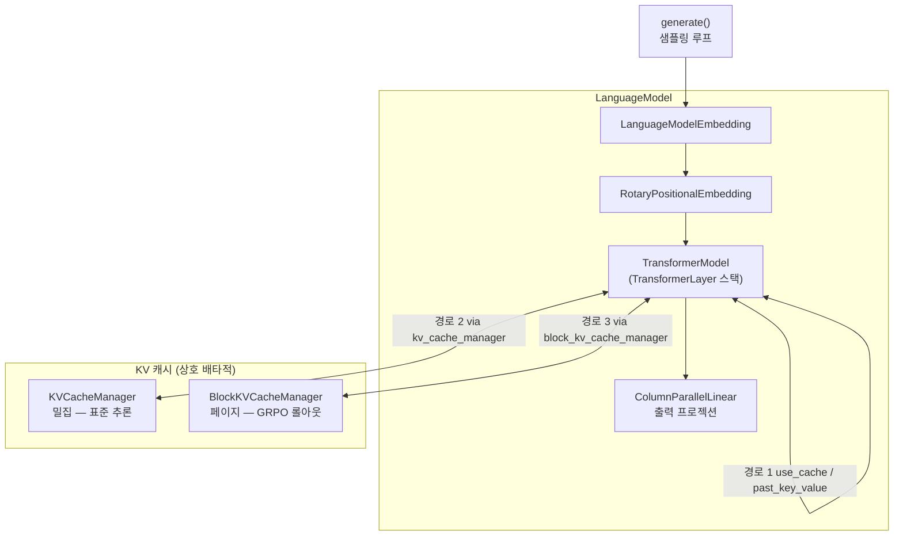
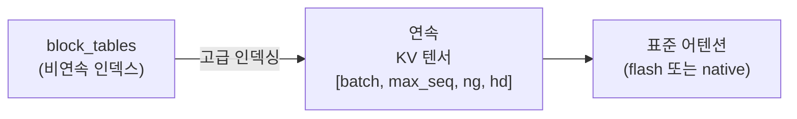

# KV 캐시 & 추론 시스템 설계

## 개요

IronCore는 서로 다른 워크로드를 위한 두 가지 KV 캐시 구현과 완전한 자기회귀 생성 루프를 제공합니다:

- **`KVCacheManager`** — 표준 추론용 밀집, 사전 할당 캐시.
- **`BlockKVCacheManager`** — GRPO 롤아웃 생성을 위한 참조 카운팅 접두사 공유가 있는 페이지 기반 블록 캐시.

`LanguageModel` 래퍼가 활성 캐시를 소유하고 통합된 `generate()` API를 제공합니다.

## 대상 / 제약 조건

- 단일 노드 추론 (TP 지원, 파이프라인 병렬화 없음).
- 각 TP 랭크는 로컬 KV 헤드 파티션만 저장 (`num_groups / TP`).
- PagedAttention은 gather-then-attend 방식 (커스텀 CUDA 커널 없음) — GRPO 처리량 최적화, 지연 시간 중요 서빙에는 비최적.
- `BlockKVCacheManager`는 GRPO 롤아웃 전용; 표준 추론은 `KVCacheManager` 사용.

## 아키텍처



### `TransformerLayer`당 세 가지 KV 처리 경로

각 `TransformerLayer.forward()`는 어떤 인수가 있는지에 따라 하나의 경로를 선택합니다:

| 경로 | 인수 | 사용 사례 |
|---|---|---|
| **함수형** | `use_cache=True` / `past_key_value` | 레거시; 상태 없는 텐서 누적 |
| **상태형** | `kv_cache_manager` + `cache_position` | 표준 추론 (KVCacheManager) |
| **페이지** | `block_kv_cache_manager` + `seq_id` | GRPO 롤아웃 (BlockKVCacheManager) |

## KVCacheManager

### 데이터 레이아웃

```
key_caches[layer_idx]:    [batch, max_seq_len, num_local_kv_groups, head_dim]
value_caches[layer_idx]:  [batch, max_seq_len, num_local_kv_groups, head_dim]
cache_positions:          [batch]  — 시퀀스당 fill 포인터
```

첫 번째 `initialize_cache()` 호출 시 모든 버퍼가 사전 할당됩니다.

### TP 파티셔닝

각 랭크는 `num_groups / TP` KV 그룹만 저장:

```
num_local_kv_groups = num_attention_groups // tensor_model_parallel_size
```

어텐션 중 랭크 간 통신이 필요 없습니다 — 각 랭크가 로컬 KV 슬라이스로 로컬 헤드 파티션에 대한 어텐션을 계산합니다.

## BlockKVCacheManager

### 데이터 레이아웃

```
physical_key_caches[layer]:  [num_physical_blocks, block_size, num_local_kv_groups, head_dim]
physical_value_caches[layer]: 같은 셰이프
block_tables:                 [max_batch, max_blocks_per_seq]  → 물리적 블록 인덱스 (-1 = 미사용)
ref_counts:                   [num_physical_blocks]
free_blocks:                  list[int]  — 사용 가능한 인덱스 스택
token_positions:              [max_batch]  — 시퀀스당 어텐션할 토큰 수
tokens_written:               [max_batch]  — 물리적으로 쓰여진 토큰
```

### PagedAttention gather

커스텀 CUDA 커널이 없는 두 단계 설계:



물리적 캐시에 대한 단일 고급 인덱싱 연산으로 전체 블록 gather; 부분 마지막 블록은 별도로 연결.

## 추론 루프

> **페이지 경로 제한:** `BlockKVCacheManager`가 활성화된 경우 `generate()`는 `batch_size=1`만 지원합니다. 배치 GRPO 생성은 `ironcore/alignment/rollout.py`의 `generate_rollouts_paged()`를 사용하세요.

### TP 동기화

TP > 1일 때 `gather_from_model_parallel_workers`가 `all_gather`를 수행해 모든 TP 랭크가 완전한 로짓을 받습니다. 확률적 샘플링 (`do_sample=True`)의 경우 rank 0이 샘플링하고 브로드캐스트합니다. Greedy의 경우 모든 랭크가 동일한 로짓에서 `argmax`를 독립적으로 계산합니다 — 브로드캐스트 불필요.

## 설정

| 필드 | 기본값 | 설명 |
|---|---|---|
| `kv_cache.enabled` | `true` | 상태형 KV 캐시 활성화 |
| `kv_cache.use_paged` | `false` | `false` → KVCacheManager, `true` → BlockKVCacheManager |
| `kv_cache.block_size` | `16` | 물리적 블록당 토큰 수 (페이지 전용) |
| `kv_cache.max_batch_size` | `32` | 최대 동시 시퀀스 수 |
| `kv_cache.max_seq_length` | `2048` | 최대 시퀀스 길이 |
| `kv_cache.gpu_memory_utilization` | `0.9` | 블록 풀에 사용할 여유 VRAM 비율 |

## 파일 인덱스

| 파일 | 역할 |
|---|---|
| `ironcore/layers/kv_cache.py` | `KVCacheManager` — 밀집 상태형 캐시 |
| `ironcore/layers/block_kv_cache.py` | `BlockKVCacheManager` — 페이지 캐시, 접두사 공유, CoW |
| `ironcore/layers/paged_attention.py` | `gather_kv_blocks_batched()` — 비연속 블록 gather |
| `ironcore/layers/attention.py` | `Attention` — KV 확장, GQA, flash/standard 경로 |
| `ironcore/models/transformer.py` | `TransformerLayer` — 세 가지 KV 캐시 디스패치 |
| `ironcore/language_model.py` | `LanguageModel` — 모델 + 캐시 래퍼, `generate()` 루프 |
| `ironcore/alignment/rollout.py` | `generate_rollouts_batched/paged()` — GRPO 특화 롤아웃 |
