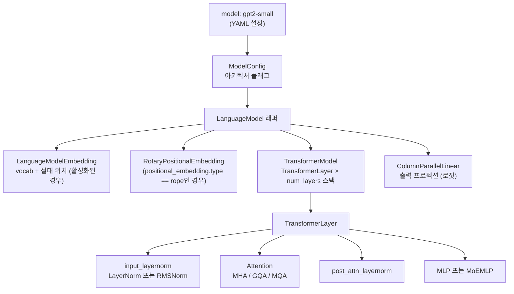
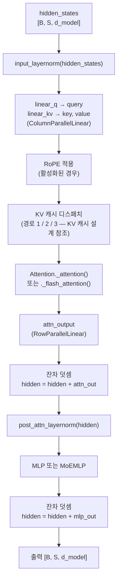
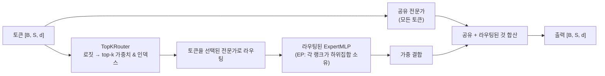

# 모델 & 레이어 시스템 설계

## 개요

단일 `TransformerModel` 클래스가 GPT-2/3, LLaMA, Gemma, Qwen, Phi, MoE 변형을 서브클래싱 없이 **설정 기반 차별화**만으로 지원합니다. 아키텍처 차이 (노름 타입, 활성화, 위치 임베딩, 어텐션 그룹화)는 `ModelConfig` 필드에 인코딩되어 생성 시 해석됩니다.

## 대상 / 제약 조건

- TP 인식 설계: 모든 프로젝션이 `ColumnParallel` / `RowParallel` 선형 레이어를 사용합니다.
- MoE는 선택적이고 직교적 — `MoEMLP`가 레이어 수준에서 `MLP`를 대체하며 나머지 모델은 변경 없습니다.
- Flash attention은 표준 경로의 드롭인 대체; 라이브러리가 없으면 표준으로 폴백합니다.
- `DummyModel` (어텐션 없는 2-레이어 MLP)은 CI 속도와 인프라 테스트용으로 존재합니다.

## 아키텍처



## TransformerModel — 단일 클래스 설계

파일: `ironcore/models/transformer.py`.

`get_model_provider_func()` (`ironcore/models/__init__.py`)는 이름 접두사로 라우팅합니다:
`GPT` / `LLAMA` / `GEMMA1` / `QWEN` / `PHI1` / `PHI2` → 모두 `TransformerModel` 반환.
`DUMMY` → `DummyModel`.

### 아키텍처를 제어하는 `ModelConfig` 필드

| 필드 | 타입 | 제어 대상 |
|---|---|---|
| `ln_type` | `"layernorm"` \| `"rmsnorm"` | 노름 클래스 (`get_norm()` 경유) |
| `activation_type` | `"gelu"` \| `"swiglu"` \| … | MLP 경로 + GLU 게이팅 |
| `positional_embedding.type` | `"absolute"` \| `"rope"` | 임베딩 덧셈 vs 토큰당 회전 |
| `positional_embedding.base` | int (기본값 10000) | RoPE 주파수 베이스 θ |
| `num_attention_heads` | int | 전체 Q 헤드 수 |
| `num_attention_groups` | int | K/V 그룹: `== heads`면 MHA, `< heads`면 GQA, `1`이면 MQA |
| `bias` | `BiasConfig` | 프로젝션별 바이어스 플래그 (q, k, v, o, gate, up, down) |
| `post_ln` | bool | 프리노름 (False) vs 포스트노름 (True) — 현재 프리노름 사용 |
| `moe.use_moe` | bool | `MLP`를 `MoEMLP`로 대체 |
| `hf_model_type` | str \| None | 체크포인트 상호운용을 위한 HF model_type |

**아키텍처 비교:**

| | GPT-2 | LLaMA | Qwen 2.5 (0.5B) |
|---|---|---|---|
| `ln_type` | `layernorm` | `rmsnorm` | `rmsnorm` |
| `activation_type` | `gelu` | `swiglu` | `gelu` |
| `positional_embedding.type` | `absolute` | `rope` | `rope` |
| `num_attention_groups` | = heads (MHA) | = heads (MHA) | 2 (GQA, 14 헤드) |
| `bias` | 모두 True | 없음 | 모두 True (기본값) |
| `max_seq_len` | 1024 | 2048 | 32768 |

설정 YAML 해석: 명시적 필드가 데이터클래스 기본값을 재정의하며 미설정 필드는 기본값을 유지합니다.

## TransformerLayer

파일: `ironcore/models/transformer.py`.

### 순전파 흐름 (프리노름, 캐시 없음)



**TP 인식:** Q는 `ColumnParallelLinear` (출력 차원 분할)를 사용하고; KV는 `concatenated_weights=2`인 융합 `ColumnParallelLinear`를 사용하며; 출력 프로젝션은 `RowParallelLinear`를 사용합니다. 각 랭크는 `heads / TP` 로컬 헤드를 계산합니다.

**활성화 재계산:** `operation.activation_recompute=True`이고 훈련 중일 때, `checkpoint(layer.custom_forward, …)`가 각 레이어를 래핑합니다. KV 캐시가 활성화되거나 활성화 스필링이 활성화된 경우 비활성화됩니다 (스필링이 재계산을 대체).

## Attention

파일: `ironcore/layers/attention.py` — `Attention`.

### MHA / GQA / MQA

세 가지 모두 같은 코드 경로를 공유합니다. GQA/MQA는 내적 전에 K/V를 Q의 헤드 수에 맞게 확장합니다:

```python
# expand_for_gqa: K/V 그룹을 반복하여 num_heads를 채움
if key.size(2) != query.size(2):
    key   = expand_for_gqa(key,   num_groups, num_heads, kv_dim=2)
    value = expand_for_gqa(value, num_groups, num_heads, kv_dim=2)
```

### Flash attention 전환

```python
if config.trainer.use_flash_attn and flash_attn_varlen_func is not None:
    return self._flash_attention(query, key, value, ...)  # flash_attn_varlen_func
else:
    return self._attention(query, key, value, ...)        # torch.einsum SDPA
```

Flash 경로는 `[B, S, …]` → `[B×S, …]`로 평탄화하고, 가변 길이 배치를 위해 `cu_seqlens`를 전달하며, 항상 `causal=True`를 사용합니다.

### RoPE 적용

어텐션 전 `TransformerLayer`에서 재형성된 `[B, S, num_local_heads, head_dim]` 텐서에 적용됩니다:

```python
if rotary_pos_emb:
    query = rotary_pos_emb.forward(query, position_ids)
    key   = rotary_pos_emb.forward(key,   position_ids)
```

## MLP

파일: `ironcore/layers/mlp.py`, `ironcore/layers/parallel_mlp.py`.

### GLU vs 비-GLU

`activation_type`으로 결정됩니다:

| 활성화 | GLU? | up_proj 출력 차원 | 예시 |
|---|---|---|---|
| `gelu`, `silu`, `relu`, `gelu_new` | 아니오 | `d_ffn` | GPT-2 |
| `swiglu`, `geglu`, `glu`, `siglu` | 예 | `d_ffn × 2` | LLaMA |

GLU 활성화의 경우 `up_proj`는 `[gate ‖ up]` 연결 출력을 내보내고; `activation(x)`는 분할 후 게이팅 적용 (`SwiGLU`의 경우 `SiLU(gate) × up`). `down_proj`는 `d_ffn`을 받습니다.

### 순전파

```python
x = self.up_proj(x)        # ColumnParallel: [B, S, d_ffn] 또는 [B, S, 2×d_ffn]
x = self.activation(x)     # 분할+게이트 (GLU) 또는 원소별 (비-GLU)
x = self.down_proj(x)      # RowParallel: [B, S, d_model]
```

`async_communication=True`는 `finalize()` 두 단계 호출을 사용해 RowParallel all-reduce와 다음 레이어의 프리노름을 겹칩니다.

## MoE (Mixture of Experts)

파일: `ironcore/layers/moe/moe_layer.py`, `router.py`, `expert.py`, `load_balance_loss.py`.

`config.model.moe.use_moe = True`로 활성화되며; `MoEMLP`가 `TransformerLayer`의 `MLP`를 대체합니다.

### 아키텍처



### TopKRouter

```
router_logits = x @ W_router           # [B, S, num_experts]
+ 지터 노이즈 (훈련 시에만)
top_k_weights, top_k_indices = topk(router_logits, k)
top_k_weights = softmax(top_k_weights) # 선택된 전문가 정규화
```

### 보조 손실

**로드 밸런싱 손실** (DeepSeek-MoE 방식):
```
L_aux = α × E × Σᵢ fᵢ × Pᵢ
```
여기서 `fᵢ`는 전문가 `i`로 라우팅되는 토큰 비율, `Pᵢ`는 평균 라우팅 확률입니다. 라우팅이 균일할 때 최소화됩니다. `moe_layer.get_aux_loss()`로 가져와 트레이너에서 주 손실에 더합니다.

### 전문가 병렬

`moe.expert_model_parallel_size > 1`일 때, 각 EP 랭크는 `ep_rank × local_count`에서 시작해 `num_routed_experts / ep_size`개의 전문가를 인스턴스화합니다. 통신은 `AllToAllDispatcher`를 통해 디스패치됩니다.

## 임베딩

파일: `ironcore/layers/embedding.py` — `LanguageModelEmbedding`.

- **토큰 임베딩:** `VocabParallelEmbedding` — vocab이 TP 랭크에 샤딩됩니다.
- **위치 임베딩:** `positional_embedding.type == "absolute"`일 때만 토큰 임베딩에 밀집 학습 가능 `nn.Embedding`을 더합니다. RoPE의 경우 임베딩은 위치 무관; 회전은 어텐션 내부에서 토큰당 적용됩니다.

## 위치 임베딩

파일: `ironcore/layers/positional_embedding/rotary.py`.

### RoPE

위치 `[offset, offset + max_seq_len)`에 대한 사전 계산된 sin/cos 캐시:

```
θᵢ = 1 / base^(2i / head_dim)   for i ∈ [0, head_dim/2)
sin_cache[pos, i] = sin(pos × θᵢ)
cos_cache[pos, i] = cos(pos × θᵢ)
```

각 헤드의 연속 절반에 적용:
```
[x₁, x₂] → [x₁·cos − x₂·sin, x₁·sin + x₂·cos]
```

시퀀스가 `max_seq_len`을 초과하면 캐시가 온디맨드로 확장됩니다.

## 정규화

팩토리: `get_norm(config)` → `config.model.ln_type`에 따라 `LayerNorm` 또는 `RmsNorm`.

| `ln_type` | 클래스 | 공식 | 일반적 사용처 |
|---|---|---|---|
| `"layernorm"` | `nn.LayerNorm` | μ=0, σ=1로 정규화 | GPT-2 |
| `"rmsnorm"` | `nn.RMSNorm` | `x / √(mean(x²) + ε) × γ` | LLaMA, Qwen, 최신 LLM |

## DummyModel

파일: `ironcore/models/dummy.py`.

단순 `Linear → ReLU → Linear` 레이어 스택 (어텐션 없음, KV 캐시 없음). 다음에 유용합니다:
- 트랜스포머 오버헤드 없이 훈련 루프, 데이터 파이프라인, 그레이디언트 흐름 테스트.
- CI/CD — 실제 모델보다 훨씬 빠름.
- 병렬화 인프라 검증.

`config.model.name = "dummy"`로 활성화됩니다.

## 설정 레퍼런스

| 필드 | 기본값 | 설명 |
|---|---|---|
| `ln_type` | `"layernorm"` | `"layernorm"` \| `"rmsnorm"` |
| `ln_eps` | `1e-5` | 노름 엡실론 |
| `activation_type` | `"gelu"` | 활성화; GLU 변형은 내부적으로 d_ffn을 두 배로 |
| `positional_embedding.type` | `"absolute"` | `"absolute"` \| `"rope"` |
| `positional_embedding.base` | `10000` | RoPE θ 베이스 |
| `num_attention_heads` | `8` | 전체 Q 헤드 수 |
| `num_attention_groups` | `1` | K/V 그룹 (`1`=MQA, `n`=GQA, `==heads`=MHA) |
| `head_dim` | `128` | 헤드당 차원 |
| `d_model` | `512` | 히든 차원 |
| `d_ffn` | `2048` | FFN 중간 차원 (GLU 두 배 전) |
| `num_layers` | `2` | 트랜스포머 레이어 수 |
| `max_seq_len` | `512` | 컨텍스트 창 길이 |
| `dropout_embd / attn / mlp` | `0.1` | 드롭아웃 비율 |
| `moe.use_moe` | `false` | Mixture of Experts 활성화 |
| `moe.num_routed_experts` | — | 전체 라우팅 전문가 수 |
| `moe.num_experts_per_token` | — | Top-k 라우팅 |
| `moe.aux_loss_alpha` | — | 로드 밸런싱 손실 계수 |
| `hf_model_type` | `null` | HF model_type (체크포인트 내보내기용) |

## 파일 인덱스

| 파일 | 역할 |
|---|---|
| `ironcore/models/transformer.py` | `TransformerModel`, `TransformerLayer` |
| `ironcore/models/__init__.py` | `get_model_provider_func()` — 이름→클래스 라우팅 |
| `ironcore/models/dummy.py` | `DummyModel`, `DummyModelLayer` |
| `ironcore/layers/attention.py` | `Attention` — MHA/GQA/MQA, flash/표준 경로 |
| `ironcore/layers/mlp.py` | `MLP` (LoRA 인식) |
| `ironcore/layers/parallel_mlp.py` | `ParallelMLP` — TP 인식 기본 클래스 |
| `ironcore/layers/embedding.py` | `LanguageModelEmbedding` |
| `ironcore/layers/positional_embedding/rotary.py` | `RotaryPositionalEmbedding` |
| `ironcore/layers/activations/activations.py` | `NewGELU`, `GLUActivation` 변형 |
| `ironcore/layers/layernorm/__init__.py` | `get_norm()` 팩토리 |
| `ironcore/layers/moe/moe_layer.py` | `MoEMLP` |
| `ironcore/layers/moe/router.py` | `TopKRouter` |
| `ironcore/layers/moe/expert.py` | `ExpertMLP` |
| `ironcore/layers/moe/load_balance_loss.py` | `LoadBalanceLoss` |
| `ironcore/config/config_model.py` | `ModelConfig`, `BiasConfig`, `PositionalEmbeddingConfig`, `MoEConfig` |
