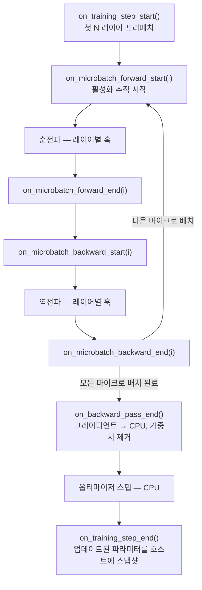
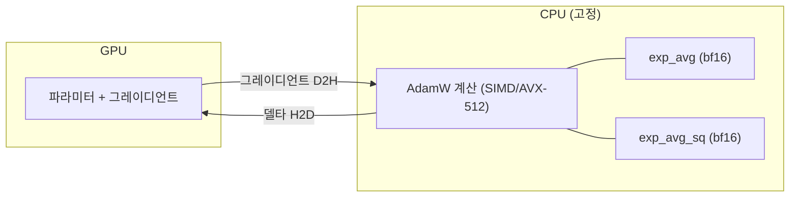
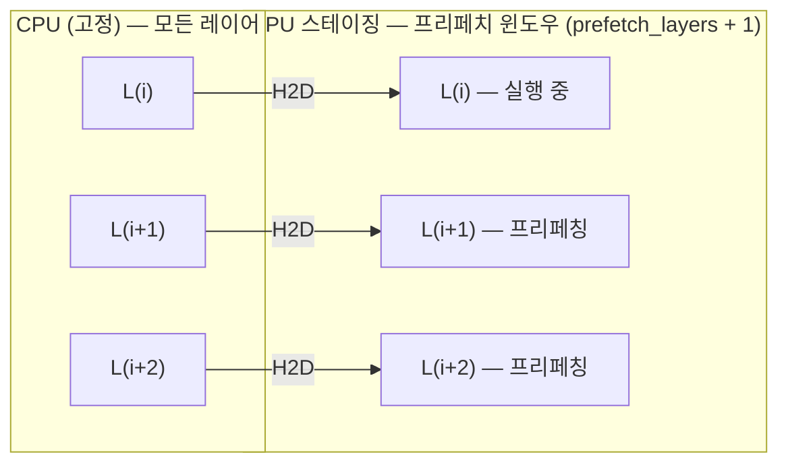
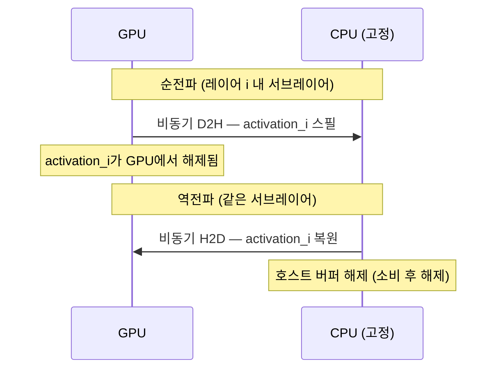

# 오프로드 시스템 설계

## 개요

오프로드 서브시스템은 옵티마이저 상태, 모델 가중치, 활성화를 GPU와 호스트 RAM 간에 이동시켜 GPU VRAM을 초과하는 모델을 훈련할 수 있게 합니다. 세 가지 독립적인 메커니즘 — 옵티마이저 오프로드, 가중치 스트리밍, 활성화 스필링 — 을 직교적으로 조합할 수 있습니다.

## 대상 하드웨어

단일 GPU (8~24 GB VRAM), 32~128 GB 호스트 RAM을 갖춘 컨슈머 데스크톱. 단일 노드 전용. 노드 간 통신 없음.

## 아키텍처


### ExecutionScheduler

`ExecutionScheduler.from_model(model, config, device)`로 생성됩니다. 모든 하위 컴포넌트를 소유하고 훈련 루프 전체에서 데이터 이동을 조율합니다. 트레이너가 각 단계에서 훅을 호출합니다:



### PinnedMemoryPool

`cudaMallocHost` (비동기 DMA를 위한 페이지 고정 메모리)를 사용하는 호스트 측 할당기. 여유 목록 병합이 있는 고정 크기 청크. 가중치 타일과 스필된 활성화가 공유합니다. 예산 강제 — 초과 시 할당이 하드 실패합니다. `threading.Lock`으로 스레드 안전.

### GPUStagingPool

PinnedMemoryPool의 GPU 측 미러. `prefetch_layers + 1`개의 연속 레이어 가중치를 담기 위해 레이어 크기의 슬라이딩 윈도우 최대값을 사용해 자동 크기 결정. 스테이징 버퍼는 TileManager가 빌려 임시 `param.data`로 사용하고 반환합니다.

### MemoryTransferEngine

전용 CUDA 스트림에서 비동기 DMA 전송을 관리합니다. 각 전송은 동기화를 위한 `torch.cuda.Event`가 있는 `TransferHandle`을 생성합니다. 스트림 배리어가 DMA와 기본 스트림의 계산 간 경쟁을 방지합니다.

### TileManager

레이어별 `WeightGroup` 객체를 관리합니다. 레이어의 각 파라미터가 하나의 `WeightTile`이 됩니다. `weight_storage_precision` (예: bf16)으로 고정 호스트 버퍼를 할당하고 정밀도 변환과 함께 초기 가중치를 복사합니다. 순전파/역전파 중 GPU 스테이징 버퍼를 빌려 `param.data`를 GPU 뷰로 교체하면서 `nn.Parameter` 아이덴티티를 보존합니다.

### ActivationSpillManager

`(microbatch_idx, layer_idx, sub_layer)` 키로 스필된 활성화를 추적합니다. 순전파: 고정 버퍼를 할당하고 비동기 D2H를 제출합니다. 역전파: D2H를 기다리고 복원을 위한 H2D를 제출하며 즉시 버퍼를 해제합니다 (소비 후 해제). 활성화가 역전파가 소비할 때 해제되므로 최대 호스트 메모리가 제한됩니다.

---

## 옵티마이저 상태 오프로드

옵티마이저 상태 (모멘텀, 분산)를 CPU RAM으로 이동합니다. 파라미터는 GPU에 유지됩니다.

### 데이터 흐름



### 구현

파일: `ironcore/offload/optimizer_helpers.py`

`_adamw_offloaded_step()`의 두 계산 경로:

1. **GPU 파라미터 (옵티마이저 오프로드만):** 그레이디언트를 GPU→CPU로 전송, CPU에서 AdamW 계산 (SIMD/AVX-512), 델타를 CPU→GPU로 전송. 상태는 CPU에 유지됩니다.

2. **CPU 파라미터 (옵티마이저 + 가중치 오프로드 결합 모드):** 파라미터와 상태 모두 CPU에 있습니다. `.to()`는 no-op. 계산이 CPU에서 네이티브로 실행됩니다. 업데이트 후 상태가 `state_dtype`으로 호스트에 다시 씁니다.

`AdamWOptimizer.step()`과 `MuonOptimizer._step_adamw()` 모두 공유합니다.

### 설정

| 필드 | 기본값 | 설명 |
|---|---|---|
| `optimizer_offload` | `false` | 옵티마이저 오프로드 활성화 |
| `optimizer_state_precision` | `"fp32"` | 저장 dtype: `"fp32"` \| `"bf16"` \| `"fp16"` |
| `optimizer_min_param_elements` | `65536` | 이보다 작은 파라미터는 오프로드 건너뜀 |

### VRAM 절약

옵티마이저 상태를 GPU에서 제거합니다. `P`개 파라미터에 대해: fp32 상태 = `2 × P × 4` 바이트 = fp32 모델 크기의 2배; bf16 상태 = `2 × P × 2` 바이트 = fp32 모델 크기의 1배.

---

## 가중치 스트리밍

모델 가중치를 순전파/역전파 중 레이어별로 GPU에 스트리밍하고, 사용 중간에는 CPU에 유지합니다. 현재 레이어 + 프리페치 윈도우만 GPU에 동시에 상주합니다.

### 데이터 흐름



레이어 `i`가 완료되면: `L(i)`가 GPU에서 제거되고 (버퍼가 스테이징 풀로 반환됨) `L(i+3)`이 CPU에서 프리페치됩니다 — 윈도우가 한 레이어씩 앞으로 슬라이드합니다.

### 구현

파일: `scheduler.py`, `tile_manager.py`, `gpu_staging_pool.py`

1. **초기화:** 모델이 CPU에 유지됩니다. TileManager가 모든 레이어를 등록하고 `weight_storage_precision`으로 고정 호스트 버퍼를 할당하며 초기 가중치를 복사합니다.

2. **순전파:** `on_layer_start(i)`가 프리페치 전송을 기다리고 `param.data`를 GPU 스테이징 버퍼 뷰로 교체하며 다음 N 레이어를 프리페치합니다. `on_layer_end(i)`가 선택적으로 가중치를 제거합니다.

3. **역전파:** 레이어가 역순으로 순회됩니다. `on_backward_layer_start(i)`가 가중치를 다시 로드합니다. `on_backward_layer_end(i)`가 제거하고 이전 레이어를 프리페치합니다.

4. **스텝 종료:** `snapshot_params_to_host()`가 업데이트된 파라미터를 호스트 타일로 다시 복사합니다.

**TP 랭크 독립성.** 각 TP 랭크는 자신의 파라미터 샤드 (각 가중치 행렬의 column-parallel 또는 row-parallel 슬라이스)를 보유합니다. `TileManager`는 랭크당 인스턴스화되어 해당 랭크의 샤드만 스트리밍합니다. GPU 스테이징 풀은 전체 가중치 차원이 아닌 로컬 샤드 차원에 맞게 크기가 결정되므로 VRAM 오버헤드가 TP 차수에 무관하게 `(prefetch_layers + 1) × local_layer_bytes`로 스케일됩니다.

### 설정

| 필드 | 기본값 | 설명 |
|---|---|---|
| `weight_offload` | `false` | 가중치 스트리밍 활성화 |
| `weight_prefetch_layers` | `2` | 순전파 선행 깊이 |
| `backward_weight_prefetch_layers` | `1` | 역전파 프리페치 깊이 |
| `weight_storage_precision` | `"bf16"` | 호스트 저장 dtype |
| `gpu_staging_pool_mb` | `0` | 최대 GPU 스테이징 (0 = 자동) |
| `gpu_staging_chunk_mb` | `256` | GPU 스테이징 청크 크기 |

### VRAM 절약

GPU에서 모델 가중치를 제거합니다: ~모델 크기 1배. GPU는 한 번에 `prefetch_layers + 1`개의 레이어만 필요합니다.

---

## 활성화 스필링

순전파 중 각 서브블록의 **입력** 활성화를 CPU에 저장하고, 역전파에서 해당 저장된 입력을 복원한 뒤 `torch.enable_grad()`로 서브블록만 재계산 (전체 순전파가 아닌)하여 그레이디언트를 얻습니다. 모든 중간 텐서를 버리고 전체 순전파를 재계산하는 표준 활성화 체크포인팅에 비해, 스필링은 재계산을 한 번에 하나의 서브블록으로 줄이면서 GPU VRAM과 호스트 RAM 대역폭을 교환합니다.

### 데이터 흐름



### 구현

파일: `ironcore/offload/hooks.py`

`_SpillCheckpointFn`은 `torch.autograd.Function`입니다:

- **순전파:** 활성화 메타데이터 (형태, dtype)를 저장합니다. ActivationSpillManager를 통해 비동기 D2H를 제출합니다. `torch.no_grad()`로 서브블록을 계산합니다. 드롭아웃 일관성을 위해 RNG 상태를 저장합니다.
- **역전파:** 가중치가 GPU에 있는지 확인합니다. 호스트에서 활성화를 복원합니다 (H2D 프리페치). 저장된 RNG 상태로 `torch.enable_grad()`를 사용해 서브블록을 재계산합니다. 그레이디언트를 위해 `torch.autograd.backward()`를 호출합니다. 마지막 서브블록 후 가중치를 제거합니다.

두 가지 세분화 모드:
- `"sub_layer"`: 레이어당 두 번 스필 (어텐션 전 hidden_states, MLP 전 norm_input).
- `"full_layer"`: 레이어당 한 번 스필 (어텐션 + MLP 함께).

### 설정

| 필드 | 기본값 | 설명 |
|---|---|---|
| `activation_spill` | `false` | 활성화 스필링 활성화 |
| `activation_spill_granularity` | `"sub_layer"` | 스필 세분화 |

### VRAM 절약

GPU에서 활성화 메모리를 제거합니다. 최대 활성화 메모리는 전체 순전파가 아닌 단일 서브레이어 중 가장 큰 것입니다.

---

## 컴포넌트 상호 작용

세 가지 메커니즘은 메모리 레이아웃의 계단식 구조를 이룹니다 — 각 단계가 GPU VRAM에서 호스트 RAM으로 더 많은 상태를 이동합니다:


### 옵티마이저 오프로드

가장 단순한 모드. 스케줄러 불필요. 옵티마이저 상태가 CPU에 할당되고; 파라미터는 GPU에 유지되며; AdamW가 CPU에서 실행됩니다. **적합한 경우:** 가중치는 GPU에 들어가지만 옵티마이저 상태가 들어가지 않는 모델.

### 옵티마이저 + 가중치 오프로드

가중치가 레이어별로 GPU에 스트리밍되고; 옵티마이저 상태는 CPU에 있습니다. 가중치 스트리밍이 활성화되면 옵티마이저 스텝 중 파라미터가 CPU에 있으므로 GPU→CPU 그레이디언트 전송이 no-op가 됩니다. **적합한 경우:** 가중치만으로도 GPU VRAM을 초과하는 모델.

### 전체 오프로드 (옵티마이저 + 가중치 + 활성화)

세 가지 메커니즘 모두 활성: 가중치가 스트리밍되고, 활성화가 CPU에 스필되며, 옵티마이저 상태가 CPU에 있습니다. **적합한 경우:** 최소 GPU VRAM으로 최대 모델 크기.

---

## 설정 레퍼런스

24 GB GPU에서 13B 모델을 위한 전체 설정 예시:

```yaml
offload:
  enabled: true
  optimizer_offload: true
  optimizer_state_precision: bf16
  weight_offload: true
  weight_prefetch_layers: 2
  weight_storage_precision: bf16
  activation_spill: true
  activation_spill_granularity: sub_layer
  pinned_memory_pool_gb: 80.0
  gpu_staging_pool_mb: 0.0
```

| 필드 | 타입 | 기본값 | 설명 |
|---|---|---|---|
| `enabled` | bool | `false` | 마스터 스위치 |
| `optimizer_offload` | bool | `false` | 옵티마이저 상태를 CPU로 오프로드 |
| `optimizer_state_precision` | str | `"fp32"` | `"fp32"` \| `"bf16"` \| `"fp16"` |
| `optimizer_min_param_elements` | int | `65536` | 오프로드 최소 파라미터 크기 |
| `weight_offload` | bool | `false` | 레이어별 가중치 스트리밍 |
| `weight_prefetch_layers` | int | `2` | 순전파 선행 깊이 |
| `backward_weight_prefetch_layers` | int | `1` | 역전파 프리페치 깊이 |
| `weight_storage_precision` | str | `"bf16"` | 호스트 가중치 dtype |
| `gpu_staging_pool_mb` | float | `0` | GPU 스테이징 예산 (0 = 자동) |
| `gpu_staging_chunk_mb` | float | `256` | GPU 스테이징 청크 크기 |
| `activation_spill` | bool | `false` | 활성화 D2H/H2D |
| `activation_spill_granularity` | str | `"sub_layer"` | `"sub_layer"` 또는 `"full_layer"` |
| `pinned_memory_pool_gb` | float | `-1` | 고정 호스트 메모리 예산 (-1 = 자동) |
| `pinned_chunk_gb` | float | `4` | 고정 청크 크기 |
| `prefetch_streams` | int | `1` | 비동기 전송용 CUDA 스트림 수 |

---

## 알려진 병목

CPU AdamW가 컨슈머 하드웨어에서 전체 오프로드의 지배적인 처리량 병목입니다. grad_accum=1에서 GPU 활용도 ~10% (스텝 시간의 ~90%가 유휴). DDR5 듀얼 채널 (~96 GB/s) 메모리 대역폭이 AdamW 스텝당 ~104 GB 데이터 이동을 제한합니다.

그레이디언트 누적이 CPU 옵티마이저 비용을 분산시킵니다. 옵티마이저 스텝은 grad_accum에 관계없이 고정 ~52초가 걸립니다. grad_accum=64~128에서 GPU 순전파/역전파가 스텝을 지배하여 GPU 활용도가 85~92%로 향상됩니다.

13B 전체 오프로드 (RTX 3090, seq_len=512, MBS=1) 측정:

| grad_accum | GBS | 스텝 시간 | GPU 활용도 |
|---|---|---|---|
| 1 | 1 | 58초 | ~10% |
| 8 | 8 | 92초 | ~43% |
| 64 | 64 | 356초 | ~85% |
| 128 | 128 | 659초 | ~92% |

---

## 파일 인덱스

| 파일 | 역할 |
|---|---|
| `ironcore/offload/scheduler.py` | ExecutionScheduler — 훈련 루프 조율 |
| `ironcore/offload/memory_pool.py` | PinnedMemoryPool — 호스트 페이지 고정 할당기 |
| `ironcore/offload/gpu_staging_pool.py` | GPUStagingPool — GPU 사전 할당 |
| `ironcore/offload/transfer_engine.py` | MemoryTransferEngine — 비동기 H2D/D2H |
| `ironcore/offload/tile_manager.py` | TileManager — 가중치 타일링 및 재조립 |
| `ironcore/offload/hooks.py` | ActivationSpillManager — 활성화 D2H/H2D |
| `ironcore/offload/optimizer_helpers.py` | 오프로드된 상태로 CPU 측 AdamW |
| `ironcore/config/config_offload.py` | OffloadConfig 데이터클래스 |
