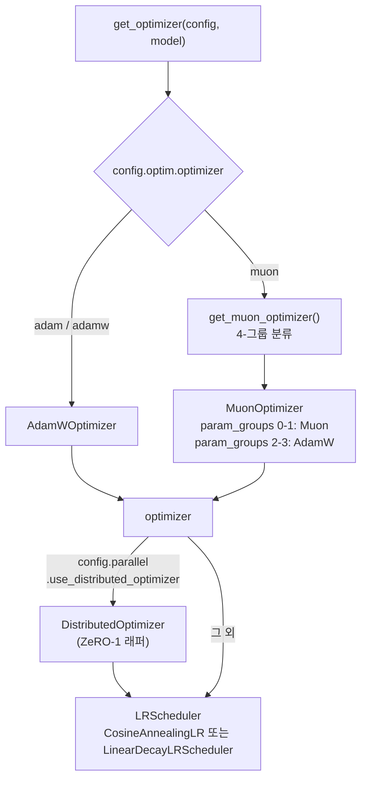
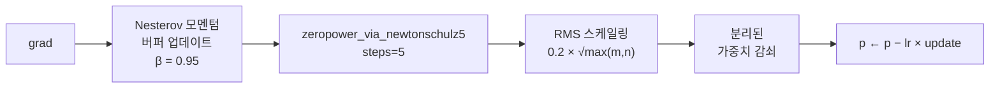

# 옵티마이저 시스템 설계

## 개요

IronCore는 **Muon + AdamW 하이브리드 옵티마이저**를 사용합니다: Newton-Schulz 직교화가 있는 Muon은 2D 가중치 행렬 (어텐션 프로젝션, MLP 가중치)에 적용되고, AdamW는 나머지 모든 것 (임베딩, 바이어스, 노름)을 처리합니다. 단일 `MuonOptimizer.step()`이 내부 파라미터 그룹 라우팅을 통해 하나의 호출로 둘 다 구동합니다.

`DistributedOptimizer`는 모델 가중치 레이아웃을 변경하지 않고 옵티마이저 상태를 DP 랭크에 샤딩합니다 (ZeRO-1).

## 대상 / 제약 조건

- 단일 노드 멀티 GPU; Muon 모멘텀 버퍼는 항상 온디바이스 (GPU).
- AdamW 상태만 CPU RAM으로 오프로드 가능 — Muon의 직교화는 온디바이스 계산이 필요.
- `DistributedOptimizer`는 FSDP와 호환되지 않음 (둘 다 `step()` 경계를 소유).
- LR 스케줄러는 마이크로 배치당이 아닌 옵티마이저 스텝당 한 번 진행.

## 아키텍처



## Muon 알고리즘

### Newton-Schulz 직교화

5차 다항식 점화식의 5번 반복을 통해 그레이디언트 행렬의 극좌표 분해에서 직교 인수를 근사합니다 (Moonshot AI, arXiv 2502.16982):

```
x ← G.bfloat16()           # 효율적인 GPU 행렬 곱을 위해 bf16으로 변환
x ← x / (‖x‖_F + ε)       # 특이값이 [0, 1]에 속하도록 정규화
if x.shape[0] > x.shape[1]:
    x ← xᵀ                 # tall → wide로 방향 조정

for _ in range(5):
    A = x xᵀ
    x ← a·x + (b·A + c·A²)·x   # a=3.4445, b=−4.7750, c=2.0315

if transposed: x ← xᵀ
```

출력은 연산자 노름 ≈ 1인 반직교 행렬.

### Muon 스텝



Muon 그룹 내의 비 2D 파라미터는 모멘텀이 있는 SGD로 폴백합니다.

### `is_muon_param()` 결정 규칙

파라미터가 **두 단계 필터**를 통과하면 Muon을 사용합니다:

1. **기본 필터** (둘 다 필요): `.dim() == 2` AND 이름이 `.weight`로 끝남
2. **제외 패턴**: 이름에 `embedding`, `output_layer`, `lm_head`, `position_embedding`, `pos_embedding`이 포함 → AdamW
3. **포함 패턴**: 이름이 명시적 `muon_patterns` 목록 중 하나와 일치 → Muon

## 4-파라미터 그룹 분류

파라미터는 두 직교 축으로 분할됩니다:

| 축 | Muon | AdamW |
|---|---|---|
| **그룹 0 / 2** (가중치 감쇠) | `is_muon_param()=True` + `should_decay=True` | `is_muon_param()=False` + `should_decay=True` |
| **그룹 1 / 3** (감쇠 없음) | `is_muon_param()=True` + `should_decay=False` | `is_muon_param()=False` + `should_decay=False` |

**가중치 감쇠 제외** (`should_decay = False`): `bias` 파라미터, `LayerNorm` / `RMSNorm` 가중치와 바이어스, `lora_A`, 임베딩 가중치 (`optim.no_decay_on_embedding: true`일 때, 기본값).

## AdamW

표준 분리된 AdamW:

```
exp_avg     ← β₁·exp_avg + (1−β₁)·grad
exp_avg_sq  ← β₂·exp_avg_sq + (1−β₂)·grad²
step_size   = lr · √(1−β₂ᵗ) / (1−β₁ᵗ)
p           ← p · (1 − lr·λ)              # 분리된 가중치 감쇠
p           ← p − step_size · exp_avg / (√exp_avg_sq + ε)
```

## LR 스케줄러

### CosineAnnealingLR

```
step ≤ warmup_steps:
    lr = base_lr × (step / warmup_steps)

warmup < step < warmup + annealing:
    progress = (step − warmup) / annealing
    lr = min_lr + (base_lr − min_lr) × (1 + cos(π · progress)) / 2

step ≥ warmup + annealing:
    lr = min_lr
```

### LinearDecayLRScheduler

```
step ≤ warmup:   lr = base_lr × (step / warmup)
step > warmup:   lr = base_lr × (1 − (step − warmup) / (total − warmup))
```

## 옵티마이저 상태 오프로드

AdamW 상태만 오프로드 가능합니다. Muon 모멘텀 버퍼는 GPU에 유지됩니다.

CPU 계산 경로: grad D2H → CPU에서 AdamW 계산 → delta H2D → GPU에서 파라미터 업데이트. 상태는 CPU에 유지됩니다.

## 설정 레퍼런스

| 필드 | 그룹 | 설명 |
|---|---|---|
| `optimizer` | `optim` | `"adam"` \| `"muon"` |
| `lr_scheduler` | `optim` | `"cosine"` \| `"linear"` |
| `max_lr` | `optim` | 최대 학습률 |
| `min_lr` | `optim` | 어닐링 후 최소 LR |
| `warmup_steps` | `optim` | 선형 워밍업 기간 |
| `muon_momentum` | `optim` | Muon Nesterov 모멘텀 (기본값: `0.95`) |
| `muon_newton_schulz_steps` | `optim` | Newton-Schulz 반복 횟수 (기본값: `5`) |
| `clip_grad` | `optim` | 전역 그레이디언트 클리핑 노름 (`0` = 끄기) |
| `use_distributed_optimizer` | `parallel` | ZeRO-1 상태 샤딩 |
| `optimizer_offload` | `offload` | AdamW 상태를 CPU로 오프로드 |

## 파일 인덱스

| 파일 | 역할 |
|---|---|
| `ironcore/optimizer/__init__.py` | `get_optimizer()`, `get_muon_optimizer()` — 팩토리 |
| `ironcore/optimizer/muon.py` | `MuonOptimizer`, `is_muon_param()`, `zeropower_via_newtonschulz5()` |
| `ironcore/optimizer/adamw.py` | `AdamWOptimizer` — 커스텀 분리된 AdamW |
| `ironcore/optimizer/distributed_optimizer.py` | `DistributedOptimizer` — ZeRO-1 래퍼 |
| `ironcore/optimizer/lr_scheduler.py` | `CosineAnnealingLR`, `LinearDecayLRScheduler`, `get_lr_scheduler()` |
| `ironcore/offload/optimizer_helpers.py` | `_adamw_offloaded_step()` — CPU 계산 AdamW |
| `ironcore/parallel/grad_norm.py` | `clip_grad_norm()` — 다축 전역 노름 |
