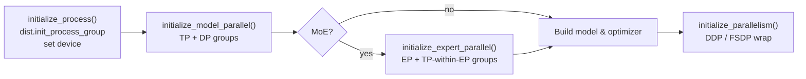
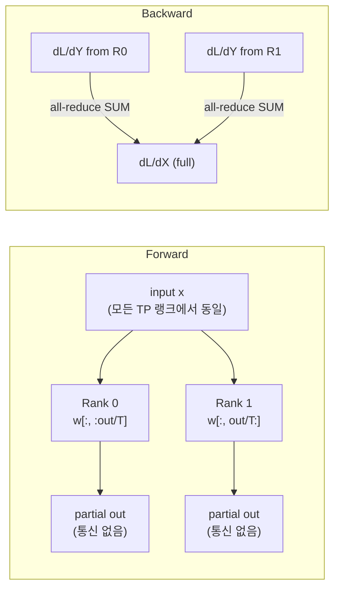
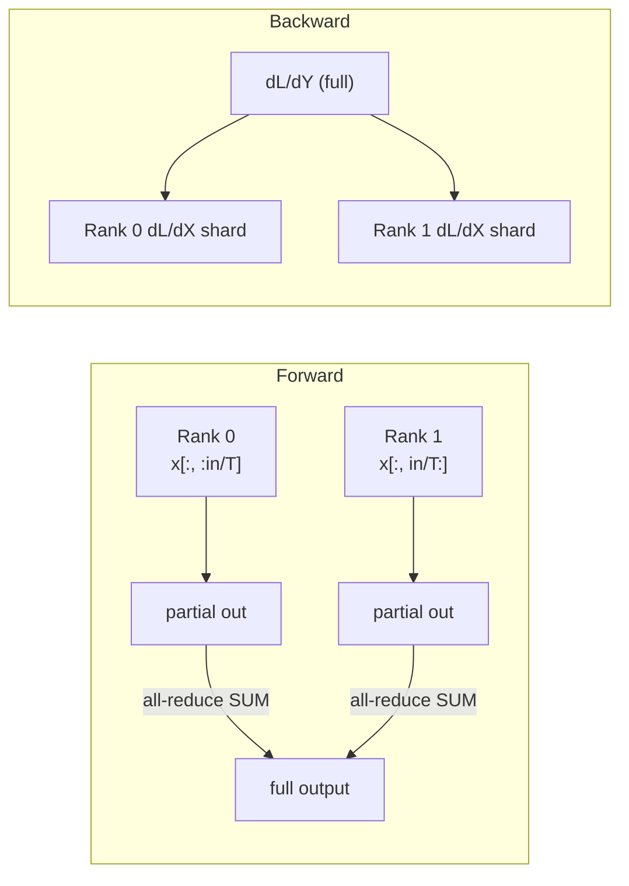

# 병렬화 시스템 설계

## 개요

IronCore는 네 가지 직교적인 병렬화 축을 지원합니다 — 텐서 병렬(TP), 데이터 병렬(DP), 전문가 병렬(EP), FSDP — 이들을 자유롭게 조합할 수 있습니다. 단일 `DistributedOptimizer`는 전체 FSDP 래핑의 오버헤드 없이 DDP 위에서 ZeRO-1 옵티마이저 상태 샤딩을 제공합니다.

## 대상 / 제약 조건

- 단일 노드 또는 멀티 노드 CUDA (NVLink 또는 PCIe); Docker를 통한 ROCm.
- TP는 빠른 노드 내 링크가 필요합니다 (NVLink 권장 — TP 그룹 내에서 집합 연산이 많음).
- EP는 MoE 전용; TP와 EP는 동시에 활성화 가능.
- `DistributedOptimizer`는 FSDP와 상호 배타적 (둘 다 옵티마이저 스텝을 소유).
- LoRA 어댑터는 항상 TP 랭크 전체에 **복제**됩니다, 샤딩 없이 — TP 정확성은 어댑터 내부가 아닌 병렬 선형 경계에서 처리.

## 아키텍처


### 프로세스 그룹 레이아웃

`world_size = W`, `tp_size = T`, `dp_size = W / T`에 대해:

- **TP 그룹** (T 랭크씩): `i ∈ [0, dp_size)`에 대해 `[i*T, i*T+1, …, i*T+T-1]`.
  TP 그룹의 모든 랭크는 *동일한* 데이터 샤드를 처리하고 *다른* 가중치 샤드를 보유.
- **DP 그룹** (dp_size 랭크씩): `j ∈ [0, T)`에 대해 `[j, j+T, j+2T, …]`.
  DP 그룹의 모든 랭크는 *다른* 데이터 샤드를 처리하고 *동일한* 가중치 샤드를 보유 (같은 TP 위치).

예시 — 8 GPU, TP=2, DP=4:

| DP 랭크 | TP 랭크 0 | TP 랭크 1 |
|---------|-----------|-----------|
| 0 | GPU 0 | GPU 1 |
| 1 | GPU 2 | GPU 3 |
| 2 | GPU 4 | GPU 5 |
| 3 | GPU 6 | GPU 7 |

TP 그룹: `[0,1]`, `[2,3]`, `[4,5]`, `[6,7]` — DP 그룹: `[0,2,4,6]`, `[1,3,5,7]`.

### 초기화 순서 (반드시 따라야 함)



파일: `ironcore/parallel/parallel_states.py`, `ironcore/parallel/expert_parallel/parallel_states.py`,
`ironcore/parallel/parallel.py`.

## 텐서 병렬

TP는 가중치 행렬을 랭크에 분산하고 집합 연산을 사용해 단일 GPU 순전파와 동일한 결과를 생성합니다. 두 가지 켤레 선형 레이어 타입이 수학을 처리합니다:

### ColumnParallelLinear

**출력** 차원을 분할: 각 랭크는 가중치 `[in, out/T]`를 보유.



- 순전파: **통신 없음** — 입력이 이미 TP 랭크 전체에 동일하게 복제됨.
- 역전파: 입력 그레이디언트 `dL/dX`에 대해 `all_reduce(SUM)`.

### RowParallelLinear

**입력** 차원을 분할: 각 랭크는 가중치 `[in/T, out]`를 보유.



- 순전파: 전체 출력을 생성하기 위해 부분 출력에 `all_reduce(SUM)`.
- 역전파: **통신 없음** — `dL/dY`가 이미 전체; 각 랭크는 로컬 행렬 곱으로 자신의 입력 그레이디언트 샤드를 계산.

**`input_is_parallel` 최적화.** `RowParallelLinear`가 `ColumnParallelLinear` 다음에 오는 경우 (표준 트랜스포머 레이아웃), 생성자는 `input_is_parallel=True`로 호출됩니다. Column 출력이 이미 랭크에 분할되어 있으므로 Row 행렬 곱 전에 scatter가 필요 없습니다. 이는 Column→Row 쌍을 **순전파당 정확히 하나의 all-reduce**와 역전파당 하나로 줄입니다 — 이 분해에 대한 이론적 최소값.

### 어텐션

QKV 프로젝션은 `ColumnParallelLinear`를 사용; 출력 프로젝션은 `input_is_parallel=True`인 `RowParallelLinear`를 사용. 헤드가 고르게 분할됩니다:

```
num_local_heads    = num_attention_heads    // tp_size
num_local_kv_groups = num_attention_groups // tp_size  # GQA / MQA
```

K와 V 프로젝션은 단일 `ColumnParallelLinear` (`linear_kv`, `concatenated_weights=2`)로 연결되어 하나의 커널이 둘 다 처리하고, `torch.chunk`로 분할됩니다.

### Vocab 및 교차 엔트로피

`VocabParallelEmbedding`은 TP 랭크에 vocab을 샤딩합니다. 손실 함수 `vocab_parallel_cross_entropy`는 샤딩된 로짓에 대해 수치적으로 안정적인 CE를 처리합니다.

### 비동기 TP (시퀀스 청킹)

표준 TP는 다음 레이어가 시작하기 전에 all-reduce가 완료되기를 기다립니다. 비동기 TP는 청크 *k*의 all-reduce와 청크 *k+1*의 계산을 겹쳐 이 지연을 숨깁니다.

설정: `trainer.sequence_chunk_size` (청크당 토큰 수; `null`은 청킹 비활성화).

## 데이터 병렬

### DDP

표준 PyTorch DDP가 DP 프로세스 그룹에 모델을 래핑합니다. `use_fsdp=False`이고 `world_size > 1`일 때 활성화됩니다.

### DistributedOptimizer (ZeRO-1)

파라미터나 그레이디언트를 샤딩하지 않고 옵티마이저 **상태** (모멘텀, 분산)만 DP 랭크에 분산합니다. 메모리-통신 트레이드오프 곡선에서의 ZeRO-1 지점입니다.

할당: 라운드 로빈 — 랭크 `r`은 인덱스 `{i | i % dp_size == r}`의 파라미터를 소유.

### FSDP

지원되는 `fsdp_sharding_strategy` 값: `FULL_SHARD` (ZeRO-3), `SHARD_GRAD_OP` (ZeRO-2), `NO_SHARD`, `HYBRID_SHARD`.

TP > 1일 때 아직 비행 중인 비동기 TP all-reduce 핸들과의 경쟁을 피하기 위해 FSDP forward prefetch가 비활성화됩니다. Backward prefetch (`BACKWARD_PRE`)는 TP와 경쟁하지 않으므로 유지됩니다.

## 전문가 병렬 (MoE)

EP는 EP 랭크에 전문가 가중치 샤드를 분산합니다. 각 랭크는 `num_experts / ep_size`개의 전문가를 보유합니다.

`AllToAllDispatcher`가 두 번의 `all_to_all_single` 호출로 토큰을 올바른 EP 랭크로 라우팅합니다.

## 그레이디언트 노름

`clip_grad_norm()`은 모든 병렬화 축에 걸쳐 진정한 전역 그레이디언트 노름을 계산합니다. TP 샤딩된 파라미터는 부분 그레이디언트를 보유하는 반면, 복제된 파라미터는 전체 그레이디언트를 보유합니다 — 합산하면 과다 계산됩니다.

## LoRA와 텐서 병렬

LoRA 어댑터는 TP 랭크 전체에 **복제**됩니다. TP 정확성은 각 병렬 선형의 경계에서 처리됩니다:

| 베이스 레이어 | LoRA A | LoRA B | 정확성 메커니즘 |
|---|---|---|---|
| ColumnParallelLinear | 복제 | 출력 차원 샤딩 | B가 TP 출력 분할을 상속 |
| RowParallelLinear | 입력 차원 샤딩 | 복제 | A 부분 × B 복제, all-reduce 전 결합 |

## 설정 레퍼런스

| 필드 | 위치 | 설명 |
|---|---|---|
| `tensor_model_parallel_size` | `trainer` | TP 차수 (기본값: 1) |
| `sequence_chunk_size` | `trainer` | 비동기 TP용 청크당 토큰 수 (`null` = 비활성화) |
| `use_fsdp` | `parallel` | FSDP 래핑 활성화 |
| `fsdp_sharding_strategy` | `parallel` | `"full"` \| `"shard_grad_op"` \| `"no_shard"` \| `"hybrid"` |
| `fsdp_use_orig_params` | `parallel` | 옵티마이저 오프로드와 FSDP 결합 시 필요 |
| `use_distributed_optimizer` | `parallel` | ZeRO-1 상태 샤딩 (DDP만) |
| `dist_opt_bucket_cap_mb` | `parallel` | 브로드캐스트 버킷 크기 (기본값: 25 MB) |
| `expert_model_parallel_size` | `model.moe` | EP 차수 (MoE 전용, 기본값: 1) |

## 파일 인덱스

| 파일 | 역할 |
|---|---|
| `ironcore/parallel/parallel_states.py` | TP/DP 그룹 초기화 및 접근자 |
| `ironcore/parallel/parallel.py` | `initialize_parallelism()` — DDP/FSDP 래핑 |
| `ironcore/parallel/tensor_parallel/layers.py` | `ColumnParallelLinear`, `RowParallelLinear`, `VocabParallelEmbedding` |
| `ironcore/parallel/tensor_parallel/comm.py` | 저수준 집합 연산; 비동기 TP용 `reduce_async()` |
| `ironcore/parallel/tensor_parallel/cross_entropy.py` | `vocab_parallel_cross_entropy` |
| `ironcore/parallel/expert_parallel/parallel_states.py` | EP/TP-within-EP 그룹 초기화 |
| `ironcore/parallel/expert_parallel/comm.py` | `AllToAllDispatcher` |
| `ironcore/parallel/grad_norm.py` | `clip_grad_norm()` — TP/DP/EP 전역 노름 |
| `ironcore/optimizer/distributed_optimizer.py` | `DistributedOptimizer` — ZeRO-1 |
| `ironcore/peft/lora.py` | 각 병렬 선형 타입의 LoRA 변형 |
