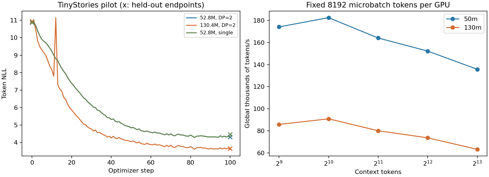

# 04. 약 50M/130M의 실제 텍스트 학습

## 명세

[A1의 최소 LM 학습](https://github.com/stanford-cs336/assignment1-basics/blob/main/cs336_assignment1_basics.pdf)을 3090에서 수행한다. 합성 반복 token의 loss 감소와 실제 corpus의 generalization은 별도 실험이다.

모델 구성은 pre-norm RMSNorm, RoPE, SwiGLU, bias 없는 projections, untied embedding/head다. tokenizer는 새 BPE를 학습하는 대신 GPT-2 tokenizer를 재사용한다. 이름이 아니라 실제 tensor parameter 수를 결과에 저장한다.

| label | width | layers | heads | head dim | FFN | context |
|---|---:|---:|---:|---:|---:|---:|
| 50m | 384 | 8 | 6 | 64 | 1024 | 1024 |
| 130m | 640 | 13 | 10 | 64 | 1792 | 1024 |

이는 원문의 모든 hyperparameter를 그대로 재현하는 실험이 아니다. 핵심 구성 요소를 같은 학습 루프에 연결한 소형 adaptation이다.

## 통제

- TinyStories source train/valid 분리; train 2,062,616 tokens, valid 258,230 tokens. 정확한 hash는 corpus manifest에 기록한다.
- BF16, dropout 0, seed 42, Adam 계열 optimizer, clipping 1.0, weight decay 0.1.
- global batch 32, context 1024: update당 32,768 tokens.
- 100 optimizer steps: 3,276,800 training token presentations. 이 작은 train subset은 순환하므로 unique token 수와 다르다.
- peak LR `3e-4`, min LR `3e-5`, 10-step warmup, 이후 cosine schedule.
- rank마다 8 held-out batches로 training 전/후 같은 evaluation 위치를 비교한다. DP=2는 총 16,384 tokens, single은 8,192 tokens다. token-weighted NLL이며 held-out 전체의 평가가 아니다. 따라서 single/DP의 최종 NLL 차이를 같은 eval set에서의 품질 차이로 해석하지 않는다.
- 50m에서 단일 GPU와 DP=2를 동일 global batch/token budget으로 비교한다. 두 BF16 궤적을 FP32의 exact equality로 요구하지 않는다.

## 명령

```bash
python scripts/benchmark_training.py --prepare --data-dir /tmp/ironcore-corpus
CUDA_VISIBLE_DEVICES=0,1 torchrun --standalone --nproc_per_node=2 \
  scripts/benchmark_training.py --data-dir /tmp/ironcore-corpus \
  --output /tmp/ironcore-50m-learning --model-size 50m \
  --context 1024 --micro-batch 4 --global-batch 32 --steps 100
```

130m은 `--model-size 130m`으로 변경한다. 전체 study runner가 동일 설정과 단일 GPU baseline을 실행한다.

## 실측 결과

| 모델 | 실제 parameters | GPU | 초기 held-out NLL | 100-step NLL | global tokens/s | peak allocated GiB/GPU |
|---|---:|---:|---:|---:|---:|---:|
| 50m | 52,795,776 | 2 | 10.8840 | 4.3268 | 175,874 | 4.06 |
| 130m | 130,433,920 | 2 | 10.9403 | 3.6536 | 87,157 | 5.97 |
| 50m | 52,795,776 | 1 | 10.8809 | 4.4628 | 89,829 | 3.86 |

peak memory는 모든 rank 중 최댓값이며 처리량은 초기 10 steps를 제외했다. 동일 global batch에서 50m의 DP=2 strong scaling은 **1.958×**다. 단일 GPU와 DP의 eval 범위 차이를 고려하여 이 비율은 timing 비교로만 사용한다.



근거: [전체 run 설정·rank별 결과](artifacts/2026-10-07/study.json), [측정 CSV](artifacts/2026-10-07/measurements.csv), [corpus manifest](artifacts/2026-10-07/corpus_manifest.json). 그래프의 x는 초기/최종 held-out NLL이고 곡선은 training NLL이다. 세 run은 같은 seed를 쓰지만 single/DP 곡선의 bitwise 동일성을 주장하지 않는다.

benchmark는 실제 trainer/model/optimizer를 사용하고 data iterator만 deterministic memmap iterator로 교체한다. 이 pilot은 tokenizer 및 native data-preprocessing pipeline 전체의 end-to-end 성능 측정은 아니다. 원본 corpus 전문과 model weights는 저장소에 추가하지 않았다.

## 해석

이 실험의 통과는 실제 텍스트를 대상으로 학습 update가 이루어지고 지정한 held-out subset의 NLL이 낮아짐을 뜻한다. 지식·추론·범용 instruction-following을 갖춘 모델을 완성했다는 뜻은 아니다. CS336 A5의 1B pretrained reasoning model 실험을 from-scratch 50M 모델의 toy reward로 대체했다고 주장하지 않는다.

130m은 step 12에서 training NLL이 7.8006→11.1490으로 뛰었고 clipping 이전 gradient norm은 143.83이었다. 다음 step의 NLL은 7.3258로 회복했다. LR은 이 구간에서 연속적으로 감소했지만 이 기록만으로 spike의 원인을 확정할 수 없다. 이를 smoothing으로 숨기지 않고 그래프와 raw 기록에 남겼다.

작은 subset 반복, single seed, 제한된 eval token 수는 pilot의 한계다. 블로그에서 generalization이나 안정성을 강하게 주장하려면 seed별 반복, 더 큰 training corpus, 전체 held-out 평가와 task-level benchmark를 추가해야 한다.
