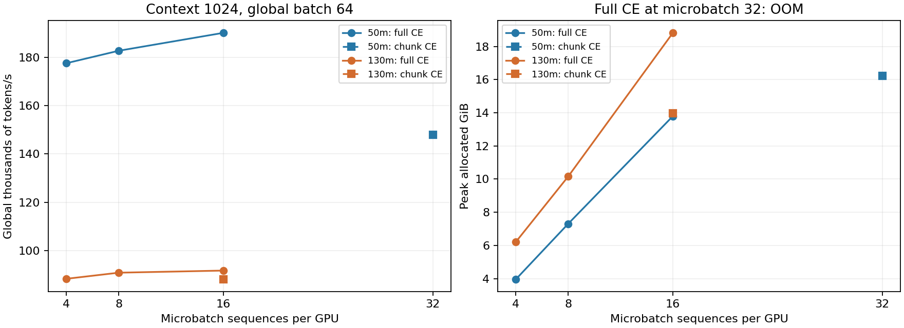

# 05. 3090에서 처리량과 메모리 최적화

## 명세

[A2 Systems](https://github.com/stanford-cs336/assignment2-systems/blob/main/cs336_assignment2_systems.pdf)의 profiling, mixed precision, activation checkpointing, kernel/분산 성능 비교를 이 trainer에서 측정한다. 현재 소형 모델을 기준으로 microbatch와 context를 늘려 hardware bottleneck을 드러낸다.

## 측정 방법

`benchmark_training.py`는 actual trainer step 전/후 CUDA synchronize를 수행하고 wall-clock elapsed를 재서 모든 rank의 MAX를 취한다. 초기 10 update는 timing 평균에서 제외한다. mean·median·p95, global tokens/s, rank별 max allocated/reserved bytes를 보존한다. steady-state update timing에는 forward/backward/optimizer 및 data `next()`가 포함되고 checkpoint/eval은 제외된다.

`run_training_study.py`는 한 번에 한 job을 실행한다. job별 nvidia-smi CSV에는 timestamp, GPU index, temperature, power, power cap, SM/memory clocks, utilization, memory 사용량을 기록한다. 마지막 프로파일 job의 torch trace와 key averages로 kernel/통신/CPU 공백을 확인한다. profiling 수치는 timing baseline과 별도이다.

## sweep

| 축 | 설정 | 비교 의도 |
|---|---|---|
| model | 50m, 130m | 연산 규모와 optimizer/통신 overhead |
| microbatch | 4, 8, 16, 32; context 1024; global batch 64 고정 | launch overhead와 memory/throughput 포화 |
| context | 512/2048/4096/8192; micro 16/4/2/1 | local microbatch tokens 8192 고정 시 attention 비용 |
| recompute | 130m, context 4096, micro 2 | activation memory와 추가 연산의 교환 |
| compile | 130m, context 1024, micro 8 | graph/kernel overhead 감소 |
| attention extension | 같은 설정, 실제 FlashAttention 설치 시 | SDPA 대비 별도 구현의 영향 |
| one vs two GPU | 50m, 동일 global batch/token budget | strong scaling |

context 비교는 attention workload 자체를 바꾼다. 서로 다른 context의 tok/s만 비교하여 kernel speedup이라고 부르지 않는다. microbatch가 달라질 때 global batch를 함께 바꾸는 context sweep은 accumulation overhead 비교와 구분한다.

OOM은 단순 제외하지 않고 실패한 용량으로 기록한다. reserved VRAM과 allocated VRAM을 구분한다. 높은 GPU utilization 자체를 높은 useful throughput이나 최대 hardware efficiency로 해석하지 않는다. 현재 GPU power cap 240 W에서 얻은 결과다.

## 구현 개선

중간 DDP accumulation에서 `no_sync`는 forward와 backward를 모두 감싸야 한다. 공통 trainer는 이 구조였지만 GRPO가 forward를 밖에서 실행했다. GRPO도 같은 범위로 변경했다. TP TFLOPS/GPU 로깅은 DP size가 아닌 실제 전체 GPU 수로 나누도록 보정했다.

현재 full-vocabulary CE의 FP32 intermediate와 gathered logits는 긴 context에서 큰 메모리를 사용한다. `trainer.loss_chunk_size`를 추가하여 token 축을 잘라 FP32 cast와 CE를 계산하도록 했다. 기본값 `None`은 기존 full CE다. logits 전체와 backward에 저장되는 softmax는 여전히 O(BSV)이므로 완전한 fused linear+CE나 vocab sharding 최적화는 아니다. CPU의 독립 CE 기준과 CUDA pretraining/SFT DP/TP/restart matrix로 gradient를 검증했다.

SDPA가 Flash 계열 fused kernel을 사용할 수 있다는 사실과 별도 `flash-attn` package의 존재는 다르다. `--attention flash`가 unavailable이면 조용히 SDPA로 대체하지 않고 실패한다. 현재 package 2.8.4는 PyTorch ABI와 맞지 않아 import가 실패했다. 최초 study의 마지막 job은 이 이유로 실패했으며 원본 report의 `status: failed`를 그대로 보존했다. 앞선 completed/OOM jobs의 결과는 각각 확인한다. 수정된 study runner는 실제 extension import를 확인하여 선택적인 비교가 불가능하면 `unavailable`로 기록한다.

PyTorch 2.12 profiler의 CUDA event 시간 속성이 변경되어 기존 CSV가 header만 저장되던 문제도 수정했다. `device_time_total`을 우선 사용하고 ranked trace 파일의 version 번호를 인식하여 덮어쓰기를 방지한다. 별도 profiler 실행에서 실제 CSV 행을 확인했다.

FLOP 추정기는 SwiGLU의 세 projection을 반영하도록 보정했다. 기록된 `6N` 계열 TFLOPS는 attention의 context 의존 비용 등을 완전히 포함하는 실제 MFU가 아니다. 이 노트는 측정한 tokens/s를 비교 지표로 사용한다.

## 실측 결과

context 1024, global batch 64, BF16, DP=2의 결과다. memory는 rank 중 최대 allocated이며 GiB 단위다. 각 sweep은 20 steps 중 마지막 10 steps의 timing을 평균한다.

| microbatch/GPU | 50m tokens/s | 50m GiB | 130m tokens/s | 130m GiB |
|---:|---:|---:|---:|---:|
| 4 | 177,503 | 3.96 | 88,343 | 6.22 |
| 8 | 182,651 | 7.31 | 90,863 | 10.16 |
| 16 | **190,063** | 13.80 | **91,737** | 18.82 |
| 32 | OOM | — | OOM | — |

50m full CE의 microbatch 32 실패는 추가 6.14 GiB allocation에 비해 남은 GPU memory가 2.52 GiB였다. 이 로그에서 unused reserved memory는 약 57 MiB로, 이 실패를 fragmentation으로 설명할 근거는 없다. [OOM 로그](artifacts/2026-10-07/50m_mb32_full_ce_oom.log).

local microbatch tokens 8192의 context 비교:

| context | microbatch/GPU | 50m tokens/s | 130m tokens/s |
|---:|---:|---:|---:|
| 512 | 16 | 174,267 | 85,762 |
| 1024 | 8 | 182,651 | 90,863 |
| 2048 | 4 | 164,184 | 80,026 |
| 4096 | 2 | 152,316 | 73,632 |
| 8192 | 1 | 135,795 | 63,187 |

context 1024 항목은 batch sweep의 global batch 64로 accumulation 4인 반면, 다른 context 항목은 accumulation 1이다. local workload는 같지만 전체 optimizer-step workload까지 같은 비교는 아니다. 길이를 늘릴수록 attention 비용이 커지는 경향과 함께 이 차이를 명시한다. 최대 길이 8192에서 130m의 peak allocated는 9.92 GiB였다.

동일 workload에서 최적화 비교:

| 변경 | 대조 → 변경 tokens/s | 대조 → 변경 GiB | 해석 |
|---|---:|---:|---|
| compile; 130m, context 1024, micro 8, global 16 | 86,108 → 97,873 | 9.91 → 9.35 | 처리량 +13.7%, peak allocated -5.7% |
| recompute; 130m, context 4096, micro 2, global 4 | 73,632 → 57,649 | 9.92 → 7.29 | 처리량 -21.7%, memory -26.5% |
| chunk CE 4096; 130m, context 1024, micro 16, global 64 | 91,737 → 88,155 | 18.82 → 13.97 | 처리량 -3.9%, memory -25.8% |
| chunk CE 4096; 50m, context 1024, micro 32, global 64 | OOM → 147,851 | OOM → 16.24 | 용량 확대, 측정 최고 처리량 조합은 아님 |

130m의 microbatch 32는 chunk CE를 적용해도 OOM이었다. 따라서 기본 systems YAML은 full CE/microbatch 16을 유지하고 chunking은 메모리 옵션으로 제공한다. compile은 짧은 한 번의 timing 비교다. 두 run의 최종 held-out NLL은 6.6141/6.6372로 같지 않았으므로 BF16 compile의 장시간 품질 동등성을 주장하지 않는다. compilation 초기 지연은 steady-state 처리량에서 제외된다.



수정 후 profile에는 2,686 GPU kernel events가 있었다. 대표 cumulative kernel duration은 BF16 GEMM 16.51 ms, 다른 GEMM 15.46/13.27 ms, NCCL BF16 all-reduce 9.24 ms다. `pytorch_flash::flash_bwd_dq_dk_dv_loop` 등 SDPA FlashAttention kernel을 확인했다. kernel별 duration 합은 overlap을 포함하므로 wall-clock 비율로 해석하지 않는다. profiler가 켜진 18,248 tokens/s는 정상 학습 처리량 비교에서 제외한다.

후속 HTML 제작에서 profiler schedule이 manager 시작 전에 진행되던 오류를 발견하고 수정했다. 위 단일-rank profile은 초반 update의 kernel 증거이며 post-warmup capture로 해석하지 않는다. 실제 update 13·14를 두 rank에서 다시 기록한 compute/NCCL overlap과 timeline은 [09](09-profiler-html.md) 및 [HTML 보고서](profiling/profile_report.html)를 따른다. non-profiled 성능 baseline은 이 schedule 오류의 영향을 받지 않는다.

근거: [측정 CSV](artifacts/2026-10-07/measurements.csv), [profile kernel 요약·원본 trace hash](artifacts/2026-10-07/profile_kernels.json), [수정 후 profiler CSV](artifacts/2026-10-07/profile_key_averages.csv), [extension 실패 로그](artifacts/2026-10-07/flash_extension_failure.log). telemetry는 같은 artifact 디렉터리의 각 run CSV다. 최대 성능이라는 표현은 이 sweep과 240 W 조건 안에서만 사용한다.

재현 예시(별도 output을 사용):

```bash
CUDA_VISIBLE_DEVICES=0,1 torchrun --standalone --nproc_per_node=2 \
  scripts/benchmark_training.py --data-dir /tmp/ironcore-corpus \
  --output /tmp/ironcore-compile --model-size 130m \
  --context 1024 --micro-batch 8 --global-batch 16 --steps 20 --compile
```

대조 run에서는 `--compile`을 생략한다. chunking은 `--loss-chunk-size 4096`이며 micro/global batch를 위 표와 맞춘다. 실제 follow-up 실행 명령은 [보존한 driver](artifacts/2026-10-07/followup_commands.txt)에 있다. 정상 PyTorch/Triton 환경 또는 00의 이번 세션용 workaround를 사용한다.
