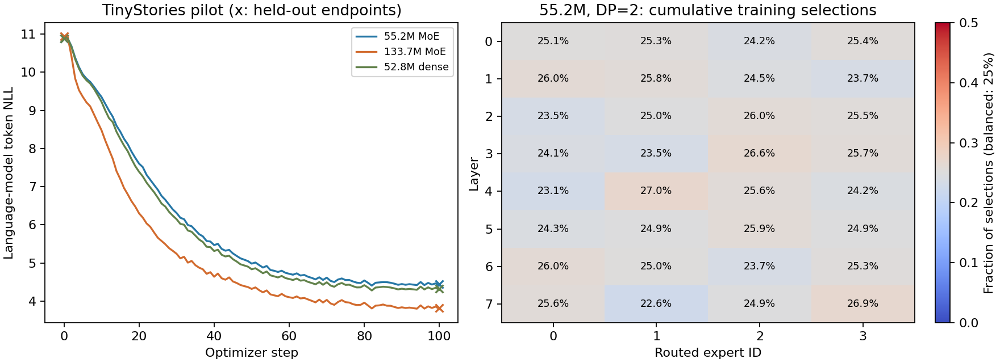

# 08. MoE의 routing·gradient·2-GPU 학습

## 질문과 판정 기준

MoE layer의 출력 shape가 맞고 gradient가 존재하는 것만으로 학습 도구의 정확성을 입증할 수 없다. shared expert + top-k routed expert의 합이 정의와 같아야 하고, router/input/expert의 gradient가 독립 기준과 일치해야 한다. EP=1에서 DP=2와 TP=2, EP=2에서 expert를 나누는 실행을 구분한다.

이번 실험은 이전 노트와 같은 RTX 3090 두 장, NVLink NV4, 240 W power cap, PyTorch 2.12.0+cu130 환경이다. 전체 증거는 [MoE artifacts](artifacts/2026-10-07-moe/README.md)에 보존한다. 기존 dense 실험의 artifact는 덮어쓰지 않는다.

## 실제 모델과 목적함수

RMSNorm/RoPE/SwiGLU, routed experts 4, top-k 2, shared expert 1, dropout/jitter 0, token dropping 없음이다. router logits/top-k/softmax는 FP32이며 mixture weights는 activation dtype으로 cast한다. expert의 FFN은 gate/up/down 세 projection이다.

`y = sum(shared_experts(x)) + sum_k(w_k(x) * routed_expert_k(x))`이며 선택한 top-k logits의 softmax를 정규화한다. load-balancing regularizer는 `alpha * E * sum(f_i * P_i)`다. `f_i`는 전체 top-k selection 수로 정규화한 빈도이고 `P_i`는 전체 experts에 대한 평균 softmax probability다. top-k를 1개 token 선택 횟수로 정규화하는 다른 정의와 구분한다.

**이 regularizer는 microbatch마다 계산한 뒤 평균한다.** `f_i * P_i`는 token별 additive loss가 아니므로 microbatch/DP 구성을 바꾸면 global-batch regularizer와 같은 목적함수가 되지 않는다. 수치 동등성 matrix는 `alpha=0`으로 routing 및 main objective를 검증하고, 별도 독립 수식 테스트는 `alpha=0.1`에서 auxiliary loss와 router gradient까지 확인한다. 실제 텍스트 pretraining은 `alpha=0.01`을 사용한다. DPO/GRPO 경로는 MoE auxiliary loss를 목적함수에 추가하지 않으며 이 matrix의 설정도 alpha 0이다.

| 이름 | width/layers | expert FFN | total parameters | active parameters/token 추정 |
|---|---|---:|---:|---:|
| 55m MoE | 384/8 | 256 | 55,167,360 | 50,448,768 |
| 134m MoE | 640/13 | 384 | 133,662,080 | 114,492,800 |

active 추정은 non-expert parameters 전체와 shared+선택한 routed experts를 포함한다. 실제 FLOP count는 아니며 embedding 접근/attention/context/dispatch 비용과 optimizer가 보관하는 전체 expert states를 구분해야 한다. dense FLOP 추정값을 MoE의 TFLOPS/MFU로 출력하지 않도록 했다. 성능은 synchronized tokens/s와 rank별 VRAM으로 비교한다.

## 발견과 수정

### SwiGLU expert의 TP shard

`ExpertMLP`가 gate/up의 concatenation 개수를 1로 전달하여 TP=2가 contiguous 절반을 나눴다. 각 rank에서 서로 대응하지 않는 gate/up가 곱해졌다. 초기 full weights는 같았지만 첫 gradient 최대 절대 오차가 **0.01356825**, 최종 weights 오차가 **0.00350082**였다. 실행과 finite loss만 검사했다면 통과했을 오류다.

GLU expert는 concatenation 2로 partition하도록 수정했다. shared expert에도 같은 수정이 적용된다. 수정 전 실패 report와 이후 matrix를 함께 보존한다.

### router precision과 idle experts

router operands를 FP32로 cast해도 외부 BF16 autocast가 matmul을 다시 BF16으로 내렸다. logits도 activation dtype으로 즉시 cast하고 있었다. router matmul에서 autocast를 끄고 logits/top-k/softmax를 설정 dtype으로 유지하도록 변경했다. CPU BF16 autocast 아래에서 독립 FP32 matmul/top-k/softmax와 비교했다.

한 microbatch에서 선택되지 않는 routed expert는 backward graph에 없을 수 있다. MoE DDP는 `find_unused_parameters=True`로 구성한다. [PyTorch 2.12 DDP 문서](https://docs.pytorch.org/docs/2.12/generated/torch.nn.parallel.DistributedDataParallel.html)의 unused-parameter 처리와 같은 조건이다. iteration마다 선택이 달라질 수 있으므로 한 번의 fully-used batch를 근거로 static graph로 고정하지 않는다.

idle-expert 실험은 router bias `[2,1,-2,-3]`와 zero router weights로 시작한다. top-k tie 대신 명확한 margin으로 두 experts를 미선택 상태에 두고 gradient/optimizer/restart를 비교한다. 미선택 parameter의 raw gradient는 비교에서 zero로 표현하되 optimizer의 `grad=None` 동작은 변경하지 않는다.

### 측정에 필요하지 않은 CPU 동기화

매 MoE forward에서 전체 router probability와 selected indices를 CPU로 복사하던 것을 device에 detach해서 보관하고 getter 호출 때 복사하도록 바꿨다. expert mask의 `any()` 이후 다시 `where()`를 호출하는 중복 host synchronization도 줄였다. getter의 CPU tensor 반환은 유지한다. 이 변경만의 isolated speedup을 측정했다고 주장하지 않는다.

## 수치 matrix

FP32/BF16의 네 trainer × full/accum/DP=2/TP=2 matrix가 모두 통과했다. 통제 모델은 42,016 parameters, global batch 8, 4 steps다. FP32 gate `atol=2e-5, rtol=2e-4`, BF16 gate `atol=5e-3, rtol=5e-2`는 dense 실험과 같다. 아래는 단일 full batch 대비 accum/DP/TP 세 경우의 최대 절대 오차다.

| task | FP32 raw gradient | FP32 최종 weights | BF16 raw gradient | BF16 최종 weights |
|---|---:|---:|---:|---:|
| pretraining | 4.47e-8 | 1.40e-7 | 1.95e-3 | 1.72e-3 |
| SFT | 2.98e-8 | 1.94e-7 | 9.77e-4 | 1.75e-3 |
| DPO | 1.19e-7 | 4.02e-7 | 3.91e-3 | 1.71e-3 |
| GRPO/GSPO | 1.19e-7 | 4.97e-7 | 3.91e-3 | 1.59e-3 |

두 matrix의 32개 same-topology 재개와 idle-expert matrix의 4개 재개에서 weights/reference/후반 loss 궤적 오차는 정확히 0이었다. scheduler/scaler 상태도 일치했다. idle-expert의 full/accum/DP/TP 비교도 통과했다. 실제 online GRPO generation은 두 precision에서 각각 full/DP/TP를 실행했고, 모든 경우 nonzero policy update를 만들었다. BF16 최대 weight 변화는 0.001953125, 평가 mean reward는 full 0.53125, DP/TP 0.5였다. toy reward pipeline의 동작 증거이며 reasoning 성과가 아니다.

CPU 회귀는 **131 passed, 1 skipped**다. 독립 sparse mixture+auxiliary 수식/gradient, BF16 autocast의 FP32 router, EP 사전 거부를 포함한다. [FP32 report](artifacts/2026-10-07-moe/ironcore-moe-fp32/report.json), [BF16 report](artifacts/2026-10-07-moe/ironcore-moe-bf16/report.json), [idle-expert report](artifacts/2026-10-07-moe/ironcore-moe-idle/report.json), [회귀 로그](artifacts/2026-10-07-moe/regressions.log)를 근거로 한다.

기본 학습 설정의 `alpha=0.01`도 BF16 pretraining/SFT의 DP=2에서 따로 검증했다. 두 경우의 same-topology 재개 weights/loss 오차가 0이었으며, 이 노트의 총 exact-resume 비교는 **38개**다. [auxiliary 포함 재개 report](artifacts/2026-10-07-moe/ironcore-moe-aux-resume/report.json). 이는 다른 microbatch 구성 사이의 regularizer 동등성을 주장하는 검증은 아니다.

```bash
CUDA_VISIBLE_DEVICES=0,1 python scripts/validate_trainers.py \
  --device cuda --architecture cs336 --moe --steps 4 \
  --output /tmp/moe-fp32
```

BF16은 `--precision bfloat16`, idle-expert 비교는 `--moe-idle --tasks pretrain`으로 별도 output을 사용한다.

## EP=2의 실패: 학습 경로 차단

`validate_moe_ep.py`는 EP=1의 full expert layer에서 각 EP rank가 소유한 global expert weights를 복사한다. 동일 inputs와 rank별 다른 inputs를 모두 비교하고 input/router/shared/routed expert gradient를 검사한다. 이 테스트는 full LanguageModelTrainer가 아닌 EP layer oracle이다. 마지막에는 실제 trainer wrapping 함수를 적용해 shard weights가 유지되는지 확인한다.

| EP 경로 | 관측 | 판정 |
|---|---|---|
| all-reduce, 같은 inputs | 출력 오차 0, parameter gradient 최대 오차 0.00520021 | backward gate 실패 |
| all-reduce, 다른 inputs | 같은 tensor 위치의 다른 tokens를 합침; parameter gradient 최대 오차 0.00989785 | forward/backward 의미 불일치 |
| all-to-all | 출력 오차 최대 4.62e-5, 두 local experts의 4개 weight gradient가 없음 | dispatch/combine 정렬·autograd gate 실패 |
| generic DDP wrapping | rank 1 routed weights가 최대 0.03345391 바뀜 | 다른 expert IDs를 같은 parameter로 broadcast |

이는 실행 실패나 환경 오류가 아니라 정상 종료한 oracle의 **수치 실패**다. 원본 report의 `status: failed`를 유지한다. 최초 oracle 준비 실행의 timeout 인자 누락은 이 수치 증거로 사용하지 않는다.

static inspection에서도 native checkpoint가 EP expert global IDs와 optimizer states를 모으는 경로를 제공하지 않음을 확인했다. EP=2 checkpoint 재개를 성공했다고 주장하지 않는다. trainer 초기화 전에 EP>1을 명시적으로 거부하고 generic DDP/FSDP wrapping도 거부하도록 했다. layer-level EP 연구 도구는 남아 있으므로 위 실패를 재현할 수 있다.

```bash
CUDA_VISIBLE_DEVICES=0,1 python scripts/validate_moe_ep.py --output /tmp/moe-ep-oracle
# 현재 구현의 numerical gate 실패를 report로 보존하고 exit code 1을 반환한다.
```

EP를 학습용으로 열려면 token ownership, autograd-aware dispatch/combine, replicated/owned parameters의 분리된 gradient synchronization, global expert ID initialization/checkpoint, 독립 gradient oracle 및 restart gate가 필요하다. EP=1의 DP=2·TP=2와 이 실패를 함께 보고한다.

## 실제 텍스트 학습과 성능

train/valid corpus와 optimizer/token budget은 04와 같으며 DP=2, microbatch 4, global batch 32, context 1024, 100 steps를 실행했다. held-out은 rank마다 8 batches로 총 16,384 tokens다. auxiliary regularizer를 제외한 held-out token NLL을 비교한다. 그래프의 training NLL도 rank별 auxiliary loss 평균을 total objective에서 빼서 그린다.

동시 GPU 작업 없이 55m/134m learning, 같은 시점의 dense 52.8m control, 55m microbatch 8/context 4096/TP=2를 순서대로 실행한다. total/active parameter 수와 architecture 차이가 있으므로 dense/MoE의 tokens/s 차이를 같은 compute 또는 같은 quality budget의 speedup으로 부르지 않는다.

```bash
CUDA_VISIBLE_DEVICES=0,1 python scripts/run_training_study.py \
  --moe --data-dir /tmp/ironcore-corpus --output /tmp/moe-study \
  --wait-for-validation /tmp/moe-fp32/report.json
```

CLI systems-only 설정은 `configs/experiments/cs336_55m_moe_dp2.yaml`, `cs336_134m_moe_dp2.yaml`이며 random-token workload다. 실제 text learning에는 benchmark/study 도구를 사용한다.

| 모델, DP=2 | 초기 held-out NLL | 100-step NLL | global tokens/s | peak allocated GiB/GPU | peak reserved GiB/GPU |
|---|---:|---:|---:|---:|---:|
| 55.2M MoE | 10.8862 | **4.4404** | 127,318 | 4.08 | 4.52 |
| 133.7M MoE | 10.9399 | **3.8211** | 65,023 | 6.16 | 6.73 |
| 52.8M dense control | 10.8840 | **4.3234** | 172,872 | 3.96 | 4.34 |

100 steps는 3,276,800 token presentations이며 train subset을 순환한다. 작은 corpus·single seed·부분 held-out 평가의 pilot이다. 이 dense/MoE 구성에서 MoE가 더 빠르거나 더 높은 품질을 보였다는 결론은 없다. 모델의 total/active parameters와 FFN 구성이 다르며, 같은 품질/FLOP budget의 비교 실험도 아니다.

누적 routed expert 선택에서 worst-layer `max count / mean count`는 55m **1.082**, 134m **1.093**이었다. 55m 각 layer의 4개 선택 비율은 약 22.64–27.05%였다. 모든 layer의 global selection count 합은 `100 × 32 × 1024 × top-k 2 = 6,553,600`과 일치했다. cumulative 평균이므로 step별 load collapse가 없었다고 확대하지 않는다. shared expert의 선택 빈도는 이 4개 histogram에 포함하지 않는다.



55m 성능 비교(초기 10 steps 제외):

| 구성 | steps | context | microbatch | global batch | tokens/s | peak allocated GiB/GPU |
|---|---:|---:|---:|---:|---:|---:|
| DP=2 baseline | 100 | 1024 | 4 | 32 | 127,318 | 4.08 |
| DP=2, 큰 microbatch | 20 | 1024 | 8 | 32 | 131,199 | 7.41 |
| DP=2, 긴 context | 20 | 4096 | 2 | 4 | 122,274 | 7.30 |
| TP=2, DP=1 | 20 | 1024 | 4 | 32 | 69,530 | 2.32 |

같은 global batch/context에서 microbatch 8은 baseline보다 처리량이 약 3.0% 높았고 더 많은 VRAM을 사용했다. TP=2는 GPU별 memory를 줄였지만 이 작은 모델에서는 DP=2보다 처리량이 낮았다. 20/100-step run의 timing 구간과 auxiliary objective의 구성 차이를 기록하며 장시간 품질 동등성을 주장하지 않는다. TP의 eval token 수는 8,192로 DP=2와 다르므로 sweep의 최종 eval 값도 같은 eval set으로 비교하지 않는다. context 4096 run은 batch/token budget도 달라서 순수 attention speedup 비교가 아니다.

MoE profile의 rank 0 trace에는 **15,595 kernel events**, `aten::mm` 1,356회, `aten::nonzero` 160회, `aten::index` 680회가 있었다. `_local_scalar_dense`는 324회/누적 CPU 36.84 ms, `nonzero`는 누적 CPU 8.16 ms였다. expert별 작은 GEMM, indexing/scatter, host synchronization이 남아 있다는 증거다. 처리량 제한의 원인이라는 해석은 추정이며 grouped GEMM/fused dispatch ablation으로 분리 검증하지 않았다. kernel duration의 합은 wall-clock 시간이 아니고 profiler run의 처리량은 baseline에 섞지 않는다.

이 단일-rank profile은 이후 발견한 profiler schedule 오류 때문에 초반 update를 기록했다. post-warmup 구간이라고 해석하지 않는다. schedule 수정 후 두 rank의 실제 update 13·14를 다시 수집한 DP/TP compute·collective 분석과 인터랙티브 HTML은 [09](09-profiler-html.md) 및 [성능 보고서](profiling/profile_report.html)에 보존한다.

두 CLI YAML도 같은 모델·batch 설정에서 4-step 실제 2-GPU 학습을 통과했다. EP=2 YAML은 public CLI에서 명시적인 오류로 종료하며 NCCL 초기화 전에 거부되는 것을 확인했다. [CLI 설정/결과](artifacts/2026-10-07-moe/cli_smoke.json), [EP 거부 로그](artifacts/2026-10-07-moe/cli_ep_rejection.log), [전체 study](artifacts/2026-10-07-moe/study.json), [측정 CSV](artifacts/2026-10-07-moe/measurements.csv), [profile 요약](artifacts/2026-10-07-moe/profile_kernels.json)을 보존했다.

## 해석의 범위

이 실험은 uncapped top-2 shared+routed MoE의 수치와 작은 실제 corpus pilot을 검증한다. capacity/token dropping, expert choice, grouped GEMM/fused routing, EP+TP(4-GPU), expert-aware FSDP/offload, 대규모 alignment quality는 별도 실험이다. raw JSON의 routing count는 누적 선택 빈도이며 expert별 wall time이나 sequence-level quality를 대신하지 않는다.
