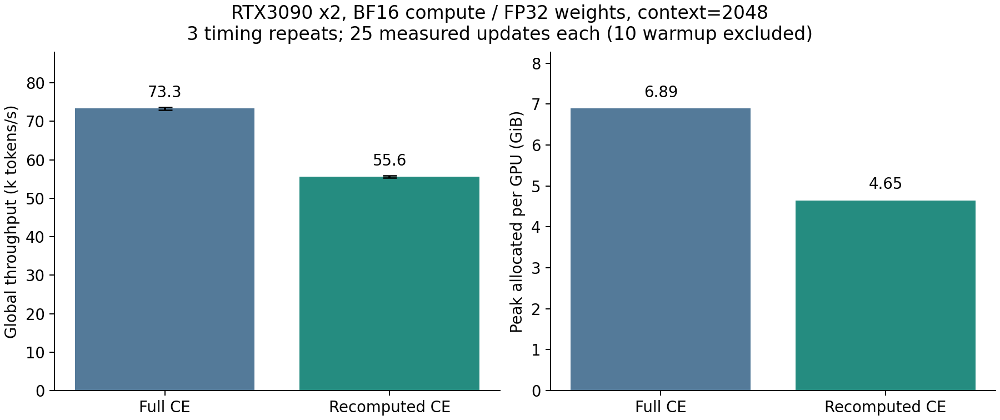
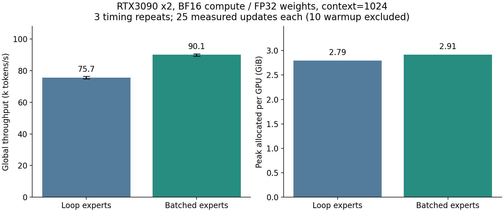

# 14. 보완 후 성능 ablation과 profiler

## 비교 계약

00–09의 source와 결과를 보존한다. 이 단계는 표준 AdamW 수식과 FP32 stored weights/BF16 compute를 기준으로 새로 측정한다. 이전 BF16 stored-weight 수치와 직접 비교해 개선율을 주장하지 않는다. GPU0/1의 두 RTX3090, NVLink NV4, 240W power cap, 동일 data/seed/global batch를 유지하고 작업을 순차 실행한다.

130M Dense는 context=2048, microbatch=2, global batch=8에서 full CE와 recomputed linear CE(chunk=256)를 비교한다. 약 55M MoE는 context=1024의 동일 batch에서 loop와 batched expert를 비교한다. 각각 35 updates 중 10 warmup을 제외한 slowest-rank synchronized step time을 3번 측정한다. Independent training seed sweep이 아니라 timing 반복이다. Profiler를 켠 run은 throughput ranking에서 제외한다.

## 구현

Recomputed linear CE는 token chunk마다 output projection→FP32 CE를 수행하고 backward에서 chunk를 재계산한다. Full `[B,S,V]` logits 저장을 피하지만 projection backward 계산량이 추가된다. Native custom autograd이며 Triton fused linear+CE라고 부르지 않는다. Bias-free output head와 tied/untied weights를 지원하고 TP CE/hidden-gradient reduction을 유지한다. 독립 full-projection loss·hidden/weight gradient의 CPU oracle와 CUDA trainer/restart matrix를 통과했다.

Batched expert는 sorted route를 expert별 padded `[E,capacity,H]`에 놓고 두 `bmm`으로 expert up/down projection을 수행한다. Capacity로 인한 padding overhead와 weight stacking 비용이 있다. Inactive expert의 gradient `None`을 보존해 unused parameter의 AdamW decay 의미를 바꾸지 않는다. TP input/router-weight backward reduction과 output reduction도 유지한다. EP>1이나 MLP dropout>0와 함께 사용하면 거부한다. 기본 backend는 loop로 유지하고 measured workload에서 이득이 확인된 경우만 batched를 선택한다.

## HTML 보고서

새 trace는 update 13/14에서 두 rank의 CPU/CUDA compute·collective를 포착한다. [09](09-profiler-html.md)의 parsing/interval union 방법을 재사용한다. Kernel duration의 합은 overlap 때문에 wall time과 같지 않다. NCCL kernel duration은 wire transfer 시간·실제 bytes/bandwidth와 같은 지표가 아니다. Rank별 timestamp origin과 critical path를 표시한다.

새 성능 표·메모리 변화·반복 spread·profiler 요약 및 self-contained HTML을 아래에 기록했다. Historical HTML과 source hash를 덮어쓰지 않는다.

## 3회 대조 결과

[원본 timing·memory 표](artifacts/2026-10-07-remediation/performance_comparison.csv)의 mean step time을 합쳐 global tokens/s를 계산했다. Range는 세 timing repeat의 최소/최대이고 peak은 두 GPU의 최대 allocated memory다.

| Workload | Context | Global tokens/s | Repeat range | Peak GiB/GPU |
|---|---:|---:|---:|---:|
| 130.4M full CE | 2048 | 73,332 | 72,869–73,716 | 6.894 |
| 130.4M recomputed CE | 2048 | 55,559 | 55,326–55,887 | 4.649 |
| 55.2M MoE loop | 1024 | 75,669 | 74,861–76,541 | 2.793 |
| 55.2M MoE batched | 1024 | 90,092 | 89,331–90,686 | 2.914 |

Recomputed CE는 이 workload에서 VRAM −32.6%, throughput −24.2%이다. Memory에 여유가 있으면 full CE가 빠르다. 긴 context나 더 큰 microbatch가 필요한 경우에 CE recomputation을 선택한다. MoE batched는 +19.1% throughput, +4.3% peak VRAM이다. 이득은 native loop 대비 관측한 것이며 Triton grouped GEMM이나 다른 expert 수로 일반화하지 않는다.

## Compute·collective 관측

[Self-contained HTML](profiling-remediation/profile_report.html)은 EP=2를 포함한 네 workload의 두 rank를 update 13/14에서 포착했다. [수치·trace SHA256](profiling-remediation/profile_summary.json)과 browser 검증을 보존한다. HTML의 steady column은 대응하는 profiler-off trial0이며 위 표는 세 repeat의 aggregate다.

| Run/rank | CUDA window ms | Compute union ms | Collective union ms | Compute overlap ms | Collective without compute ms |
|---|---:|---:|---:|---:|---:|
| Dense recomputed / 0 | 662.005 | 474.151 | 35.755 | 23.110 | 12.645 |
| Dense recomputed / 1 | 661.966 | 467.553 | 100.910 | 75.758 | 25.152 |
| MoE loop / 0 | 560.259 | 123.161 | 53.743 | 8.094 | 45.649 |
| MoE loop / 1 | 560.236 | 123.165 | 13.027 | 3.445 | 9.582 |
| MoE batched / 0 | 373.663 | 119.422 | 13.967 | 5.741 | 8.226 |
| MoE batched / 1 | 373.637 | 119.040 | 16.098 | 6.198 | 9.900 |

Batched MoE는 backward phase CUDA events가 약 9,143→5,346으로 줄었다. Forward의 누적 GPU duration 자체가 줄지는 않았으므로 이 결과를 “모든 GEMM이 빨라졌다”로 요약하지 않는다. Host launch·indexing과 backward의 작업 수 감소를 함께 보는 근거다. Profiler의 window 감소율은 instrumentation overhead도 포함하여 정상 throughput +19.1%와 별개다.

같은 dense run에서도 rank별 NCCL duration이 다르다. Collective kernel은 다른 rank를 기다리는 시간과 compute overlap을 포함할 수 있으므로 100.9ms를 link의 순수 전송 비용이라고 해석하지 않는다. Trace의 “activity 미기록 시간”도 직접 측정한 SM idle이나 GPU utilization은 아니다.

HTML의 run/rank·검색·phase/category·zoom/offset 및 390/768px viewport의 11개 browser checks가 통과했고 JavaScript errors/external requests는 0이다. EP=2 all-to-all trace와 대형 batch/context 후속 결과를 아래에 기록했다.

## Compile와 hardware workload 확대

같은 130.4M/context1024/microbatch2/globalbatch8의 profiler-off 대조에서 baseline은 60,501 tokens/s·4.792GiB, compile은 65,233 tokens/s·4.618GiB였다(+7.8%). 각각 35 updates의 10 warmup을 제외한 단일 측정이다. Compile log의 RoPE max-position scalar graph break를 보존했고, full-graph compile이라고 부르지 않는다.

| 더 큰 workload | Context / micro / global batch | Tokens/s | Peak GiB/GPU |
|---|---|---:|---:|
| 130.4M Dense full CE | 2048 / 4 / 16 | 81,466 | 11.072 |
| 55.2M MoE batched | 2048 / 4 / 16 | 135,752 | 8.239 |
| 130.4M Dense recomputed CE | 8192 / 2 / 8 | 52,377 | 9.187 |

같은 optimizer/precision으로 실제 text 학습을 마친 workload다. Larger context/batch는 kernel ablation과 다른 실험이고, 이 표의 변화율을 CE/batched 구현 단독 효과로 사용하지 않는다. “하드웨어의 절대 최대치” 탐색을 입증한 것이 아니라 이 두 GPU에서 쓸 수 있는 긴 context·높은 arithmetic-intensity 설정을 확인한 것이다.

실제 CLI loader/trainer에도 [55M batched preset](../../configs/experiments/cs336_55m_moe_batched_dp2.yaml)과 [130M 8K preset](../../configs/experiments/cs336_130m_long_context_dp2.yaml)을 제공했다. 두 설정 모두 FP32 stored weights의 2-GPU/2-step smoke를 실행했다. Preset은 mock tokens의 systems 확인용이며 실제 text 명령은 `benchmark_training.py --moe --moe-backend batched --context 2048 --micro-batch 4 --global-batch 16`, 또는 `--model-size 130m --context 8192 --recompute-linear-ce --loss-chunk-size 256`이다.

## EP all-to-all profile 추가

최종 HTML에는 EP=2를 포함한 **4 workloads×2 ranks**를 넣었다. EP의 NCCL token exchange는 SendRecv kernel로 관측된다. Update 13/14 동안 각 rank에 SendRecv 192개와 AllReduce 148개가 있었다. Rank0/1의 collective union은 39.925/37.879ms이고 compute와의 관측 overlap은 0이었다. Shared-gradient sync를 backward 이후 prepare 단계에서 수행하여 그 collective는 norm/clip phase에 포함된다. 이 구성의 token routing·gradient sync를 compute와 overlap하도록 구현했다고 주장하지 않는다.

최종 browser 검증은 **11 checks**, JavaScript errors/external requests 0이다. HTML steady EP reference는 profiler-off 35-step run이다. 현재의 EP 통신은 optimizer moment partition이나 TP보다 항상 유리하다는 뜻이 아니며, support/ownership gate와 workload별 성능을 함께 읽는다.
