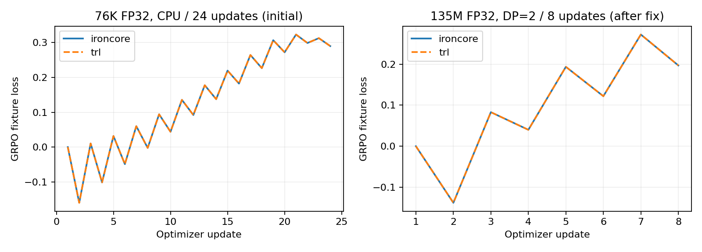
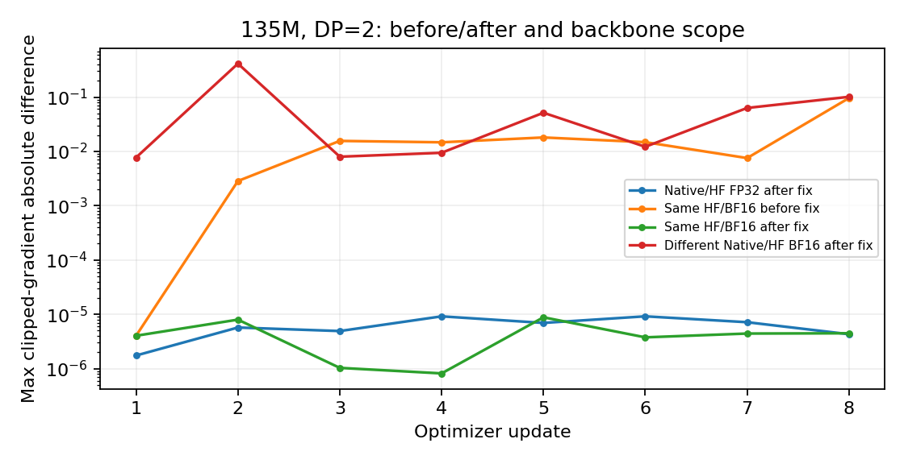

# 16. GRPO를 TRL의 실제 학습 루프와 대조하기

## 최종 판정: 보완 완료, 문서에 명시한 조건에서 사용 가능

판정일: 2026-10-08.

실제 비교에서 찾은 **불필요한 BF16 gradient 반올림은 수정했고 회귀 검증을 통과했다**. 같은 HF backbone을 사용하는 135M/BF16의 두 trainer는 8 updates 동안 loss·gradient·weights 비교를 통과했다. Native backbone의 135M/FP32도 통과했다. 이 문서의 실패 기록은 이 판정에 이르기까지의 근거이며, 독자가 다시 처리해야 하는 미결 버그 목록이 아니다.

| 항목 | 최종 처리 | 추가 코드 수정이 필요한가? |
|---|---|---|
| 같은 log-probability를 두 번 계산해 BF16 gradient를 각각 반올림 | 계산 그래프 공유로 수정, 독립 gradient oracle·실제 TRL 대조 통과 | **아니오. 해결 완료** |
| Native 135M/FP32의 GRPO update가 TRL과 다른가? | loss·gradient·weights 비교 통과 | **아니오** |
| 같은 HF backbone/BF16에서 trainer update가 다른가? | 보완 후 비교 통과 | **아니오** |
| 서로 다른 Native/HF backbone의 BF16 trajectory가 일치하는가? | 초기 forward부터 차이가 있는 비교로 분류. 이 조건의 수치 동등성은 보장하지 않음 | **현재 GRPO trainer의 필수 수정 항목이 아님** |
| GSM8k reasoning 성능이 향상됐는가? | 이전 paired pilot 0→0. 품질 개선 주장에 사용하지 않음 | 이 결과만으로 코드 버그나 수정 필요를 판정하지 않음 |

사용 결정은 다음과 같다. **외부 참조와의 수치 동등성이 필요한 Native GRPO 실험은 이 문서의 FP32 설정을 사용한다. BF16 Native 학습은 Native의 DP/TP/restart 계약을 기준으로 사용하며 HF와 같은 trajectory를 보장한다고 표기하지 않는다.** 향후 Native/HF backbone 자체의 BF16 동등성이 제품 요구 사항이 된다면 별도 모델 연산 검증을 시작한다. 현재 GRPO 보완을 재개해야 하는 조건으로 남겨 두지 않는다.

## 무엇을 입증하는가

“수식대로 코드를 작성했다”에서 한 단계 더 나아가, 같은 초기 weights·prompt·completion·reward·optimizer를 넣었을 때 널리 쓰이는 외부 구현과 같은 update를 만드는지 검사한다. 기준은 [TRL 0.29.0 GRPOTrainer](https://huggingface.co/docs/trl/v0.29.0/en/grpo_trainer)와 [해당 release의 실제 코드](https://github.com/huggingface/trl/blob/v0.29.0/trl/trainer/grpo_trainer.py)다. 최신 release 전체의 동등성을 주장하지 않고 설치한 버전과 trainer 파일 SHA256을 고정했다.

독립 수식 oracle에 더해 외부 trainer와의 대조를 확보하면, 선택한 목적함수와 update 경로의 구현을 신뢰할 근거가 강해진다. 수학 reasoning 품질이나 모든 optimizer/precision/rollout 설정의 동등성을 입증하는 실험은 아니다.

## 공통 실험 계약

[`validate_grpo_reference.py`](../../scripts/validate_grpo_reference.py)는 **실제 `IronCore.GRPOTrainer.train()`과 `TRL.GRPOTrainer.train()`을 모두 실행**한다. TRL의 loss·advantage·backward·optimizer 학습 코드를 복사하거나 자체 수식으로 대체하지 않는다. Callback으로 각 optimizer step의 gradient와 전체 trainable weights를 수집하고 HF 이름으로 대응시킨다. Gradient는 clipping 이후 값이다.

생성만 scripted fixture로 바꿔 두 구현에 같은 completion을 공급한다. 각 prompt의 네 completion은 두 후보를 번갈아 사용하며 EOS를 포함한다. 두 구현은 자기 policy에서 old token log-prob를 직접 계산하고 reference는 초기 weights로 고정한다. Scripted completion의 선택 분포는 current policy sampling 분포와 다르므로, 이 실험을 실제 on-policy rollout이나 importance sampling의 통계적 정당성 검증으로 해석하지 않는다.

| 항목 | 동일하게 설정한 값 |
|---|---|
| Objective | token ratio, TRL `loss_type="grpo"`, valid-token mean → completion mean |
| Group | prompt당 4 completions, sample std(correction=1), normalization epsilon 1e−4 |
| Epochs / clipping | rollout당 2 optimizer updates, symmetric epsilon 0.2 |
| KL | beta 0.1, k3, TRL bias correction off; Native log-ratio clamp ±6 바깥의 동등성은 주장하지 않음 |
| Sampling score | temperature 1, top-p 1, top-k 0 |
| Entropy bonus | 0 |
| Optimizer | AdamW, betas=(0.9,0.95), epsilon 1e−8, weight decay 0.01, gradient clip 1 |
| LR | 작은 모델 1e−3 / 135M 1e−5, constant |
| Stored weights | FP32; dropout 0; 초기 weights와 frozen reference exact 비교 |

Native의 기본 `gspo`, advantage epsilon 1e−8을 그대로 놓고 다른 목적함수의 TRL default와 비교하지 않는다. 이 계약은 명시적으로 token GRPO를 선택하고 epsilon도 맞춘다. 같은 prompt의 reward가 전부 0인 대조는 학습 경로의 증거가 약하므로, 작은 fixture는 `[1,0.5,1,0.5]`, 135M은 `[1,0,1,0]`로 비영 advantage를 만든다. DP=2의 두 rank는 동일한 통제 prompt를 사용한다. Uneven DP partition 검증은 [15](15-distributed-training.md)의 별도 독립 oracle이다.

## FP32 실측 결과

Tensor gate는 `atol=2e−5, rtol=2e−4`, loss scalar는 absolute 2e−5다. 초기 weights와 frozen reference는 tolerance 0이다. 아래 최대값은 모든 optimizer steps와 두 rank의 전체 trainable tensors를 확인한 결과다.

| Workload | Updates | Max loss error | Max clipped-gradient error | Max weight error | Gate |
|---|---:|---:|---:|---:|---|
| 76,096-parameter Llama / CPU | 24 | 1.79e−7 | 2.37e−6 | 2.55e−6 | 통과 |
| 같은 작은 모델 / DP=2 CUDA | 24 | 1.56e−7 | 4.15e−7 | 1.50e−5 | 통과 |
| SmolLM2-135M-Instruct / DP=2 CUDA | 8 | 8.20e−6 | 9.54e−6 | 2.33e−6 | 통과 |

135M은 [13](13-alignment-contracts.md)과 동일한 134,515,008-parameter checkpoint를 Native에 import하고 TRL은 HF model로 읽었다. 따라서 실제 크기의 Native backbone과 외부 HF backbone을 포함하는 비교다.



Loss curve의 일치는 동일 update 경로의 보조 근거다. GRPO scalar loss가 매 step 감소해야 하는 것은 아니므로, 이 curve를 teacher-forced NLL이나 생성 성공률의 개선으로 해석하지 않는다.

보상 후보의 조건부 확률 `P(positive)/(P(positive)+P(negative))`도 비교했다. 작은 CPU run은 두 구현 모두 0.52598→0.9999999, 135M FP32는 약 0.0082595→0.9996778이었다. 조건부 확률의 denominator는 지정한 두 completion뿐이며 전체 생성의 성공률이 아니다. 실제 prompt는 하나의 통제 fixture이고 held-out generalization 결과도 아니다. Scripted reward 평균 자체는 고정이므로 이 실험에서 reward curve 상승을 주장하지 않는다.

## 보완 전 BF16 실패와 원인

실사용 조건인 FP32 stored weights/BF16 compute에도 같은 135M·8-update 대조를 수행했다. 기존 분산 BF16 gate와 같은 `atol=5e−3, rtol=5e−2`를 유지했지만 **전체 trajectory의 엄격한 gradient/loss 일치 gate는 실패했다**. 허용 오차를 늘려 통과로 바꾸지 않았다.

| BF16 비교 | Max gradient error | Max weight error | Max loss error | Failed tensor/loss checks per rank |
|---|---:|---:|---:|---:|
| Native backbone vs HF/TRL | 0.5063 | 1.34e−4 | 0.1099 | 602 |
| 두 trainer 모두 같은 HF backbone | 0.09606 | 8.05e−5 | 0.04635 | 55 |

Native vs HF는 update 이전부터 positive completion의 sequence log-prob가 −19.7443 / −19.5826으로 달랐다. 같은 HF backbone을 넣는 추가 fixture는 초기 출력이 같고 첫 update의 최대 gradient error가 4.03e−6, weight error가 1.19e−7이었다. 이후에는 차이가 누적돼 strict gate를 벗어났다. 이 adapter는 실험 도구 안에서 backbone 효과를 분리하기 위한 것이며 production trainer의 HF-model 호환성을 새로 선언하는 기능이 아니다.

두 BF16 비교 모두 보상 후보의 확률은 증가했다. Native/HF의 조건부 확률은 각각 0.00695→0.39472 / 0.00850→0.48838, 같은 HF backbone의 IronCore/TRL은 0.00850→0.52324 / 0.00850→0.48838이었다. 이는 같은 학습 방향의 관측이며 여러 seed의 reward 분포가 동등하다는 통계 검증은 아니다.

이 실패는 최종 결론이 아니라 원인 분리의 출발점이었다. 이후 아래의 코드 보완과 재검증으로 trainer에서 수정할 부분을 닫았다. 서로 다른 backbone의 초기 BF16 출력까지 동일하게 만드는 작업은 이번 GRPO의 지원 계약에 포함하지 않는다.

## 확인한 원인과 수정

Temperature=1, top-p=1, top-k=0에서는 KL과 policy objective가 같은 token log-probability를 사용한다. 기존 구현은 같은 logits에 대해 FP32 log-softmax를 두 번 계산했다. Backward에서는 두 경로의 gradient가 각각 BF16 logits dtype으로 반올림된 뒤 합쳐졌다. 한 번의 FP32 loss graph에서 gradient를 합친 뒤 BF16으로 변환하는 것과 다른 결과를 만들었다.

Variable response lengths·positive/negative advantages·IS clipping·비영 KL을 갖는 독립 검사를 만들었다. FP32로 전체 token loss의 gradient를 계산한 뒤 한 번 BF16으로 변환한 기준과 비교하면, 보완 전에는 74개 gradient element가 다르고 최대 차이가 4.8828e−4였다. 이 판정은 다른 backbone이나 optimizer를 거치지 않는 단일 logits 검사로 원인을 분리한 것이다.

[`grpo_trainer.py`](../../ironcore/trainers/grpo_trainer.py)는 filtering이 없을 때 기존 raw token log-probability의 계산 그래프를 재사용하도록 수정했다. 목적함수는 같고 불필요한 softmax 계산 및 중간 반올림을 제거한다. 보완 후 위 검사에서 gradient 차이는 **0개, 최대 차이 0**이었다. Filtering이 있는 경로는 실제 다른 분포를 계산해야 하므로 별도 점수를 유지한다. 이 수정으로 warped 설정의 TRL 동등성까지 입증했다고 주장하지 않는다.

## 보완 후 최종 검증

같은 135M·두 RTX3090·8 updates·초기 weights·reward·hyperparameters를 유지하고 다시 비교했다. [보완 후 원본 결과](artifacts/2026-10-07-grpo-reference/postfix/study.json)에 실행 명령과 성공/실패 판정을 기록했다.

| 비교 | Max loss error | Max clipped-gradient error | Max weight error | 최종 판정 |
|---|---:|---:|---:|---|
| Native backbone / FP32 vs HF/TRL | 4.14e−6 | 9.18e−6 | 2.33e−6 | 통과 |
| 같은 HF backbone / BF16, IronCore vs TRL | 5.40e−7 | 8.81e−6 | 1.19e−7 | 통과; 보완 전 실패 해소 |
| Native backbone / BF16 vs HF/TRL | 0.03288 | 0.41376 | 1.40e−4 | 불일치; 서로 다른 backbone의 BF16 동등성은 미지원 |

같은 HF backbone/BF16에서는 실패한 tensor/loss 비교가 55개→0개로 줄었고, 두 trainer의 최종 후보 확률도 0.4883783으로 일치했다. 이 재실험이 수정의 실제 효과를 확인하는 근거다. Native/HF BF16은 초기 forward부터 차이가 남아 있으며, GRPO trainer의 같은-backbone 검사를 통과한 뒤에도 다른 모델 연산을 같은 것으로 간주할 수는 없다. 어느 단일 backbone kernel이 그 차이를 만들었는지까지 확정한 결과는 아니다.

추가 회귀는 **CPU 전체 선택 692 passed / 30 skipped / 230 deselected**, focused gradient/alignment 검사 96 passed / 2 skipped다. 실제 CUDA의 MoE token GRPO/BF16은 full·DP=2·TP=2 비교를 통과했고 세 same-topology 재개의 최종 weights 차이는 모두 0이었다. 기존 15의 결과를 새 코드 결과로 덮지 않고 이 보완의 검증을 추가했다.

## 재현과 블로그에서의 결론



Optional experiment dependency는 `trl==0.29.0`이다. Production dependencies에는 추가하지 않는다. [결과·로그·source snapshot·manifest](artifacts/2026-10-07-grpo-reference/README.md)에 성공과 실패를 모두 보존한다.

```bash
pip install trl==0.29.0
CUDA_VISIBLE_DEVICES='' torchrun --standalone --nproc_per_node=1 \
  scripts/validate_grpo_reference.py --output /tmp/grpo-reference-cpu
CUDA_VISIBLE_DEVICES=0,1 torchrun --standalone --nproc_per_node=2 \
  scripts/validate_grpo_reference.py --device cuda \
  --model-dir /path/to/SmolLM2-135M-Instruct --lr 1e-5 --rollouts 4 \
  --output /tmp/grpo-reference-135m
```

출력 경로는 매번 새로 지정한다. BF16 실패를 재현하려면 `--precision bfloat16`, 동일 HF backbone 진단에는 추가로 `--backbone hf`를 사용한다. Failed gate는 JSON을 먼저 기록하고 nonzero exit를 반환한다.

현재 뒷받침할 수 있는 문장은 **“지정한 token-GRPO 설정과 고정 rollout에서, 135M Native trainer의 FP32 update가 TRL과 일치했다. BF16 gradient의 중복 반올림을 보완한 뒤에는 같은 HF backbone의 BF16 trainer update도 일치했다”**이다.

**이 문서가 확인한 필수 코드 보완은 완료했고 현재 조건에서 사용 가능한 것으로 판정하고 닫는다.** GSM8k paired reward 0→0은 그대로 유지한다. 실제 on-policy reasoning 성공률을 높이는 비교는 별도 품질 실험이며, 이 완료된 구현 검증을 다시 처리해야 하는 TODO로 남기지 않는다.
